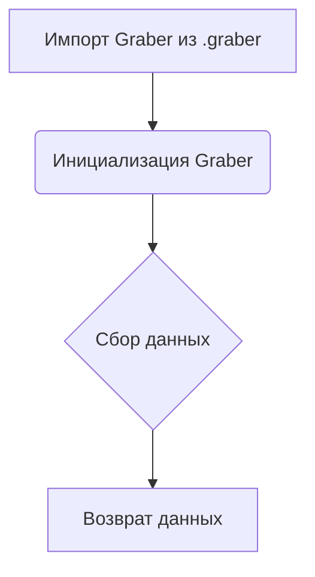

### **Анализ кода `hypotez/src/suppliers/etzmaleh/__init__.py`**

#### **1. <алгоритм>**:
1.  **Импорт модуля `Graber`**: Импортируется класс `Graber` из модуля `.graber`.
2.  **Инициализация**: При создании экземпляра класса `Graber` происходит инициализация необходимых атрибутов и настроек для последующего сбора данных.
3.  **Сбор данных**: Вызываются методы класса `Graber` для получения и обработки данных с веб-сайта поставщика Etzmaleh.
4.  **Возврат данных**: Обработанные данные возвращаются в требуемом формате.

#### **2. <mermaid>**:

**Объяснение зависимостей в `mermaid`**:

*   **A**: Импорт класса `Graber` из модуля `.graber`. Это указывает на то, что данный модуль использует функциональность, предоставляемую классом `Graber`.
*   **B**: Инициализация класса `Graber`.
*   **C**: Сбор данных с использованием методов класса `Graber`.
*   **D**: Возврат обработанных данных.

#### **3. <объяснение>**:

*   **Импорты**:
    *   `from .graber import Graber`: Импортирует класс `Graber` из модуля `graber.py`, находящегося в той же директории. Этот класс, вероятно, содержит логику для сбора и обработки данных с веб-сайта Etzmaleh.
*   **Классы**:
    *   `Graber`: Класс, который, вероятно, отвечает за сбор и обработку данных с веб-сайта Etzmaleh. Он может содержать методы для отправки HTTP-запросов, парсинга HTML и извлечения нужной информации.
*   **Функции**:
    *   В данном коде функции отсутствуют, но класс `Graber`, вероятно, содержит методы для выполнения различных операций, таких как:
        *   `__init__`: Конструктор класса, инициализирующий необходимые атрибуты.
        *   `grab_data`: Метод для сбора данных с веб-сайта.
        *   `process_data`: Метод для обработки собранных данных.
*   **Переменные**:
    *   В данном коде переменные отсутствуют, но класс `Graber` может содержать переменные для хранения настроек, URL-адресов и других параметров.

**Потенциальные области для улучшения**:

*   Добавить обработку исключений для более надежной работы.
*   Добавить логирование для отслеживания ошибок и предупреждений.