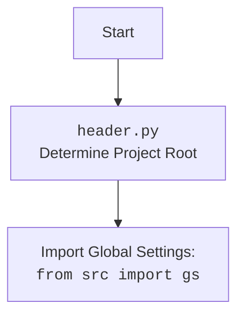

## <алгоритм>

1.  **Начало**: Функция `get_graber_by_supplier_url` принимает экземпляр WebDriver `self` и URL-адрес веб-страницы `url` в качестве входных данных.

    *   *Пример:* `self` - объект класса WebDriver, `url` = "https://www.amazon.com/product".
2.  **Загрузка страницы**: Используется `self.driver.get_url(url)` для загрузки веб-страницы в браузере, управляемом `WebDriver`.

    *   *Пример:* WebDriver открывает в браузере страницу "https://www.amazon.com/product".
3.  **Проверка URL**: Функция проверяет, с какого домена начинается URL-адрес. Для каждого домена есть своя проверка через `if url.startswith((...))`.

    *   *Пример:* Проверяется, начинается ли URL с "https://aliexpress.com" или "https://www.aliexpress.com".
4.  **Создание грабера**: Если URL соответствует одному из известных доменов, создается соответствующий объект грабера (например, `AliexpressGraber(self.driver)`).

    *   *Пример:* Если URL начинается с "https://www.amazon.com", создается объект `AmazonGraber` с использованием экземпляра WebDriver `self.driver`.
5.  **Возврат грабера**: Функция возвращает созданный объект грабера.
    *   *Пример:* Возвращается объект `AmazonGraber`.
6.  **Если нет совпадения**: Если URL не соответствует ни одному из известных доменов, в лог записывается сообщение `logger.debug(f'No graber found for URL: {url}')`, выполняется `...` и возвращается `None`.

    *   *Пример:* Если URL "https://www.example.com" не соответствует ни одному из известных доменов, функция возвращает `None`.
7.  **Конец**: Функция завершается.

## <mermaid>

```mermaid
flowchart TD
    Start[Начало: get_graber_by_supplier_url(self, url)] --> LoadPage[Загрузка страницы: self.driver.get_url(url)]
    LoadPage --> CheckAliexpress[Проверка: url.startswith("aliexpress.com")]
    CheckAliexpress -- Да --> CreateAliexpressGraber[Создание: AliexpressGraber(self.driver)]
    CreateAliexpressGraber --> ReturnGraber[Возврат грабера]
    CheckAliexpress -- Нет --> CheckAmazon[Проверка: url.startswith("amazon.com")]
    CheckAmazon -- Да --> CreateAmazonGraber[Создание: AmazonGraber(self.driver)]
    CreateAmazonGraber --> ReturnGraber
    CheckAmazon -- Нет --> CheckBangood[Проверка: url.startswith("bangood.com")]
    CheckBangood -- Да --> CreateBangoodGraber[Создание: BangoodGraber(self.driver)]
    CreateBangoodGraber --> ReturnGraber
    CheckBangood -- Нет --> CheckCdata[Проверка: url.startswith("cdata.co.il")]
    CheckCdata -- Да --> CreateCdataGraber[Создание: CdataGraber(self.driver)]
    CreateCdataGraber --> ReturnGraber
     CheckCdata -- Нет --> CheckEbay[Проверка: url.startswith("ebay.")]
    CheckEbay -- Да --> CreateEbayGraber[Создание: EbayGraber(self.driver)]
    CreateEbayGraber --> ReturnGraber
    CheckEbay -- Нет --> CheckEtzmaleh[Проверка: url.startswith("etzmaleh.co.il")]
    CheckEtzmaleh -- Да --> CreateEtzmalehGraber[Создание: EtzmalehGraber(self.driver)]
    CreateEtzmalehGraber --> ReturnGraber
    CheckEtzmaleh -- Нет --> CheckGearbest[Проверка: url.startswith("gearbest.com")]
    CheckGearbest -- Да --> CreateGearbestGraber[Создание: GearbestGraber(self.driver)]
    CreateGearbestGraber --> ReturnGraber
    CheckGearbest -- Нет --> CheckGrandadvance[Проверка: url.startswith("grandadvance.co.il")]
    CheckGrandadvance -- Да --> CreateGrandadvanceGraber[Создание: GrandadvanceGraber(self.driver)]
    CreateGrandadvanceGraber --> ReturnGraber
    CheckGrandadvance -- Нет --> CheckHB[Проверка: url.startswith("hb-digital.co.il")]
    CheckHB -- Да --> CreateHBGraber[Создание: HBGraber(self.driver)]
    CreateHBGraber --> ReturnGraber
    CheckHB -- Нет --> CheckIvory[Проверка: url.startswith("ivory.co.il")]
    CheckIvory -- Да --> CreateIvoryGraber[Создание: IvoryGraber(self.driver)]
    CreateIvoryGraber --> ReturnGraber
    CheckIvory -- Нет --> CheckKsp[Проверка: url.startswith("ksp.co.il")]
    CheckKsp -- Да --> CreateKspGraber[Создание: KspGraber(self.driver)]
    CreateKspGraber --> ReturnGraber
    CheckKsp -- Нет --> CheckKualaStyle[Проверка: url.startswith("kualastyle.com")]
    CheckKualaStyle -- Да --> CreateKualaStyleGraber[Создание: KualaStyleGraber(self.driver)]
    CreateKualaStyleGraber --> ReturnGraber
    CheckKualaStyle -- Нет --> CheckMorlevi[Проверка: url.startswith("morlevi.co.il")]
     CheckMorlevi -- Да --> CreateMorleviGraber[Создание: MorleviGraber(self.driver)]
    CreateMorleviGraber --> ReturnGraber
     CheckMorlevi -- Нет --> CheckVisualDG[Проверка: url.startswith("visualdg.com")]
     CheckVisualDG -- Да --> CreateVisualDGGraber[Создание: VisualDGGraber(self.driver)]
     CreateVisualDGGraber --> ReturnGraber
    CheckVisualDG -- Нет --> CheckWallaShop[Проверка: url.startswith("wallashop.co.il")]
    CheckWallaShop -- Да --> CreateWallaShopGraber[Создание: WallaShopGraber(self.driver)]
    CreateWallaShopGraber --> ReturnGraber
    CheckWallaShop -- Нет --> CheckWallmart[Проверка: url.startswith("wallmart.com")]
    CheckWallmart -- Да --> CreateWallmartGraber[Создание: WallmartGraber(self.driver)]
    CreateWallmartGraber --> ReturnGraber
    CheckWallmart -- Нет --> LogNoGraber[Лог: logger.debug('No graber found')]
    LogNoGraber --> ReturnNone[Возврат: None]
    ReturnGraber --> End[Конец]
    ReturnNone --> End
```



## <объяснение>

**Импорты:**

*   `from __future__ import annotations`:  Этот импорт позволяет использовать аннотации типов в Python 3.7 и более ранних версиях, когда используется отложенная оценка аннотаций. Позволяет использовать тип `Graber` внутри аннотации функции.
*   `import header`: Импортирует модуль `header`, который, вероятно, содержит логику для определения корневой директории проекта.
*   `from src.suppliers.aliexpress.graber import Graber as AliexpressGraber`: Импортирует класс `Graber` из модуля `src.suppliers.aliexpress.graber` и переименовывает его в `AliexpressGraber`. Классы граберов используются для извлечения данных с конкретных сайтов поставщиков.
*   Аналогичные импорты для других поставщиков, таких как `AmazonGraber`, `BangoodGraber` и так далее. Каждый из них предназначен для работы с конкретным сайтом поставщика.
*    `from src.logger.logger import logger`: Импортирует объект `logger` для логирования событий, таких как отсутствие грабера для конкретного URL.

**Переменные:**

*   `MODE = 'dev'`: Глобальная переменная, устанавливающая режим работы скрипта в "dev" (разработка). Она может использоваться для включения/отключения отладочных сообщений и т.д.

**Функции:**

*   `get_graber_by_supplier_url(self, url: str) -> 'Graber' | None`:
    *   **Аргументы**:
        *   `self`: Экземпляр класса, содержащий драйвер веб-браузера (`WebDriver`), используется для загрузки веб-страниц.
        *   `url`: URL-адрес веб-страницы поставщика (тип `str`).
    *   **Возвращаемое значение**:
        *   `Graber` (или его подкласс): Возвращает экземпляр грабера, если URL-адрес соответствует известному поставщику.
        *   `None`: Возвращает `None`, если для данного URL-адреса не найден подходящий грабер.
    *   **Назначение**:
        *   Функция отвечает за выбор и создание соответствующего объекта грабера на основе URL-адреса. Она использует `url.startswith()` для определения поставщика.
        *   При совпадении URL с шаблоном, создается экземпляр соответствующего класса грабера, передавая в него экземпляр драйвера.
        *   Если ни один шаблон URL не совпадает, в лог записывается сообщение об ошибке, выполняется заглушка `...` и возвращается `None`.

**Классы:**

*   `Graber` (и его подклассы, такие как `AliexpressGraber`, `AmazonGraber` и т.д.):
    *   **Роль**: Каждый класс грабера отвечает за извлечение данных (например, название продукта, цена) с конкретного сайта поставщика.
    *   **Атрибуты**: Обычно содержат экземпляр `WebDriver` для взаимодействия с веб-страницей.
    *   **Методы**: Обычно содержат методы для извлечения данных, например `extract_title()`, `extract_price()`.
    *   **Взаимодействие**: Каждый грабер использует экземпляр `WebDriver`, полученный из аргумента `self` функции `get_graber_by_supplier_url`, для загрузки веб-страницы и поиска элементов.

**Потенциальные ошибки и области для улучшения:**

*   **Зависимость от URL**: Функция жестко закодирована на проверку URL-адресов. Это может привести к проблемам, если поставщики изменят структуру своих URL-адресов.
*   **Дублирование кода**: Много повторяющегося кода для каждого поставщика. Можно использовать более абстрактный подход, возможно, с использованием словаря или паттерна `Strategy`.
*   **Непонятная заглушка ...**: В случае, когда не найден грабер, выполняется `...`. Это выглядит странно и не информативно, лучше вызывать ошибку.
*   **Отсутствие обработки ошибок**: Не хватает обработки исключений, которые могут возникнуть при создании экземпляра грабера или при работе с веб-страницей.
*   **Отсутствие документации**: Не хватает документации на каждый из импортированных классов грабера.

**Взаимосвязи с другими частями проекта:**

*   `src.webdriver.WebDriver`:  Используется для управления веб-браузером и загрузки веб-страниц.
*   `src.logger.logger`: Используется для логирования событий в процессе работы.
*   `src.suppliers.<supplier_name>.graber`: Модули граберов, которые специализируются на извлечении данных с сайтов определенных поставщиков.

**Общее:**

Функция `get_graber_by_supplier_url` является центральным элементом для выбора грабера в зависимости от URL. Она играет важную роль в системе извлечения данных, предоставляя соответствующий объект грабера для каждого поставщика. Однако ее текущая реализация имеет недостатки, которые можно улучшить с помощью рефакторинга и добавления абстракций.