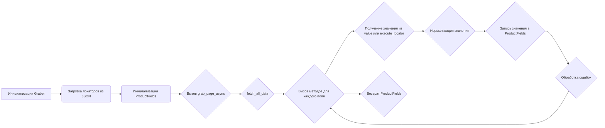
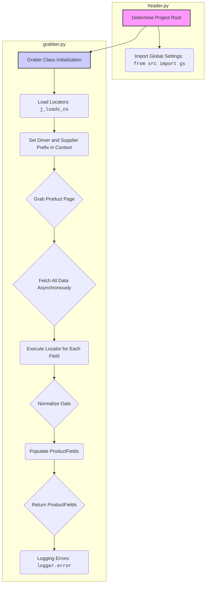
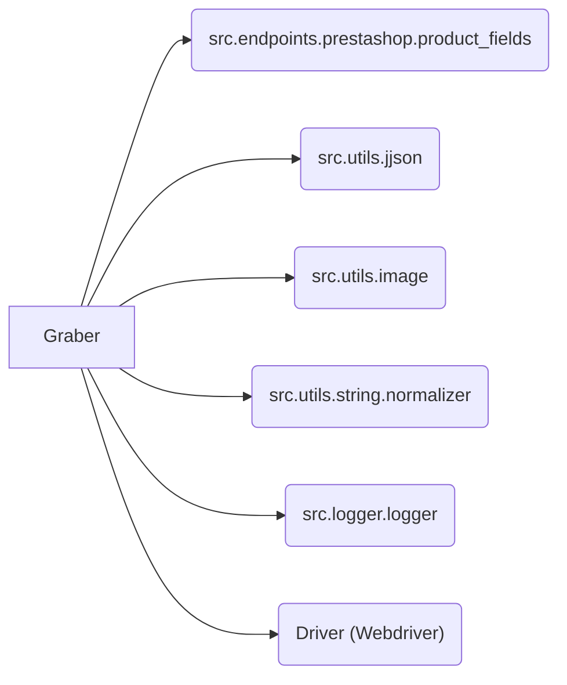

## Проект `hypotez`
# Роль `code explainer`
## ИНСТРУКЦИЯ  :

Анализируй предоставленный код подробно и объясни его функциональность. Ответ должен включать три раздела:  

1. **<алгоритм>**: Опиши рабочий процесс в виде пошаговой блок-схемы, включая примеры для каждого логического блока, и проиллюстрируй поток данных между функциями, классами или методами.  
2. **<mermaid>**: Напиши код для диаграммы в формате `mermaid`, проанализируй и объясни все зависимости, 
    которые импортируются при создании диаграммы. 
    **ВАЖНО!** Убедитесь, что все имена переменных, используемые в диаграмме `mermaid`, 
    имеют осмысленные и описательные имена. Имена переменных вроде `A`, `B`, `C`, и т.д., не допускаются!  
    
    **Дополнительно**: Если в коде есть импорт `import header`, добавьте блок `mermaid` flowchart, объясняющий `header.py`:\
    ```mermaid\
    flowchart TD\
        Start --> Header[<code>header.py</code><br> Determine Project Root]\
    
        Header --> import[Import Global Settings: <br><code>from src import gs</code>] \
    ```

3. **<объяснение>**: Предоставь подробные объяснения:  
   - **Импорты**: Их назначение и взаимосвязь с другими пакетами `src.`.  
   - **Классы**: Их роль, атрибуты, методы и взаимодействие с другими компонентами проекта.  
   - **Функции**: Их аргументы, возвращаемые значения, назначение и примеры.  
   - **Переменные**: Их типы и использование.  
   - Выдели потенциальные ошибки или области для улучшения.  

Дополнительно, постройте цепочку взаимосвязей с другими частями проекта (если применимо).  

Это обеспечивает всесторонний и структурированный анализ кода.
## Формат ответа: `.md` (markdown)


## Твое поведение при анализе кода:
- всегда смотри системную инструкцию для обработки кода проекта `hypotez`;
- анализируй расположение файла в проекте. Это поможет понять его назначение и взаимосвязь с другими файлами. Расположение файла ты найдешь в самой превой строке кода, начинающейся с `## \\file /...`;
- запоминай предоставленный код и анализируй его связь с другими частями проекта `hypotez`;


**КОНЕЦ ИНСТРУКЦИИ**
```

```md
## \\file /src/suppliers/graber.py

### **1. <алгоритм>**:

#### **Общий алгоритм работы класса `Graber`**

1.  **Инициализация**:

    *   Создается экземпляр класса `Graber` с указанием префикса поставщика (`supplier_prefix`), индекса языка (`lang_index`) и драйвера (`driver`).

    *   Загружаются локаторы (`locators`) из JSON-файла, специфичного для данного поставщика, используя функцию `j_loads_ns`.

    *   Инициализируется объект `ProductFields` для хранения собранных данных о продукте.

    *   Устанавливаются глобальные контекстные переменные `Context.driver` и `Context.supplier_prefix`.

    *   Инициализируется декоратор `Context.locator_for_decorator = None`.

2.  **Сбор данных о продукте**:

    *   Вызывается метод `grab_page` (или асинхронный `grab_page_async`) для запуска процесса сбора данных.

    *   Метод `grab_page_async` динамически вызывает методы класса `Graber`, соответствующие полям продукта, которые необходимо собрать.

    *   Для каждого поля вызывается соответствующий метод (например, `name`, `description`, `price` и т.д.).

    *   Метод пытается получить значение поля из двух источников:

        *   Из аргумента `value`, переданного в метод.
        *   Из HTML-страницы с использованием `driver.execute_locator` и локатора, специфичного для данного поля.

    *   Полученное значение нормализуется с использованием функций нормализации (например, `normalize_string`, `normalize_int`, `normalize_float` и т.д.).

    *   Нормализованное значение записывается в соответствующее поле объекта `ProductFields`.

    *   В случае возникновения ошибки при получении или нормализации значения поля, информация об ошибке записывается в лог с использованием `logger.error`.

3.  **Закрытие всплывающих окон**:

    *   Перед выполнением основной логики каждого метода, помеченного декоратором `@close_pop_up()`, вызывается функция `close_pop_up`.

    *   Функция `close_pop_up` проверяет, установлен ли `Context.locator_for_decorator`.

    *   Если `Context.locator_for_decorator` установлен, вызывается `driver.execute_locator` с локатором, указанным в `Context.locator_for_decorator`, для закрытия всплывающего окна.

    *   После закрытия всплывающего окна `Context.locator_for_decorator` сбрасывается в `None`.

4.  **Возврат результата**:

    *   После сбора данных обо всех полях метод `grab_page_async` возвращает объект `ProductFields`, содержащий собранные данные о продукте.

#### **Примеры логических блоков**

*   **Инициализация `Graber`**:

    ```python
    supplier_prefix = 'SomeSupplier'
    lang_index = 1
    driver = Driver()  # Предполагается, что класс Driver уже определен
    graber = Graber(supplier_prefix, lang_index, driver)
    ```

*   **Вызов метода для сбора названия продукта**:

    ```python
    async def name(self, value: Optional[Any] = None):
        try:
            self.fields.name = normalize_string(value or await self.driver.execute_locator(self.locator.name) or '')
        except Exception as ex:
            logger.error(f"Ошибка получения значения в поле `name`", ex)
    ```

*   **Нормализация значения**:

    ```python
    normalized_price = normalize_float(raw_price)
    ```

*   **Запись значения в `ProductFields`**:

    ```python
    self.fields.price = normalized_price
    ```

*   **Обработка ошибок**:

    ```python
    try:
        value = normalize_float(value or await self.driver.execute_locator(self.locator.price) or None)
        if not value:
            logger.debug(f'Невалидный результат {value=}\nлокатор {self.locator.price}')
            ...
            return
        self.fields.price = value
        return True
    except Exception as ex:
        logger.error(f'Ошибка получения значения в поле `price`', ex)
        ...
        return
    ```

#### **Поток данных**



### **2. <mermaid>**:



**Объяснение диаграммы:**

*   **`header.py`**:
    *   `Determine Project Root`: Определяет корень проекта.
    *   `Import Global Settings`: Импортирует глобальные настройки из `src import gs`.
*   **`grabber.py`**:
    *   `Graber Class Initialization`: Инициализация класса `Graber`, который отвечает за сбор данных о товарах.
    *   `Load Locators`: Загружает локаторы из JSON-файла с использованием функции `j_loads_ns`. Локаторы используются для определения местоположения элементов на веб-странице.
    *   `Set Driver and Supplier Prefix in Context`: Устанавливает драйвер и префикс поставщика в глобальном контексте (`Context`).
    *   `Grab Product Page`: Запускает процесс сбора данных со страницы товара.
    *   `Fetch All Data Asynchronously`: Асинхронно извлекает все необходимые данные о товаре.
    *   `Execute Locator for Each Field`: Для каждого поля товара (например, название, описание, цена) выполняет поиск элемента на странице с использованием соответствующего локатора.
    *   `Normalize Data`: Нормализует полученные данные, приводя их к нужному формату (например, удаляет лишние пробелы, приводит к числовому типу).
    *   `Populate ProductFields`: Заполняет объект `ProductFields` нормализованными данными.
    *   `Return ProductFields`: Возвращает объект `ProductFields`, содержащий все собранные данные о товаре.
    *   `Logging Errors`: В случае возникновения ошибок в процессе сбора данных, информация об ошибке записывается в лог с использованием `logger.error`.

**Импортированные зависимости (из предоставленного кода):**

```mermaid
flowchart TD
    A[grabber.py] --> B(datetime);
    A --> C(os);
    A --> D(sys);
    A --> E(asyncio);
    A --> F(pathlib.Path);
    A --> G(typing.Optional);
    A --> H(typing.Any);
    A --> I(types.SimpleNamespace);
    A --> J(typing.Callable);
    A --> K(functools.wraps);
    A --> L(header);
    A --> M(src.gs);
    A --> N(src.endpoints.prestashop.product_fields.ProductFields);
    A --> O(src.utils.jjson.j_loads);
    A --> P(src.utils.jjson.j_loads_ns);
    A --> Q(src.utils.jjson.j_dumps);
    A --> R(src.utils.image.save_image);
    A --> S(src.utils.image.save_image_async);
    A --> T(src.utils.image.save_image_from_url_async);
    A --> U(src.utils.string.normalizer.normalize_string);
    A --> V(src.utils.string.normalizer.normalize_int);
    A --> W(src.utils.string.normalizer.normalize_float);
    A --> X(src.utils.string.normalizer.normalize_boolean);
    A --> Y(src.utils.string.normalizer.normalize_sql_date);
    A --> Z(src.utils.string.normalizer.normalize_sku);
    A --> AA(src.logger.exceptions.ExecuteLocatorException);
    A --> BB(src.utils.printer.pprint);
    A --> CC(src.logger.logger.logger);
```



**Объяснение зависимостей:**

*   `datetime`: Используется для работы с датой и временем, например, для получения текущей даты.
*   `os`: Используется для работы с операционной системой, например, для получения доступа к переменным окружения.
*   `sys`: Используется для работы с интерпретатором Python, например, для получения доступа к аргументам командной строки.
*   `asyncio`: Используется для асинхронного программирования.
*   `pathlib.Path`: Используется для работы с путями к файлам и директориям.
*   `typing.Optional`: Используется для указания, что переменная может иметь значение `None`.
*   `typing.Any`: Используется для указания, что переменная может иметь любой тип.
*   `types.SimpleNamespace`: Используется для создания простого объекта, к атрибутам которого можно обращаться через точку.
*   `typing.Callable`: Используется для указания, что переменная является вызываемым объектом (функцией, методом).
*   `functools.wraps`: Используется для сохранения метаданных оборачиваемой функции при использовании декораторов.
*   `header`: (Предположительно) Содержит общие функции и переменные для проекта.
*   `src.gs`: Содержит глобальные настройки проекта.
*   `src.endpoints.prestashop.product_fields.ProductFields`: Класс для хранения данных о товаре.
*   `src.utils.jjson.j_loads`, `src.utils.jjson.j_loads_ns`, `src.utils.jjson.j_dumps`: Функции для работы с JSON-файлами.
*   `src.utils.image.save_image`, `src.utils.image.save_image_async`, `src.utils.image.save_image_from_url_async`: Функции для сохранения изображений.
*   `src.utils.string.normalizer.normalize_string`, `src.utils.string.normalizer.normalize_int`, `src.utils.string.normalizer.normalize_float`, `src.utils.string.normalizer.normalize_boolean`, `src.utils.string.normalizer.normalize_sql_date`, `src.utils.string.normalizer.normalize_sku`: Функции для нормализации строк.
*   `src.logger.exceptions.ExecuteLocatorException`: Пользовательское исключение, которое выбрасывается при ошибке выполнения локатора.
*   `src.utils.printer.pprint`: Функция для красивого вывода данных.
*   `src.logger.logger.logger`: Объект логгера для записи информации о работе программы.

### **3. <объяснение>**:

#### **Импорты:**

*   `datetime`: Предоставляет классы для работы с датами и временем.
*   `os`: Предоставляет функции для взаимодействия с операционной системой, например, для работы с файловой системой.
*   `sys`: Предоставляет доступ к некоторым переменным и функциям, взаимодействующим с интерпретатором Python.
*   `asyncio`: Библиотека для написания конкурентного кода с использованием синтаксиса async/await.
*   `pathlib.Path`: Класс для представления путей к файлам и директориям.
*   `typing.Optional`: Используется для указания, что переменная может иметь значение `None` (может отсутствовать).
*   `typing.Any`: Обозначает, что переменная может быть любого типа.
*   `types.SimpleNamespace`: Удобный класс для создания объектов, к атрибутам которых можно обращаться как к обычным атрибутам объекта.
*   `typing.Callable`: Тип, используемый для аннотирования вызываемых объектов (функций, методов).
*   `functools.wraps`: Декоратор, который используется для сохранения метаданных оборачиваемой функции при использовании декораторов.
*   `header`: (Предположительно) Модуль, содержащий общие функции и переменные для всего проекта. Судя по всему, он определяет корень проекта.
*   `src.gs`: Модуль, содержащий глобальные настройки проекта.
*   `src.endpoints.prestashop.product_fields.ProductFields`: Класс, представляющий поля продукта в PrestaShop.
*   `src.utils.jjson.j_loads, src.utils.jjson.j_loads_ns, src.utils.jjson.j_dumps`: Функции для работы с JSON-файлами, обертки над стандартными функциями `json`, возможно, добавляющие какую-то дополнительную функциональность.
*   `src.utils.image.save_image, src.utils.image.save_image_async, src.utils.image.save_image_from_url_async`: Функции для сохранения изображений с использованием асинхронности.
*   `src.utils.string.normalizer.normalize_string, src.utils.string.normalizer.normalize_int, src.utils.string.normalizer.normalize_float, src.utils.string.normalizer.normalize_boolean, src.utils.string.normalizer.normalize_sql_date, src.utils.string.normalizer.normalize_sku`: Функции для нормализации строк, приведения их к определенному формату.
*   `src.logger.exceptions.ExecuteLocatorException`: Пользовательское исключение, которое выбрасывается при ошибке выполнения локатора (например, если элемент не найден на странице).
*   `src.utils.printer.pprint`: Функция для красивого вывода данных в консоль.
*   `src.logger.logger.logger`: Объект логгера для записи информации о работе программы в лог-файл.

#### **Классы:**

*   **`Context`**: Класс для хранения глобальных настроек, таких как драйвер, локаторы и префикс поставщика. Используется для передачи этих настроек между разными частями программы.
    *   `driver`: Объект драйвера (например, `selenium.webdriver`), используемый для взаимодействия с браузером.
    *   `locator_for_decorator`: Локатор, используемый декоратором `@close_pop_up` для закрытия всплывающих окон.
    *   `supplier_prefix`: Префикс поставщика (например, "amazon", "ebay"), используемый для определения, с какого сайта собираются данные.

*   **`Graber`**: Базовый класс для сбора данных со страницы товара.
    *   `supplier_prefix`: Префикс поставщика.
    *   `locator`: Объект `SimpleNamespace`, содержащий локаторы для элементов на странице товара.
    *   `driver`: Объект драйвера.
    *   `fields`: Объект `ProductFields`, содержащий поля продукта, которые нужно заполнить.

#### **Функции:**

*   **`close_pop_up()`**: Декоратор, который закрывает всплывающее окно перед выполнением функции. Используется для обработки сайтов, которые показывают всплывающие окна при загрузке страницы.
    *   Перед выполнением декорируемой функции проверяется, установлен ли `Context.locator_for_decorator`.
    *   Если `Context.locator_for_decorator` установлен, выполняется локатор для закрытия всплывающего окна.
    *   `Context.locator_for_decorator` сбрасывается в `None`, чтобы декоратор не срабатывал повторно.

*   **`Graber.__init__(supplier_prefix: str, lang_index: int, driver: 'Driver')`**: Конструктор класса `Graber`.
    *   `supplier_prefix`: Префикс поставщика.
    *   `lang_index`: Индекс языка.
    *   `driver`: Объект драйвера.
    *   Загружает локаторы из JSON-файла, специфичного для данного поставщика.
    *   Инициализирует объект `ProductFields`.
    *   Устанавливает глобальные контекстные переменные `Context.driver` и `Context.supplier_prefix`.

*   **`Graber.error(field: str)`**: Обработчик ошибок для полей.
    *   `field`: Название поля, для которого произошла ошибка.
    *   Записывает сообщение об ошибке в лог.

*   **`Graber.set_field_value(value: Any, locator_func: Callable[[], Any], field_name: str, default: Any = '')`**: Универсальная функция для установки значений полей с обработкой ошибок.
    *   `value`: Значение для установки.
    *   `locator_func`: Функция для получения значения из локатора.
    *   `field_name`: Название поля.
    *   `default`: Значение по умолчанию.
    *   Пытается получить значение из локатора с помощью `locator_func`.
    *   Если значение получено, оно возвращается.
    *   Если значение не получено, записывается сообщение об ошибке в лог и возвращается значение по умолчанию.

*   **`Graber.grab_page(args, kwards)`**: Функция для сбора полей продукта.
    *   `args`: Список полей, которые нужно собрать.
    *   `kwards`: Словарь с дополнительными параметрами.
    *   Вызывает асинхронную функцию `grab_page_async` и возвращает результат.

*   **`Graber.grab_page_async(args, kwards)`**: Асинхронная функция для сбора полей продукта.
    *   `args`: Список полей, которые нужно собрать.
    *   `kwards`: Словарь с дополнительными параметрами.
    *   Динамически вызывает методы класса `Graber`, соответствующие полям продукта, которые необходимо собрать.
    *   Возвращает объект `ProductFields`, содержащий собранные данные о продукте.

*   **`Graber.additional_shipping_cost(value: Optional[Any] = None)`**: Получает и устанавливает дополнительную стоимость доставки.
    *   `value`: Значение, которое можно передать в словаре `kwargs`.
    *   Пытается получить значение из `kwargs` или из локатора.
    *   Нормализует значение и записывает его в поле `additional_shipping_cost` объекта `ProductFields`.

Подобные функции определены для каждого поля продукта, которое нужно собрать (например, `delivery_in_stock`, `active`, `additional_delivery_times` и т.д.). Все они имеют схожую структуру:

*   Пытаются получить значение из `kwargs` или из локатора.
*   Нормализуют значение.
*   Записывают значение в соответствующее поле объекта `ProductFields`.
*   Обрабатывают ошибки и записывают информацию об ошибках в лог.

#### **Переменные:**

*   `Context.driver`: Объект драйвера.
*   `Context.locator_for_decorator`: Локатор для декоратора `@close_pop_up`.
*   `Context.supplier_prefix`: Префикс поставщика.
*   `Graber.supplier_prefix`: Префикс поставщика.
*   `Graber.locator`: Объект `SimpleNamespace`, содержащий локаторы.
*   `Graber.driver`: Объект драйвера.
*   `Graber.fields`: Объект `ProductFields`, содержащий поля продукта.

#### **Потенциальные ошибки и области для улучшения:**

*   **Жесткая привязка к путям к файлам:** Пути к JSON-файлам с локаторами жестко закодированы в коде. Это может затруднить перенос проекта на другую систему или изменение структуры каталогов. Рекомендуется использовать переменные окружения или конфигурационные файлы для хранения путей к файлам.
*   **Обработка ошибок:** Обработка ошибок в основном заключается в записи информации об ошибке в лог. В некоторых случаях может быть полезно предпринять какие-то действия для исправления ошибки или предотвращения ее повторного возникновения.
*   **Дублирование кода:** Код для получения и нормализации значений полей сильно дублируется между разными функциями. Можно выделить общую функцию, которая будет выполнять эти действия.
*   **Использование `Any`:** Использование `Any` снижает типобезопасность кода. Рекомендуется использовать более конкретные типы, когда это возможно.
*   **Отсутствие документации для некоторых функций:** Некоторые функции не имеют документации, что затрудняет понимание их назначения.
*   **Использование `...`:** Много мест в коде, где используется `...` для пропуска логики. Это затрудняет понимание работы программы и может привести к ошибкам. Необходимо заменить `...` на реальный код.
*   **Не все переменные имеют аннотации типов:** Рекомендуется добавить аннотации типов для всех переменных, чтобы улучшить читаемость и типобезопасность кода.

#### **Взаимосвязи с другими частями проекта:**

*   Класс `Graber` использует класс `ProductFields` из модуля `src.endpoints.prestashop.product_fields` для хранения данных о товаре.
*   Класс `Graber` использует функции из модуля `src.utils.jjson` для работы с JSON-файлами с локаторами.
*   Класс `Graber` использует функции из модуля `src.utils.image` для сохранения изображений.
*   Класс `Graber` использует функции из модуля `src.utils.string.normalizer` для нормализации строк.
*   Класс `Graber` использует объект логгера из модуля `src.logger.logger` для записи информации о работе программы.
*   Класс `Graber` использует объект `Driver` (не показан в коде), который, вероятно, является частью `hypotez` и отвечает за взаимодействие с веб-страницами.



Этот анализ предоставляет полное представление о функциональности и структуре кода `graber.py`, а также выявляет потенциальные области для улучшения.