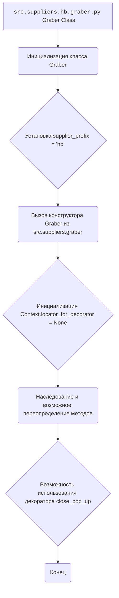
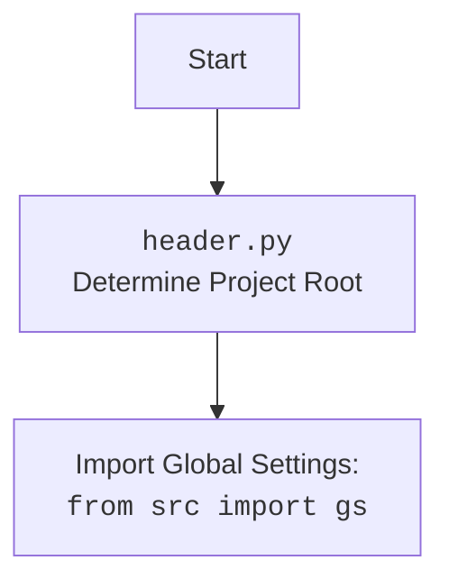

### **Анализ кода `hypotez/src/suppliers/hb/graber.py`**

#### 1. **<алгоритм>**:

1.  **Инициализация**:
    *   Создается экземпляр класса `Graber`.
    *   Устанавливается префикс поставщика (`supplier_prefix`) как `'hb'`.
    *   Вызывается конструктор родительского класса `Graber` (из `src.suppliers.graber`).
    *   Инициализируется `Context.locator_for_decorator` в `None`.

    Пример:

    ```python
    graber_instance = Graber(driver_instance, lang_index=0)
    ```

2.  **Наследование и переопределение**:

    *   Класс `Graber` наследуется от класса `Graber` (из `src.suppliers.graber`).
    *   Методы родительского класса могут быть переопределены для нестандартной обработки полей страницы товара.

3.  **Использование декоратора `close_pop_up` (закомментировано)**:

    *   Предоставляется шаблон декоратора `close_pop_up`, который можно использовать для закрытия всплывающих окон перед выполнением основной логики функции.
    *   Если `Context.locator` установлено, декоратор по умолчанию из родительского класса выполнит предварительные действия перед отправкой запроса к веб-драйверу.
    *   В текущем коде декоратор закомментирован, но его можно раскомментировать и переопределить его поведение.

4.  **Управление `Context.locator_for_decorator`**:

    *   `Context.locator_for_decorator` устанавливается в `None` в конструкторе класса `Graber`.
    *   Если установлено значение для `Context.locator_for_decorator`, то декоратор `@close_pop_up` будет выполнен.

#### 2. **<mermaid>**:



**Объяснение `mermaid`**:

*   Диаграмма показывает поток управления при инициализации класса `Graber` в модуле `src.suppliers.hb.graber.py`.
*   `A`: Начало - класс `Graber`.
*   `B`: Инициализация класса `Graber`.
*   `C`: Установка атрибута `supplier_prefix` в `'hb'`.
*   `D`: Вызов конструктора родительского класса `Graber` из `src.suppliers.graber`.
*   `E`: Инициализация `Context.locator_for_decorator` в `None`.
*   `F`: Указывает, что класс наследуется от `src.suppliers.graber.Graber` и может переопределять его методы.
*   `G`: Указывает на возможность использования декоратора `close_pop_up` для выполнения предварительных действий.
*   `H`: Конец процесса.



#### 3. **<объяснение>**:

*   **Импорты**:
    *   `typing.Any`: Используется для аннотации типов, когда тип переменной может быть любым.
    *   `header`: (предположительно) Содержит функции для определения корневого каталога проекта и, возможно, загрузки глобальных настроек.
    *   `src.suppliers.graber.Graber` (as `Grbr`): Базовый класс для грабберов, предоставляющий общую функциональность.
    *   `src.suppliers.graber.Context`: Контекст, используемый для передачи данных между функциями и классами.
    *   `src.suppliers.graber.close_pop_up`: Декоратор для закрытия всплывающих окон.
    *   `src.webdriver.driver.Driver`: Класс для управления веб-драйвером.
    *   `src.logger.logger.logger`: Модуль для логирования событий.

*   **Классы**:
    *   `Graber`:
        *   Роль: Сбор данных со страниц товаров на сайте `hb.co.il`.
        *   Атрибуты:
            *   `supplier_prefix` (str): Префикс поставщика, установлен в `'hb'`.
        *   Методы:
            *   `__init__`: Конструктор класса, инициализирует `supplier_prefix`, вызывает конструктор родительского класса и устанавливает `Context.locator_for_decorator` в `None`.
        *   Взаимодействие:
            *   Наследуется от `src.suppliers.graber.Graber`.
            *   Использует `src.webdriver.driver.Driver` для управления веб-драйвером.
            *   Использует `src.logger.logger.logger` для логирования.
            *   Использует `src.suppliers.graber.Context` для передачи контекста выполнения.
            *   Импортирует и использует `header` для определения корневого каталога проекта.

*   **Функции**:
    *   `__init__(self, driver: Driver, lang_index)`:
        *   Аргументы:
            *   `driver` (Driver): Экземпляр веб-драйвера.
            *   `lang_index`: Индекс языка.
        *   Возвращаемое значение: `None`.
        *   Назначение: Инициализация класса `Graber` и установка начальных значений.
        *   Пример:
            ```python
            graber_instance = Graber(driver_instance, lang_index=0)
            ```

*   **Переменные**:
    *   `supplier_prefix` (str): Префикс поставщика, используется для идентификации поставщика.
    *   `Context.locator_for_decorator`: Используется для передачи локатора декоратору `@close_pop_up`.

*   **Потенциальные ошибки и области для улучшения**:
    *   Закомментированный код декоратора `close_pop_up` может быть неактуальным или требовать пересмотра.
    *   Отсутствует обработка исключений при установке `Context.locator_for_decorator`.
    *   Необходимо реализовать логику сбора данных со страниц товаров, переопределив методы родительского класса.

*   **Взаимосвязи с другими частями проекта**:
    *   Класс `Graber` является частью модуля `src.suppliers.hb`, который отвечает за сбор данных с сайта `hb.co.il`.
    *   Использует общие компоненты, такие как `src.webdriver.driver.Driver` для управления веб-драйвером и `src.logger.logger.logger` для логирования.
    *   Зависит от базового класса `src.suppliers.graber.Graber` для общей функциональности грабберов.
    *   Использует `src.suppliers.graber.Context` для передачи контекста выполнения между различными компонентами.
    *   Импортирует и использует `header` для определения корневого каталога проекта.