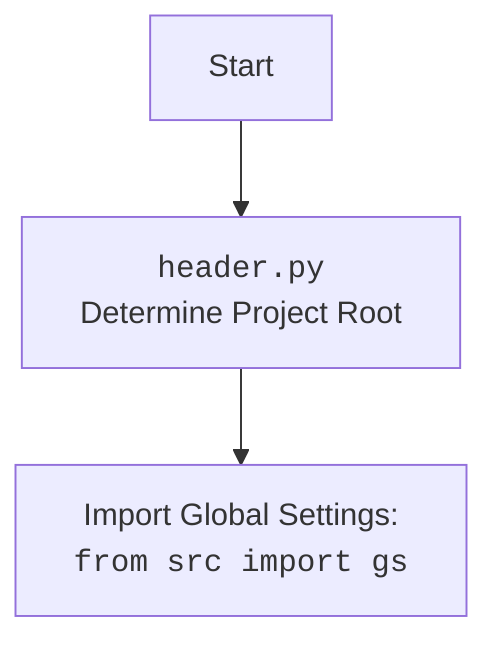

# Проект `hypotez`
# Роль `code explainer`
## <алгоритм>

1.  **Функция `set_project_root`**:
    *   Начинает поиск корневого каталога проекта с каталога, в котором находится текущий файл.
    *   Проверяет наличие файлов-маркеров (по умолчанию `__root__` и `.git`) в текущем каталоге и его родительских каталогах.
    *   Если один из маркеров найден, устанавливает родительский каталог в качестве корневого каталога.
    *   Добавляет корневой каталог в `sys.path`, если он еще не добавлен.
    *   Возвращает путь к корневому каталогу.

    ```python
    # Пример использования функции set_project_root
    root_path = set_project_root()
    print(f"Root path: {root_path}")
    ```

2.  **Определение `__root__`**:
    *   Вызывает `set_project_root` для определения корневого каталога проекта.
    *   Сохраняет путь к корневому каталогу в переменной `__root__`.

    ```python
    # Определение __root__
    __root__: Path = set_project_root()
    print(f"Project root: {__root__}")
    ```

3.  **Импорт `gs`**:
    *   Импортирует модуль `gs` из пакета `src`.
    *   Предполагается, что модуль `gs` содержит глобальные настройки проекта.

    ```python
    # Импорт gs
    from src import gs
    print(f"Imported gs: {gs}")
    ```

4.  **Загрузка настроек из `settings.json`**:
    *   Пытается открыть файл `settings.json`, расположенный в каталоге `src` внутри корневого каталога.
    *   Загружает содержимое файла как словарь `settings`.
    *   Обрабатывает исключения `FileNotFoundError` и `json.JSONDecodeError`, если файл не найден или содержит некорректный JSON.

    ```python
    # Загрузка настроек
    settings: dict = None
    try:
        with open(gs.path.root / 'src' / 'settings.json', 'r') as settings_file:
            settings = json.load(settings_file)
        print(f"Settings: {settings}")
    except (FileNotFoundError, json.JSONDecodeError) as e:
        print(f"Error loading settings: {e}")
    ```

5.  **Чтение документации из `README.MD`**:
    *   Пытается открыть файл `README.MD`, расположенный в каталоге `src` внутри корневого каталога.
    *   Читает содержимое файла в строку `doc_str`.
    *   Обрабатывает исключения `FileNotFoundError` и `json.JSONDecodeError`, если файл не найден.

    ```python
    # Чтение документации
    doc_str: str = None
    try:
        with open(gs.path.root / 'src' / 'README.MD', 'r') as settings_file:
            doc_str = settings_file.read()
        print(f"Documentation: {doc_str[:100]}...")  # Вывод первых 100 символов
    except (FileNotFoundError, json.JSONDecodeError) as e:
        print(f"Error loading documentation: {e}")
    ```

6.  **Определение глобальных переменных**:
    *   Инициализирует глобальные переменные проекта, такие как `__project_name__`, `__version__`, `__doc__`, `__author__`, `__copyright__` и `__cofee__`.
    *   Значения переменных берутся из словаря `settings`, если он был успешно загружен, в противном случае используются значения по умолчанию.

    ```python
    # Определение глобальных переменных
    __project_name__ = settings.get("project_name", 'hypotez') if settings else 'hypotez'
    __version__: str = settings.get("version", '') if settings else ''
    print(f"Project name: {__project_name__}, Version: {__version__}")
    ```

## <mermaid>

```mermaid
flowchart TD
    Start --> FindRoot[Найти корневой каталог проекта]
    FindRoot --> CheckMarkers{Проверить маркерные файлы (__root__, .git)}
    CheckMarkers -- Да --> SetRoot[Установить корневой каталог]
    CheckMarkers -- Нет --> MoveUp[Перейти к родительскому каталогу]
    MoveUp --> CheckMarkers
    SetRoot --> AddToSysPath[Добавить корневой каталог в sys.path]
    AddToSysPath --> ImportGS[Импортировать модуль gs из src]
    ImportGS --> LoadSettings{Попытка загрузить settings.json}
    LoadSettings -- Успех --> ReadmeMD{Попытка прочитать README.MD}
    LoadSettings -- Ошибка --> ReadmeMD
    ReadmeMD -- Успех --> DefineGlobals[Определить глобальные переменные]
    ReadmeMD -- Ошибка --> DefineGlobals
    DefineGlobals --> End

```



**Объяснение зависимостей для первой диаграммы `mermaid`:**

*   `pathlib` (класс `Path`): Используется для работы с путями к файлам и каталогам.
*   `sys`: Используется для добавления корневого каталога проекта в `sys.path`.
*   `json`: Используется для загрузки данных из файла `settings.json`.

**Объяснение зависимостей для второй диаграммы `mermaid`:**

*   `src.gs`: `header.py` импортирует `gs` для получения доступа к глобальным настройкам и путям.

## <объяснение>

**Импорты**:

*   `sys`: Используется для работы с системными переменными и функциями, такими как добавление пути к проекту в `sys.path`.
*   `json`: Используется для работы с данными в формате JSON, например, для чтения файла настроек `settings.json`.
*   `packaging.version.Version`: Используется для сравнения версий программного обеспечения. В данном коде явно не используется, но импортирован, возможно, для дальнейшего использования.
*   `pathlib.Path`: Используется для представления путей к файлам и каталогам в виде объектов. Это упрощает работу с файловой системой.

**Классы**:

*   `Path` (из `pathlib`): Представляет путь к файлу или каталогу. Используется для определения корневого каталога проекта и путей к файлам настроек и документации.

**Функции**:

*   `set_project_root(marker_files: tuple = ('__root__', '.git')) -> Path`:
    *   **Аргументы**:
        *   `marker_files` (tuple): Кортеж с именами файлов или каталогов, которые используются для определения корневого каталога проекта. По умолчанию `('__root__', '.git')`.
    *   **Возвращаемое значение**:
        *   `Path`: Путь к корневому каталогу проекта.
    *   **Назначение**:
        *   Функция определяет корневой каталог проекта, начиная с текущего файла, и ищет вверх по дереву каталогов до тех пор, пока не найдет один из маркерных файлов или каталогов.
        *   Добавляет найденный корневой каталог в `sys.path`, чтобы обеспечить возможность импорта модулей из этого каталога.
    *   **Пример**:
        ```python
        root_path = set_project_root()
        print(root_path)  # Выводит путь к корневому каталогу проекта
        ```

**Переменные**:

*   `__root__` (Path): Путь к корневому каталогу проекта.
*   `settings` (dict): Словарь с настройками проекта, загруженный из файла `settings.json`.
*   `doc_str` (str): Строка с содержимым файла `README.MD`.
*   `__project_name__` (str): Название проекта.
*   `__version__` (str): Версия проекта.
*   `__doc__` (str): Документация проекта.
*   `__details__` (str): Детали проекта (в данном коде не инициализирована).
*   `__author__` (str): Автор проекта.
*   `__copyright__` (str): Информация об авторских правах.
*   `__cofee__` (str): Сообщение с предложением угостить разработчика кофе.

**Потенциальные ошибки и области для улучшения**:

*   **Обработка исключений**: Обработка исключений `FileNotFoundError` и `json.JSONDecodeError` выполняется с использованием `...`, что не является хорошей практикой. Необходимо добавить логирование ошибок, чтобы можно было отслеживать проблемы.
*   **Отсутствие обработки исключений при импорте `gs`**: Если модуль `gs` не существует или возникает ошибка при его импорте, это может привести к сбою программы. Необходимо добавить обработку исключений для импорта `gs`.
*   **Использование `get` без значений по умолчанию**: При обращении к словарю `settings` с помощью метода `get` всегда указывается значение по умолчанию. Это предотвращает возникновение исключения `KeyError`, если ключ отсутствует в словаре.
*   **Отсутствие логирования**: В коде отсутствует логирование. Необходимо добавить логирование для отслеживания работы программы, особенно при возникновении ошибок.

**Взаимосвязи с другими частями проекта**:

*   `gs` (global settings): Модуль `gs` содержит глобальные настройки проекта, такие как пути к различным каталогам. Он используется для определения местоположения файлов `settings.json` и `README.MD`.
*   `settings.json`: Файл `settings.json` содержит настройки проекта, такие как название, версия, автор и информация об авторских правах.
*   `README.MD`: Файл `README.MD` содержит документацию проекта.

**Пример улучшения с логированием:**

```python
import sys
import json
from packaging.version import Version
from pathlib import Path
from src.logger.logger import logger # Import logger
def set_project_root(marker_files=('__root__', '.git')) -> Path:
    """
    Finds the root directory of the project starting from the current file's directory,
    searching upwards and stopping at the first directory containing any of the marker files.

    Args:
        marker_files (tuple): Filenames or directory names to identify the project root.
    
    Returns:
        Path: Path to the root directory if found, otherwise the directory where the script is located.
    """
    __root__:Path
    current_path:Path = Path(__file__).resolve().parent
    __root__ = current_path
    for parent in [current_path] + list(current_path.parents):
        if any((parent / marker).exists() for marker in marker_files):
            __root__ = parent
            break
    if __root__ not in sys.path:
        sys.path.insert(0, str(__root__))
    return __root__


# Get the root directory of the project
__root__: Path = set_project_root()
"""__root__ (Path): Path to the root directory of the project"""

from src import gs

settings:dict = None
try:
    with open(gs.path.root / 'src' /  'settings.json', 'r') as settings_file:
        settings = json.load(settings_file)
except (FileNotFoundError, json.JSONDecodeError) as e:
    logger.error(f'Error while loading settings.json: {e}', exc_info=True)

doc_str:str = None
try:
    with open(gs.path.root / 'src' /  'README.MD', 'r') as settings_file:
        doc_str = settings_file.read()
except (FileNotFoundError, json.JSONDecodeError) as e:
    logger.error(f'Error while loading README.MD: {e}', exc_info=True)


__project_name__ = settings.get("project_name", 'hypotez') if settings  else 'hypotez'
__version__: str = settings.get("version", '')  if settings  else ''
__doc__: str = doc_str if doc_str else ''
__details__: str = ''
__author__: str = settings.get("author", '')  if settings  else ''
__copyright__: str = settings.get("copyrihgnt", '')  if settings  else ''
__cofee__: str = settings.get("cofee", "Treat the developer to a cup of coffee for boosting enthusiasm in development: https://boosty.to/hypo69")  if settings  else "Treat the developer to a cup of coffee for boosting enthusiasm in development: https://boosty.to/hypo69"