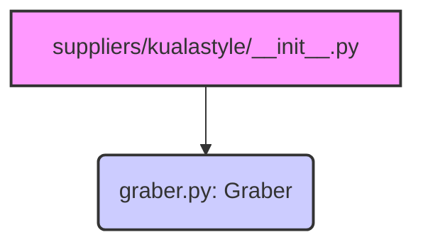

### **Анализ кода `hypotez/src/suppliers/kualastyle/__init__.py`**

#### **1. <алгоритм>**:

1.  **Импорт `Graber`**: Импортирует класс `Graber` из модуля `.graber`. Этот класс, вероятно, отвечает за сбор данных с определенного источника (сайта kualastyle).

    ```python
    from .graber import Graber
    ```

#### **2. <mermaid>**:



**Объяснение `mermaid`:**

*   Диаграмма показывает, что модуль `__init__.py` в пакете `kualastyle` импортирует класс `Graber` из модуля `graber.py`. Это означает, что функциональность, определенная в `Graber`, становится доступной через пакет `kualastyle`.

#### **3. <объяснение>**:

*   **Импорты**:
    *   `from .graber import Graber`: Импортирует класс `Graber` из модуля `graber.py`, находящегося в той же директории (`.`).  `Graber` предположительно является основным классом, отвечающим за парсинг и обработку данных с сайта kualastyle.
*   **Классы**:
    *   `Graber`: Ожидается, что класс `Graber` содержит логику для сбора и обработки данных с сайта kualastyle.  Детали реализации находятся в файле `graber.py`.
*   **Файл `__init__.py`**:
    *   Файл `__init__.py` используется для обозначения директории `kualastyle` как пакета Python.  Импорт `Graber` в `__init__.py` делает этот класс доступным для импорта непосредственно из пакета `kualastyle`.

```python
from src import gs
```

Отсутствует в исходном коде.

**Вывод:**

Файл `__init__.py` в пакете `kualastyle` импортирует класс `Graber` из модуля `graber.py`.  Это позволяет использовать `Graber` через пакет `kualastyle`.  Более подробная информация о функциональности `Graber` находится в файле `graber.py`.