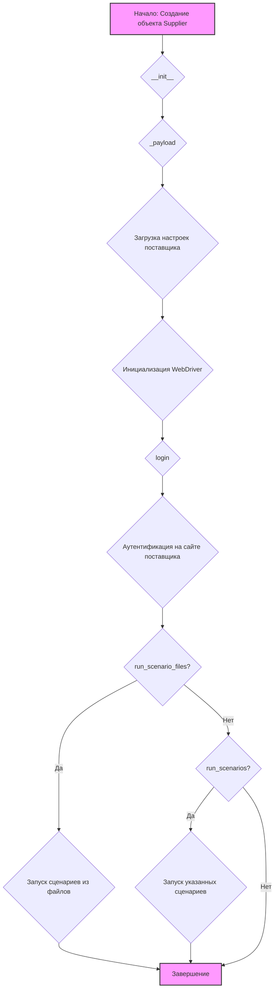
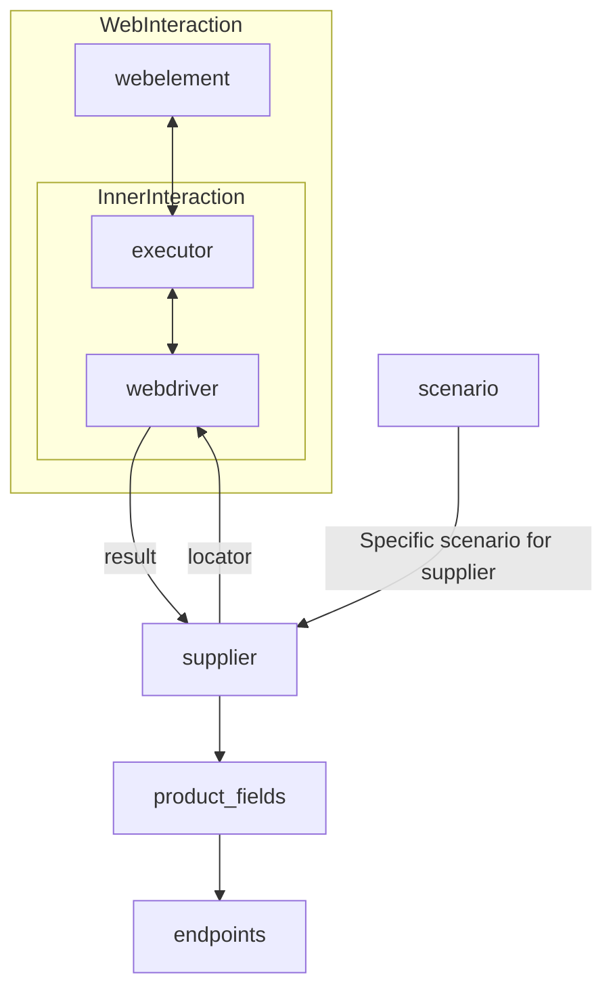
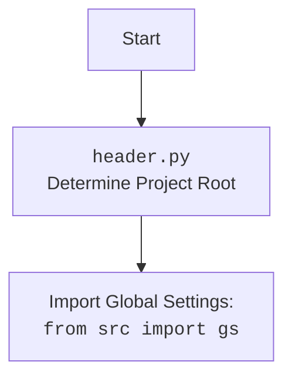

# Анализ кода `suppliers/readme.md`

## 1. <алгоритм>

###  Блок-схема работы класса `Supplier`

**Примеры работы каждого блока:**

1.  **Начало: Создание объекта Supplier**
    *   Пример: `supplier = Supplier(supplier_prefix='aliexpress', locale='en', webdriver='chrome')`
    *   Создается объект класса `Supplier` для поставщика `aliexpress` с английской локализацией и драйвером `chrome`.

2.  `__init__`: Метод инициализирует основные атрибуты поставщика, такие как `supplier_prefix`, `locale` и `webdriver`.

3.  `_payload`:
    *   Загружает настройки поставщика из соответствующего JSON файла.
    *   Инициализирует `locators` (словарь локаторов веб-элементов).
    *   Создает экземпляр `WebDriver`, если не передан напрямую.
    *   Пример: `supplier._payload(webdriver='firefox')` — загружает настройки и инициализирует `WebDriver` для `firefox`.

4.  `login`:
    *   Аутентифицируется на сайте поставщика, используя сохраненные данные для входа.
    *   Пример: `supplier.login()` — выполняет вход на сайт.

5.  `run_scenario_files`:
    *   Запускает сценарии, описанные в файлах JSON, для выполнения конкретных действий (например, парсинг данных со страницы, добавление товара в корзину).
    *   Пример: `supplier.run_scenario_files(['scenario1.json', 'scenario2.json'])` — запускает сценарии из файлов.

6. `run_scenarios`:
   * Запускает сценарии, переданные в виде словаря или списка словарей, для выполнения конкретных действий.
   * Пример: `supplier.run_scenarios([{'action': 'scrape', 'target': 'product_list'}])` – запускает сценарий парсинга списка товаров.

7. Завершение: Завершение работы поставщика.

**Поток данных:**
*   **Создание объекта `Supplier`:**  `supplier_prefix`, `locale`, `webdriver` → `Supplier.__init__()`
*   **Загрузка настроек:** `webdriver` → `Supplier._payload()` → `supplier_settings`, `locators`, `driver`
*   **Аутентификация:** `login_data` → `Supplier.login()`
*   **Выполнение сценариев:** `scenario_files` или `scenarios` → `Supplier.run_scenario_files()`/`Supplier.run_scenarios()` → `driver` (для веб-драйвера) → Результаты выполнения

## 2. <mermaid>

### Диаграмма зависимостей

**Объяснение зависимостей:**

1.  **`webelement`**: Представляет HTML-элементы на веб-странице, с которыми взаимодействует WebDriver.
2.  **`executor`**: Управляет выполнением команд WebDriver, таких как поиск элементов, клики и ввод текста.
3.  **`webdriver`**: Интерфейс для управления веб-браузером, предоставляемый драйверами браузеров (Chrome, Firefox и т.д.).
4. **`supplier`**: Основной класс, который управляет взаимодействием с конкретным поставщиком. Он использует `webdriver` для доступа к сайту поставщика.
5.  **`result`**: Данные, полученные от `webdriver` после выполнения действий. Эти данные передаются в `supplier` для дальнейшей обработки.
6.  **`locator`**: Способ поиска элементов на веб-странице (например, XPath, CSS-селектор). `supplier` передает их в `webdriver` для нахождения нужных элементов.
7. **`product_fields`**: Данные о продукте, которые необходимо извлечь из веб-страницы.
8. **`endpoints`**: Конечные точки API, которые могут использоваться для получения информации о продуктах.
9. **`scenario`**: Описывает действия (например, посещение страниц, поиск товаров) и порядок их выполнения для конкретного поставщика.

### `header.py` (не указано в коде, но подразумевается как часть проекта)

**Объяснение `header.py`:**

1.  **Start**: Начало процесса загрузки.
2.  **Header**: Модуль `header.py` определяет корень проекта.
3.  **Import**: Из `header.py` импортируется `gs` из пакета `src` для доступа к глобальным настройкам проекта.

## 3. <объяснение>

### Импорты

*   **В данном файле импортов нет**. Однако, подразумевается, что класс `Supplier` использует модули и классы из других частей проекта.

### Класс `Supplier`

*   **Роль:** Базовый класс для управления поставщиками данных. Предоставляет унифицированный интерфейс для взаимодействия с различными источниками данных (сайтами, API и т.д.).
*   **Атрибуты:**
    *   `supplier_id` (int): Уникальный идентификатор поставщика.
    *   `supplier_prefix` (str): Префикс поставщика (например, `'amazon'`, `'aliexpress'`).
    *   `supplier_settings` (dict): Настройки поставщика, загруженные из JSON файла.
    *   `locale` (str): Локализация (например, `'en'`).
    *   `price_rule` (str): Правила расчета цен (например, правила НДС).
    *   `related_modules` (module): Модули-помощники для операций поставщика.
    *   `scenario_files` (list): Список файлов со сценариями.
    *   `current_scenario` (dict): Текущий выполняемый сценарий.
    *   `login_data` (dict): Данные для аутентификации.
    *   `locators` (dict): Словарь локаторов веб-элементов.
    *   `driver` (`Driver`): Экземпляр `WebDriver` для взаимодействия с сайтом поставщика.
    *   `parsing_method` (str): Метод парсинга данных (`'webdriver'`, `'api'`, `'xls'`, `'csv'`).

*   **Методы:**
    *   `__init__`: Конструктор класса, инициализирующий основные атрибуты. Принимает `supplier_prefix` (обязательный) и `locale`, `webdriver` (опциональные) аргументы.
    *   `_payload`: Загружает настройки поставщика и инициализирует `WebDriver`.
    *   `login`: Выполняет аутентификацию на сайте поставщика.
    *   `run_scenario_files`: Запускает сценарии из указанных файлов.
    *   `run_scenarios`: Выполняет заданные сценарии (представлены в виде словаря или списка словарей).
    *  `_payload`, `login`, `run_scenario_files`, `run_scenarios` - **возвращают** `bool`, указывающий на успешность выполнения операций.

*   **Взаимодействие:**
    *   `Supplier` взаимодействует с классами `Driver` и `Scenario`, а также с другими модулями и классами проекта.
    *   Загружает настройки из JSON файлов.
    *   Использует `WebDriver` для навигации по веб-сайтам.
    *   Выполняет сценарии с использованием `Scenario`.
    *   Имеет доступ к глобальным настройкам через `gs`.

### Функции

*   **`__init__`:** Инициализирует объект `Supplier`, устанавливая атрибуты, необходимые для работы с конкретным поставщиком.
*   **`_payload`:** Отвечает за загрузку конфигурации поставщика и создание или использование экземпляра `WebDriver`.
*   **`login`:** Обеспечивает аутентификацию на сайте поставщика.
*   **`run_scenario_files`:** Запускает последовательность сценариев, определенных в файлах JSON.
*   **`run_scenarios`:** Запускает последовательность сценариев, переданных в виде словаря или списка словарей.

### Переменные

*   Атрибуты класса `Supplier`, как описано выше.
*   Локальные переменные внутри методов, которые могут содержать экземпляры `Driver`, данные конфигурации и результаты выполнения сценариев.

### Потенциальные ошибки и области для улучшения

*   **Отсутствие обработки ошибок**: Код не содержит явной обработки ошибок, таких как неудачная загрузка настроек, неудачная аутентификация или проблемы с выполнением сценариев. Это может привести к неожиданным сбоям.
*   **Жёсткая зависимость от `WebDriver`**: Код предполагает работу с веб-сайтами, используя `WebDriver`. Это может ограничить использование класса для поставщиков данных, не имеющих веб-интерфейса.
*   **Отсутствие валидации**: Нет явной валидации входных данных, таких как `supplier_prefix`, `locale`, `webdriver`. Это может привести к ошибкам при создании экземпляра `Supplier`.
*   **Общая логика аутентификации:** Метод `login` реализован как заглушка. Логика аутентификации должна быть специфичной для каждого поставщика и вынесена в отдельные методы или классы.

### Взаимосвязи с другими частями проекта

*   **`Driver`**: `Supplier` создает и использует экземпляры `Driver` для взаимодействия с браузером.
*   **`Scenario`**: Использует экземпляры `Scenario` для выполнения действий на сайте поставщика.
*   **JSON файлы настроек**: Используются для загрузки конфигурации поставщика, локаторов и сценариев.
*   **`src.gs`**: Используется для доступа к глобальным настройкам проекта (предположительно).

### Дополнительно

*   Класс `Supplier` спроектирован как основа для расширения. Новые поставщики могут быть добавлены путем создания подклассов `Supplier` и реализации необходимых методов.
*   Описание содержит подробные комментарии, облегчающие понимание кода.
*   Присутствует Markdown оформление, делающее документ читаемым.