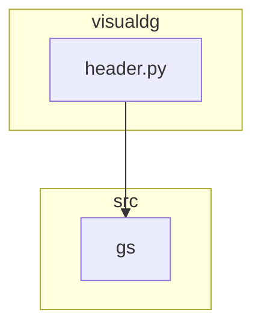

## Анализ кода `hypotez/src/suppliers/visualdg/header.py`

### 1. <алгоритм>

1.  **`set_project_root(marker_files=('__root__', '.git'))`**:
    *   Начинает поиск корневой директории проекта с директории текущего файла.
    *   Проверяет наличие файлов-маркеров (`__root__`, `.git`) в текущей и родительских директориях.
    *   Если маркер найден, устанавливает родительскую директорию в качестве корневой.
    *   Добавляет корневую директорию в `sys.path`, если её там нет.

    ```python
    # Пример:
    # Если файл находится в /path/to/project/src/suppliers/visualdg/header.py
    # и в /path/to/project есть файл .git, то __root__ будет /path/to/project
    __root__ = set_project_root()
    ```

2.  **Определение `__root__`**:
    *   Вызывает `set_project_root()` для определения корневой директории проекта.
    *   Сохраняет результат в переменной `__root__`.

    ```python
    # Пример:
    # __root__ = Path('/path/to/project')
    __root__: Path = set_project_root()
    ```

3.  **Импорт `src.gs`**:
    *   Импортирует модуль `gs` из пакета `src`.

    ```python
    # Пример:
    # from src import gs
    # gs содержит глобальные настройки проекта
    from src import gs
    ```

4.  **Загрузка настроек из `settings.json`**:
    *   Пытается открыть и прочитать файл `settings.json` из директории `src` в корне проекта.
    *   Если файл найден и успешно прочитан, загружает настройки в словарь `settings`.
    *   Обрабатывает исключения `FileNotFoundError` и `json.JSONDecodeError`, если файл не найден или содержит некорректный JSON.

    ```python
    # Пример:
    # Если settings.json содержит {"project_name": "hypotez", "version": "1.0.0"},
    # то settings будет {"project_name": "hypotez", "version": "1.0.0"}
    settings: dict = None
    try:
        with open(gs.path.root / 'src' / 'settings.json', 'r') as settings_file:
            settings = json.load(settings_file)
    except (FileNotFoundError, json.JSONDecodeError):
        ...
    ```

5.  **Чтение документации из `README.MD`**:
    *   Пытается открыть и прочитать файл `README.MD` из директории `src` в корне проекта.
    *   Если файл найден и успешно прочитан, сохраняет содержимое в строку `doc_str`.
    *   Обрабатывает исключения `FileNotFoundError` и `json.JSONDecodeError`, если файл не найден или содержит некорректный JSON.

    ```python
    # Пример:
    # Если README.MD содержит "# Hypotez",
    # то doc_str будет "# Hypotez"
    doc_str: str = None
    try:
        with open(gs.path.root / 'src' / 'README.MD', 'r') as settings_file:
            doc_str = settings_file.read()
    except (FileNotFoundError, json.JSONDecodeError):
        ...
    ```

6.  **Определение глобальных переменных проекта**:
    *   Определяет глобальные переменные проекта, такие как `__project_name__`, `__version__`, `__doc__`, `__author__`, `__copyright__`, `__cofee__`.
    *   Значения переменных берутся из словаря `settings`, если он был успешно загружен.
    *   Если `settings` не был загружен, используются значения по умолчанию.

    ```python
    # Пример:
    # Если settings = {"project_name": "hypotez", "version": "1.0.0"},
    # то __project_name__ будет "hypotez", а __version__ будет "1.0.0"
    __project_name__ = settings.get("project_name", 'hypotez') if settings else 'hypotez'
    __version__: str = settings.get("version", '') if settings else ''
    ```

### 2. <mermaid>

```mermaid
flowchart TD
    Start --> SetProjectRoot[<code>set_project_root</code><br>Determine Project Root]

    SetProjectRoot --> FindMarkerFiles[Find marker files <br>(<code>__root__</code>, <code>.git</code>)]
    FindMarkerFiles --> CheckExistence[Check if any marker file exists in parent directories]
    CheckExistence -- Yes --> SetRootDirectory[Set parent directory as root directory]
    CheckExistence -- No --> ContinueSearch[Continue searching in parent directories]
    ContinueSearch --> EndSetProjectRoot
    SetRootDirectory --> EndSetProjectRoot
    EndSetProjectRoot --> AddToSysPath[Add root directory to <code>sys.path</code> if not present]
    AddToSysPath --> End[End <code>set_project_root</code>]

    End --> ImportGS[Import Global Settings: <br><code>from src import gs</code>]
    ImportGS --> LoadSettings[Load settings from <code>settings.json</code>]
    LoadSettings -- Success --> SetProjectVariables[Set project variables from settings]
    LoadSettings -- Fail --> SetDefaultProjectVariables[Set default project variables]

    SetProjectVariables --> SetDocString[Load documentation string from <code>README.MD</code>]
    SetDefaultProjectVariables --> SetDocString

    SetDocString -- Success --> EndHeader[End <code>header.py</code>]
    SetDocString -- Fail --> EndHeader

    style Start fill:#f9f,stroke:#333,stroke-width:2px
    style End fill:#ccf,stroke:#333,stroke-width:2px
    style EndHeader fill:#ccf,stroke:#333,stroke-width:2px
```

**Объяснение диаграммы:**

*   **`set_project_root`**: Функция определяет корневую директорию проекта, начиная поиск с директории текущего файла.
*   **`FindMarkerFiles`**:  Поиск файлов-маркеров (`__root__`, `.git`) в текущей и родительских директориях.
*   **`CheckExistence`**: Проверяет наличие файлов-маркеров.
*   **`SetRootDirectory`**: Устанавливает родительскую директорию в качестве корневой, если маркер найден.
*   **`ContinueSearch`**: Продолжает поиск в родительских директориях.
*   **`AddToSysPath`**: Добавляет корневую директорию в `sys.path`, если её там нет.
*   **`ImportGS`**: Импортирует модуль `gs` из пакета `src`.
*   **`LoadSettings`**: Пытается загрузить настройки из файла `settings.json`.
*   **`SetProjectVariables`**: Устанавливает значения переменных проекта из файла настроек, если он успешно загружен.
*   **`SetDefaultProjectVariables`**: Устанавливает значения переменных проекта по умолчанию, если файл настроек не найден или не может быть прочитан.
*   **`SetDocString`**: Пытается загрузить строку документации из файла `README.MD`.
*   **`EndHeader`**: Завершает выполнение скрипта `header.py`.

### 3. <объяснение>

#### Импорты:

*   **`sys`**: Предоставляет доступ к некоторым переменным и функциям, взаимодействующим с интерпретатором Python. Используется для добавления корневой директории проекта в `sys.path`.
*   **`json`**: Используется для работы с данными в формате JSON. Применяется для чтения файла `settings.json`.
*   **`packaging.version.Version`**: Используется для работы с версиями пакетов.
*   **`pathlib.Path`**: Предоставляет способ представления путей к файлам и директориям. Используется для работы с путями к файлам `settings.json` и `README.MD`.

#### Классы:

*   Нет классов.

#### Функции:

*   **`set_project_root(marker_files=('__root__', '.git')) -> Path`**:
    *   **Аргументы**:
        *   `marker_files` (tuple): Кортеж с именами файлов или директорий, которые идентифицируют корневую директорию проекта. По умолчанию `('__root__', '.git')`.
    *   **Возвращаемое значение**:
        *   `Path`: Путь к корневой директории проекта.
    *   **Назначение**:
        *   Находит корневую директорию проекта, начиная с директории текущего файла и двигаясь вверх по дереву директорий. Останавливается при обнаружении одного из файлов-маркеров. Добавляет корневую директорию в `sys.path`, если её там нет.
    *   **Пример**:

        ```python
        # Если файл находится в /path/to/project/src/suppliers/visualdg/header.py
        # и в /path/to/project есть файл .git, то set_project_root() вернет Path('/path/to/project')
        root_path = set_project_root()
        print(root_path)
        # Вывод: /path/to/project
        ```

#### Переменные:

*   **`__root__`**:
    *   Тип: `Path`
    *   Использование: Путь к корневой директории проекта.
*   **`settings`**:
    *   Тип: `dict | None`
    *   Использование: Словарь с настройками проекта, загруженными из файла `settings.json`.
*   **`doc_str`**:
    *   Тип: `str | None`
    *   Использование: Строка с содержимым файла `README.MD`.
*   **`__project_name__`**:
    *   Тип: `str`
    *   Использование: Название проекта.
*   **`__version__`**:
    *   Тип: `str`
    *   Использование: Версия проекта.
*   **`__doc__`**:
    *   Тип: `str`
    *   Использование: Описание проекта, взятое из `README.MD`.
*   **`__author__`**:
    *   Тип: `str`
    *   Использование: Автор проекта.
*   **`__copyright__`**:
    *   Тип: `str`
    *   Использование: Информация об авторских правах.
*   **`__cofee__`**:
    *   Тип: `str`
    *   Использование: Сообщение с предложением угостить разработчика кофе.

#### Потенциальные ошибки и области для улучшения:

*   Обработка исключений `FileNotFoundError` и `json.JSONDecodeError` в блоках `try...except` просто пропускает ошибку (`...`). Было бы лучше логировать эти ошибки с использованием модуля `logger` из `src.logger.logger`.
*   Использование `settings.get` с значениями по умолчанию может привести к трудностям при отладке, если значение в `settings.json` отсутствует. Возможно, стоит добавить проверку на наличие ключей в словаре `settings` и логировать предупреждение, если ключ отсутствует.
*   В коде присутствует опечатка `copyrihgnt` вместо `copyright`.

#### Взаимосвязи с другими частями проекта:

*   Файл `header.py` используется для определения корневой директории проекта и загрузки глобальных настроек. Он является важной частью проекта, так как предоставляет информацию о проекте, такую как название, версия, автор и описание.
*   Модуль `gs` (global settings) используется для хранения путей к файлам и директориям проекта. Он импортируется для получения доступа к корневой директории проекта.
*   Файл `settings.json` содержит настройки проекта, которые используются для определения значений глобальных переменных.
*   Файл `README.MD` содержит документацию проекта, которая используется для определения значения переменной `__doc__`.


```python
#Улучшенный код
## \file /src/suppliers/visualdg/header.py
# -*- coding: utf-8 -*-

#! .pyenv/bin/python3

"""
.. module:: src.suppliers.visualdg 
	:platform: Windows, Unix
	:synopsis:

"""


import sys
import json
from packaging.version import Version

from pathlib import Path
from typing import Optional


def set_project_root(marker_files: tuple[str, ...] = ('__root__', '.git')) -> Path:
    """
    Finds the root directory of the project starting from the current file's directory,
    searching upwards and stopping at the first directory containing any of the marker files.

    Args:
        marker_files (tuple): Filenames or directory names to identify the project root.
    
    Returns:
        Path: Path to the root directory if found, otherwise the directory where the script is located.
    """
    __root__: Path
    current_path: Path = Path(__file__).resolve().parent
    __root__ = current_path
    for parent in [current_path] + list(current_path.parents):
        if any((parent / marker).exists() for marker in marker_files):
            __root__ = parent
            break
    if __root__ not in sys.path:
        sys.path.insert(0, str(__root__))
    return __root__


# Get the root directory of the project
__root__: Path = set_project_root()
"""__root__ (Path): Path to the root directory of the project"""

from src import gs
from src.logger import logger  # Import the logger

settings: dict = None
try:
    with open(gs.path.root / 'src' / 'settings.json', 'r') as settings_file:
        settings = json.load(settings_file)
except (FileNotFoundError, json.JSONDecodeError) as e:
    logger.error(f'Error loading settings.json: {e}', exc_info=True)


doc_str: str = None
try:
    with open(gs.path.root / 'src' / 'README.MD', 'r') as settings_file:
        doc_str = settings_file.read()
except (FileNotFoundError, json.JSONDecodeError) as e:
    logger.error(f'Error loading README.MD: {e}', exc_info=True)


__project_name__ = settings.get('project_name', 'hypotez') if settings else 'hypotez'
__version__: str = settings.get('version', '') if settings else ''
__doc__: str = doc_str if doc_str else ''
__details__: str = ''
__author__: str = settings.get('author', '') if settings else ''
__copyright__: str = settings.get('copyright', '') if settings else ''  # Fixed typo here
__cofee__: str = settings.get(
    'cofee', 'Treat the developer to a cup of coffee for boosting enthusiasm in development: https://boosty.to/hypo69'
) if settings else 'Treat the developer to a cup of coffee for boosting enthusiasm in development: https://boosty.to/hypo69'
```
**Изменения:**
*   Добавлен импорт `logger` из `src.logger`.
*   Добавлено логирование ошибок при загрузке `settings.json` и `README.MD`.
*   Исправлена опечатка `copyrihgnt` на `copyright`.
*   Добавлена аннотация типов `Optional` для `marker_files` в функции `set_project_root`.