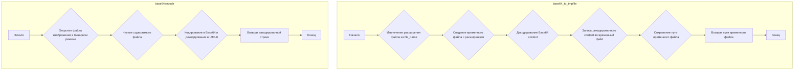

## Анализ кода `hypotez/src/utils/convertors/base64.py`

### 1. <алгоритм>

**Функция `base64_to_tmpfile`**

1.  **Начало**: Функция принимает на вход `content` (Base64 строка) и `file_name` (имя файла для определения расширения).
2.  **Извлечение расширения**: Из `file_name` извлекается расширение файла с помощью `os.path.splitext(file_name)`.
    *   Пример: Если `file_name` равен "example.txt", то `ext` будет ".txt".
3.  **Создание временного файла**: Создается временный файл с помощью `tempfile.NamedTemporaryFile`. Важно: `delete=False`, чтобы файл не удалялся сразу после закрытия. Расширением временного файла будет `ext`.
    *   Пример: Если `ext` равен ".txt", то временный файл будет иметь расширение .txt.
4.  **Декодирование и запись**: `content` декодируется из Base64 с помощью `base64.b64decode(content)` и записывается во временный файл.
    *   Пример: Если `content` равен "SGVsbG8gd29ybGQh", то в файл будет записано "Hello world!".
5.  **Сохранение пути**: Полный путь к созданному временному файлу сохраняется в переменную `path`.
6.  **Возврат пути**: Функция возвращает `path`.
7.  **Конец**

**Функция `base64encode`**

1. **Начало**: Функция принимает на вход `image_path` (путь к изображению).
2. **Открытие файла**: Открывается файл изображения в бинарном режиме для чтения (`"rb"`).
3. **Кодирование Base64**: Считывается содержимое файла и кодируется в Base64 с помощью `base64.b64encode()`. Результат декодируется в строку UTF-8.
4. **Возврат закодированной строки**: Функция возвращает закодированную строку Base64.
5. **Конец**

### 2. <mermaid>

**Объяснение зависимостей:**

*   `base64`: Этот модуль используется для кодирования и декодирования данных в формат Base64. В функции `base64_to_tmpfile` он используется для декодирования входной строки `content`, а в `base64encode` для кодирования изображения.
*   `tempfile`: Этот модуль используется для создания временных файлов и каталогов. В функции `base64_to_tmpfile` он используется для создания временного файла, в который записывается декодированное содержимое.
*   `os`: Этот модуль предоставляет функции для взаимодействия с операционной системой. В функции `base64_to_tmpfile` он используется для извлечения расширения файла из имени файла.

### 3. <объяснение>

**Импорты:**

*   `base64`: Используется для кодирования и декодирования данных в формат Base64.
*   `tempfile`: Используется для создания временных файлов и каталогов. Это позволяет избежать конфликтов имен файлов и автоматически удалять файлы после использования.
*   `os`: Предоставляет функции для взаимодействия с операционной системой, такие как работа с путями к файлам.

**Функции:**

*   `base64_to_tmpfile(content: str, file_name: str) -> str`:
    *   Аргументы:
        *   `content` (str): Base64 закодированная строка, которую нужно декодировать и записать в файл.
        *   `file_name` (str): Имя файла, которое используется для получения расширения временного файла.
    *   Возвращаемое значение:
        *   `str`: Путь к созданному временному файлу.
    *   Назначение:
        *   Декодирует Base64 строку и записывает ее в новый временный файл с определенным расширением. Это полезно, когда нужно обработать Base64 данные как файл.
    *   Пример:
        *   Если `content` содержит Base64 представление изображения, а `file_name` - "image.png", то функция создаст временный PNG файл с декодированным содержимым.
*   `base64encode(image_path)`:
    *   Аргументы:
        *   `image_path` (str): Путь к файлу изображения, которое нужно закодировать.
    *   Возвращаемое значение:
        *   `str`: Base64 закодированная строка содержимого изображения.
    *   Назначение:
        *   Кодирует содержимое файла изображения в строку Base64.

**Переменные:**

*   `content`: Base64 закодированная строка, которую нужно декодировать.
*   `file_name`: Имя файла, используемое для определения расширения временного файла.
*   `ext`: Расширение файла, извлеченное из `file_name`.
*   `tmp`: Объект временного файла, созданный с помощью `tempfile.NamedTemporaryFile`.
*   `path`: Путь к созданному временному файлу.
*   `image_path`: Путь к файлу изображения для кодирования.

**Потенциальные ошибки и области для улучшения:**

*   **Обработка ошибок**: В коде отсутствует явная обработка ошибок. Например, если `base64.b64decode(content)` не сможет декодировать `content`, возникнет исключение.  Рекомендуется добавить блок `try...except` для обработки возможных исключений и логирования ошибок.
*   **Расширение файла**: Если `file_name` не содержит расширения, `os.path.splitext` вернет пустую строку. В этом случае временный файл будет создан без расширения, что может быть нежелательно.  Возможно, стоит добавить проверку на наличие расширения и задавать расширение по умолчанию, если оно отсутствует.
*   **Безопасность**:  Хранение временных файлов (с `delete=False`) может привести к проблемам с безопасностью, если их не удалять после использования.  Рекомендуется предусмотреть механизм для удаления временных файлов после их обработки, либо использовать менеджер контекста `tempfile.TemporaryDirectory` для автоматической очистки.

**Взаимосвязи с другими частями проекта:**

*   Этот модуль может использоваться в других частях проекта, где необходимо преобразовывать Base64 данные в файлы (например, для обработки изображений или других типов файлов, полученных в Base64 формате).  Он также может использоваться для кодирования файлов в Base64 для передачи или хранения.