### **Анализ кода `hypotez/src/utils/convertors/json.py`**

#### **1. <алгоритм>**:
Этот модуль предоставляет функции для преобразования JSON-данных в различные форматы: CSV, SimpleNamespace, XML и XLS.

1.  **`json2csv`**:
    *   Принимает JSON-данные (строка, список, словарь или путь к файлу) и путь к CSV-файлу.
    *   Определяет тип входных данных:
        *   Если это словарь, преобразует его в список, содержащий этот словарь.
        *   Если это строка, пытается распарсить JSON.
        *   Если это список, использует его как есть.
        *   Если это путь к файлу, открывает файл и загружает JSON из него.
        *   В противном случае вызывает исключение `ValueError`.
    *   Вызывает функцию `save_csv_file` из `src.utils.csv` для сохранения данных в CSV-файл.
    *   Обрабатывает возможные исключения при парсинге JSON или записи CSV, логируя ошибки.
    *   Возвращает `True` в случае успеха и `False` в случае неудачи.
    ```python
    # Пример работы с json2csv
    json_data = '[{"name": "John", "age": 30}, {"name": "Jane", "age": 25}]'
    csv_file_path = 'output.csv'
    result = json2csv(json_data, csv_file_path)
    print(f"json2csv result: {result}")
    ```

2.  **`json2ns`**:
    *   Принимает JSON-данные (строка, словарь или путь к файлу).
    *   Определяет тип входных данных аналогично `json2csv`.
    *   Создает объект `SimpleNamespace` из JSON-данных.
    *   Обрабатывает возможные исключения при парсинге JSON, логируя ошибки.
    *   Возвращает объект `SimpleNamespace`.
    ```python
    # Пример работы с json2ns
    json_data = '{"name": "John", "age": 30}'
    result = json2ns(json_data)
    print(f"json2ns result: {result}")
    print(f"json2ns name: {result.name}")
    ```

3.  **`json2xml`**:
    *   Принимает JSON-данные и необязательный корневой тег.
    *   Вызывает функцию `dict2xml` из `src.utils.convertors.dict` для преобразования JSON в XML.
    *   Возвращает XML-строку.
    ```python
    # Пример работы с json2xml
    json_data = '{"name": "John", "age": 30}'
    result = json2xml(json_data, root_tag="person")
    print(f"json2xml result: {result}")
    ```

4.  **`json2xls`**:
    *   Принимает JSON-данные и путь к XLS-файлу.
    *   Вызывает функцию `save_xls_file` из `src.utils.xls` для сохранения данных в XLS-файл.
    *   Возвращает `True` в случае успеха и `False` в случае неудачи.
    ```python
    # Пример работы с json2xls
    json_data = '[{"name": "John", "age": 30}, {"name": "Jane", "age": 25}]'
    xls_file_path = 'output.xls'
    result = json2xls(json_data, xls_file_path)
    print(f"json2xls result: {result}")
    ```

#### 2. **<mermaid>**:



```mermaid
flowchart TD
    subgraph json2csv
        A[JSON Data] --> B{Type Check}
        B -- Dict --> C[Convert to List]
        B -- String --> D[Parse JSON]
        B -- List --> E[Use Data]
        B -- Path --> F[Read JSON File]
        B -- Other --> G[Raise ValueError]
        C --> E
        D --> E
        F --> E
        E --> H[save_csv_file]
        H --> I{Success?}
        I -- Yes --> J[Return True]
        I -- No --> K[Log Error]
        K --> L[Return False]
        G --> K
    end

    subgraph json2ns
        M[JSON Data] --> N{Type Check}
        N -- Dict --> O[Use Data]
        N -- String --> P[Parse JSON]
        N -- Path --> Q[Read JSON File]
        N -- Other --> R[Raise ValueError]
        O --> S[Create SimpleNamespace]
        P --> S
        Q --> S
        R --> T[Log Error]
        S --> U[Return SimpleNamespace]
        T --> U
    end

    subgraph json2xml
        V[JSON Data] --> W[dict2xml]
        W --> X[Return XML String]
    end

    subgraph json2xls
        Y[JSON Data] --> Z[save_xls_file]
        Z --> AA{Success?}
        AA -- Yes --> BB[Return True]
        AA -- No --> CC[Log Error]
        CC --> DD[Return False]
    end
```

**Объяснение зависимостей:**

*   **`json2csv`**: Преобразует JSON в CSV, используя `save_csv_file` для сохранения. Зависит от `json.loads` для парсинга JSON из строки.
*   **`json2ns`**: Преобразует JSON в `SimpleNamespace`, используя `json.loads` для парсинга JSON из строки.
*   **`json2xml`**: Преобразует JSON в XML, используя `dict2xml`.
*   **`json2xls`**: Преобразует JSON в XLS, используя `save_xls_file`.

#### 3. **<объяснение>**:

*   **Импорты**:
    *   `json`: Используется для работы с JSON-данными (парсинг и сериализация).
    *   `csv`: Используется для работы с CSV-файлами.
    *   `types.SimpleNamespace`: Используется для создания объектов, к которым можно обращаться по атрибутам.
    *   `pathlib.Path`: Используется для работы с путями к файлам и директориям.
    *   `typing.List`, `typing.Dict`: Используются для аннотации типов.
    *   `src.utils.csv.save_csv_file`: Функция для сохранения данных в CSV-файл.
    *   `src.utils.jjson.j_dumps`: Функция для преобразования данных в JSON-строку.
    *   `src.utils.xls.save_xls_file`: Функция для сохранения данных в XLS-файл.
    *   `src.utils.convertors.dict.dict2xml`: Функция для преобразования словаря в XML-строку.
    *   `src.logger.logger.logger`: Объект логгера для записи информации о работе программы.
*   **Классы**:
    *   В данном коде классы не используются.
*   **Функции**:
    *   `json2csv(json_data: str | list | dict | Path, csv_file_path: str | Path) -> bool`:
        *   Аргументы:
            *   `json_data`: JSON-данные для преобразования (строка, список, словарь или путь к файлу).
            *   `csv_file_path`: Путь к CSV-файлу для записи.
        *   Возвращает: `True` в случае успеха, `False` в случае неудачи.
        *   Назначение: Преобразует JSON-данные в CSV-формат и сохраняет в файл.
    *   `json2ns(json_data: str | dict | Path) -> SimpleNamespace`:
        *   Аргументы:
            *   `json_data`: JSON-данные для преобразования (строка, словарь или путь к файлу).
        *   Возвращает: Объект `SimpleNamespace`, представляющий JSON-данные.
        *   Назначение: Преобразует JSON-данные в объект `SimpleNamespace`.
    *   `json2xml(json_data: str | dict | Path, root_tag: str = "root") -> str`:
        *   Аргументы:
            *   `json_data`: JSON-данные для преобразования (строка, словарь или путь к файлу).
            *   `root_tag`: Корневой тег для XML.
        *   Возвращает: XML-строка.
        *   Назначение: Преобразует JSON-данные в XML-формат.
    *   `json2xls(json_data: str | list | dict | Path, xls_file_path: str | Path) -> bool`:
        *   Аргументы:
            *   `json_data`: JSON-данные для преобразования (строка, список, словарь или путь к файлу).
            *   `xls_file_path`: Путь к XLS-файлу для записи.
        *   Возвращает: `True` в случае успеха, `False` в случае неудачи.
        *   Назначение: Преобразует JSON-данные в XLS-формат и сохраняет в файл.
*   **Переменные**:
    *   `data`: Используется для хранения распарсенных JSON-данных.
    *   `json_file`: Используется для хранения файлового объекта при чтении JSON из файла.
*   **Потенциальные ошибки и области для улучшения**:
    *   В функциях `json2csv` и `json2ns` повторяется логика определения типа входных данных. Это можно вынести в отдельную функцию.
    *   В функциях не хватает обработки исключений, связанных с файловой системой (например, `FileNotFoundError`).
    *   В `json2xls` не указан тип исключения в `except Exception as ex:`.

**Цепочка взаимосвязей с другими частями проекта**:

*   Этот модуль использует `src.utils.csv.save_csv_file` для сохранения данных в CSV-файл.
*   Этот модуль использует `src.utils.xls.save_xls_file` для сохранения данных в XLS-файл.
*   Этот модуль использует `src.utils.convertors.dict.dict2xml` для преобразования словаря в XML-строку.
*   Этот модуль использует `src.logger.logger.logger` для логирования ошибок.