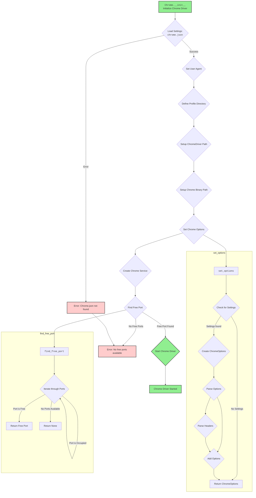
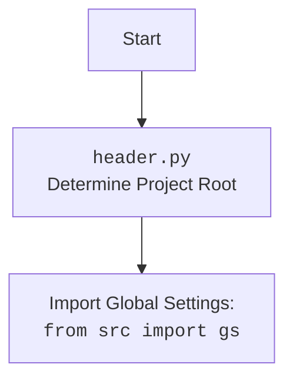

## <алгоритм>

1. **Инициализация класса `Chrome`**:
   - При создании экземпляра класса `Chrome` вызывается метод `__init__`.
   - **Пример:** `driver = Chrome(user_agent={"User-Agent": "CustomAgent"})`
2. **Настройка `user_agent`**:
    - Если `user_agent` передан, используется он. В противном случае генерируется случайный `user_agent` через `UserAgent().random`.
    - **Пример:** `self.user_agent` становится либо переданным `dict`, либо случайной строкой, сгенерированной `UserAgent`.
3. **Загрузка настроек из `chrome.json`**:
   - Загружаются настройки из файла `chrome.json`, находящегося по пути `src/webdriver/chrome/chrome.json`
   - Если файл не найден или возникла ошибка, программа завершается с ошибкой.
   - **Пример:** `settings` становится словарем с настройками из `chrome.json`.
4. **Настройка пути к профилю**:
    - Определяется путь к каталогу профиля Chrome.
    - **Пример:** `profile_directory` может стать `%LOCALAPPDATA%\Google\Chrome for Testing\User Data`.
5. **Формирование путей к драйверу и бинарнику**:
   - Из настроек `settings` извлекаются пути к ChromeDriver и бинарному файлу Chrome.
   - Заменяется часть пути `'chrome'` на `gs.default_webdriver`, что позволяет использовать пути из конфигурации проекта.
   - **Пример:** `chromedriver_path` может стать `C:\bin\webdrivers\chrome\125.0.6422.14\chromedriver.exe`.
6. **Установка опций Chrome**:
   - Вызывается метод `set_options` для установки дополнительных опций из файла конфигурации `chrome.json`, таких как заголовки.
   - Добавляется аргумент `--user-data-dir` с путем к профилю.
   - **Пример:** `self.options` включает пользовательские заголовки и путь к профилю.
7. **Инициализация сервиса Chrome**:
   - Создается экземпляр `ChromeService` с путем к исполняемому файлу Chrome.
   - **Пример:** `self.service` становится экземпляром `ChromeService` с путем к `chrome.exe`.
8. **Поиск свободного порта**:
   - Ищется свободный порт, начиная с `gs.webdriver_current_port` и увеличивая его.
   - Если свободный порт найден, он используется для запуска WebDriver.
    - Если свободный порт не найден, программа завершается с ошибкой.
   - **Пример:** `free_port` может стать `9501` или `None`, если все порты заняты.
9. **Запуск WebDriver**:
   - Создается экземпляр `webdriver.Chrome` с опциями и сервисом.
   - Обрабатываются исключения `WebDriverException` и другие общие ошибки.
   - **Пример:** `super().__init__(options=self.options, service=self.service)` запускает браузер Chrome.
10. **Метод `find_free_port`**:
    -  Проверяет доступность порта в заданном диапазоне.
    - Возвращает первый свободный порт или `None`, если ни один не найден.
    - **Пример:** `port = self.find_free_port(9500, 9599)` возвращает свободный порт или `None`.
11. **Метод `set_options`**:
    - Принимает настройки из файла конфигурации `chrome.json`
    - Применяет настройки для опций Chrome, включая заголовки.
    - **Пример:** `options = self.set_options(settings)` возвращает настроенный объект `ChromeOptions`.

## <mermaid>

## <объяснение>

### Импорты:
- `os`: Модуль для работы с операционной системой, используется для работы с путями файлов.
- `socket`: Модуль для сетевого программирования, используется для поиска свободных портов.
- `pathlib.Path`: Класс для работы с путями файлов, более объектно-ориентированный подход по сравнению с `os.path`.
- `typing.List, Dict`: Используются для аннотации типов, улучшают читаемость и помогают избегать ошибок.
- `selenium.webdriver`: Модуль для управления браузерами через WebDriver.
- `selenium.webdriver.chrome.service.Service as ChromeService`: Класс для управления сервисом ChromeDriver.
- `selenium.webdriver.chrome.options.Options as ChromeOptions`: Класс для настройки параметров запуска Chrome.
- `fake_useragent.UserAgent`: Библиотека для генерации случайных user-agent строк, используется для эмуляции различных браузеров.
- `selenium.common.exceptions.WebDriverException`: Исключение, возникающее при ошибках WebDriver.
- `src.gs`: Глобальные настройки проекта, используется для получения путей к исполняемым файлам и другим параметрам.
- `src.utils.jjson.j_loads_ns`: Функция для загрузки JSON-файлов с учетом namespace, обеспечивающая безопасное и удобное чтение конфигурационных файлов.
- `src.logger.logger`: Модуль для логирования событий, используется для записи информации о работе программы.

### Классы:
- `Chrome`:
    - **Назначение:** Расширяет функциональность `selenium.webdriver.Chrome`, предоставляя дополнительные методы для настройки и управления браузером Chrome.
    - **Атрибуты:**
        - `driver_name`: Строка, содержащая имя драйвера (`"chrome"`).
        - `d`: Экземпляр `webdriver.Chrome` (изначально `None`).
        - `options`: Экземпляр `ChromeOptions`, содержащий настройки запуска Chrome.
        - `user_agent`: Словарь, содержащий user-agent данные.
    - **Методы:**
        - `__init__(self, user_agent: dict = None, *args, **kwargs)`: Конструктор класса. Инициализирует драйвер, загружает настройки, устанавливает опции, находит свободный порт и запускает браузер. Принимает опциональный параметр `user_agent` и дополнительные аргументы и ключевые аргументы для родительского класса `webdriver.Chrome`.
            - **Пример:** `Chrome(user_agent={"User-Agent": "MyCustomAgent"})`
        - `find_free_port(self, start_port: int, end_port: int) -> int | None`:  Находит свободный порт в заданном диапазоне.
            - **Пример:** `free_port = self.find_free_port(9500, 9599)`
        - `set_options(self, settings: list | dict | None = None) -> ChromeOptions`: Устанавливает дополнительные опции для запуска браузера на основе данных из конфигурационного файла.
             - **Пример:** `options = self.set_options(settings={"options": ["--headless", "window-size=1920,1080"]})`
### Функции:
- `__init__(self, user_agent: dict = None, *args, **kwargs)`:
    - **Аргументы:**
        - `user_agent` (dict, optional): Словарь с настройками User-Agent.
        - `*args`: Произвольное количество позиционных аргументов.
        - `**kwargs`: Произвольное количество именованных аргументов.
    - **Возвращаемое значение:** None
    - **Назначение:** Инициализирует экземпляр класса `Chrome` с настройками, параметрами и профилем.
- `find_free_port(self, start_port: int, end_port: int) -> int | None`:
    - **Аргументы:**
      - `start_port` (int): Начальный порт диапазона.
      - `end_port` (int): Конечный порт диапазона.
    - **Возвращаемое значение:** (int | None): Свободный порт или None, если не найден.
    - **Назначение:** Ищет свободный порт в заданном диапазоне.
- `set_options(self, settings: list | dict | None = None) -> ChromeOptions`:
  - **Аргументы:**
    - `settings` (list | dict | None, optional): Настройки из конфигурационного файла `chrome.json`.
  - **Возвращаемое значение:** (`ChromeOptions`): Настроенный экземпляр `ChromeOptions`.
  - **Назначение:** Устанавливает параметры запуска Chrome.

### Переменные:
- `driver_name`: Строка, содержащая имя драйвера ("chrome").
- `d`: Экземпляр `webdriver.Chrome` (изначально `None`).
- `options`: Экземпляр `ChromeOptions`.
- `user_agent`: Словарь с user-agent данными.
- `settings`: Словарь, полученный из файла `chrome.json`.
- `profile_directory`: Строка, содержащая путь к профилю Chrome.
- `chromedriver_path`: Строка, содержащая путь к исполняемому файлу ChromeDriver.
- `binary_location`: Строка, содержащая путь к исполняемому файлу Chrome.
- `service`: Экземпляр `ChromeService`.
- `free_port`: Целое число, представляющее свободный порт, найденный функцией `find_free_port`.

### Потенциальные ошибки и области для улучшения:
- Отсутствует обработка ошибок при загрузке настроек из `chrome.json`. Добавлена проверка `if not settings`.
- Жестко заданный путь к каталогу профиля: `os.path.join(os.getenv('LOCALAPPDATA'), 'Google', 'Chrome for Testing', 'User Data')`. Путь может зависеть от операционной системы.
- Обработка ошибок при запуске WebDriver через `try-except` блок.
- Отсутствует механизм перезапуска драйвера при сбоях.
- Отсутствует детальный механизм обработки исключений `WebDriverException`.
- Отсутствует проверка на тип `settings`, перед использованием в `set_options`
- Необходимо добавить возможность настройки диапазонов для поиска портов.
- Необходимо добавить обработку ошибок при создании объекта `ChromeOptions`.

### Связи с другими частями проекта:
- `src.gs`: Используется для получения глобальных настроек проекта, включая пути к директориям с исполняемыми файлами и порта для webdriver.
- `src.utils.jjson`: Используется для безопасной загрузки настроек из JSON файлов.
- `src.logger`: Используется для логирования событий и ошибок в процессе работы WebDriver.
- Путь к `chrome.json` жёстко закодирован внутри `__init__`, что делает компонент не переиспользуемым, необходим механизм для его переопределения.
- Обращение к `os.getenv('LOCALAPPDATA')` также делает компонент зависимым от окружения, его тоже необходимо прокидывать как параметр.