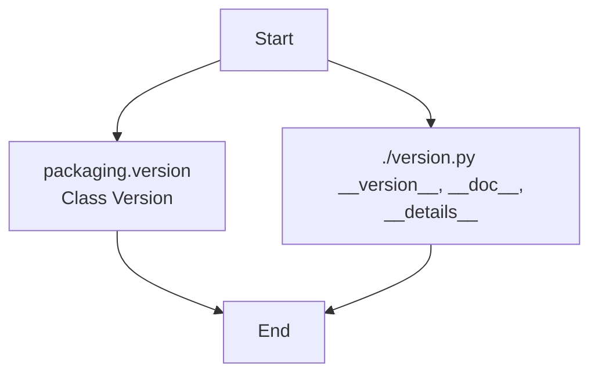

### **Анализ кода `hypotez/src/webdriver/chrome/extentions/__init__.py`**

#### 1. **<алгоритм>**:

Файл `__init__.py` служит для инициализации пакета `src.webdriver.chrome.extentions`. Он импортирует переменные `__version__`, `__doc__` и `__details__` из модуля `version.py`, а также класс `Version` из библиотеки `packaging.version`.

**Блок-схема:**

1.  **Импорт `Version`**: Импортирует класс `Version` из библиотеки `packaging.version`. Этот класс используется для работы с версиями программного обеспечения.

    *   Пример: `from packaging.version import Version`

2.  **Импорт из `.version`**: Импортирует переменные `__version__`, `__doc__` и `__details__` из модуля `version.py`. Эти переменные содержат информацию о версии, документацию и детали пакета.

    *   Пример: `from .version import __version__, __doc__, __details__`

#### 2. **<mermaid>**:

**Объяснение зависимостей `mermaid`**:

*   `packaging.version`: Содержит класс `Version`, используемый для управления версиями.
*   `./version.py`: Содержит переменные `__version__`, `__doc__` и `__details__`, относящиеся к текущему пакету.

#### 3. **<объяснение>**:

**Импорты**:

*   `from packaging.version import Version`: Импортирует класс `Version` из библиотеки `packaging.version`. Этот класс предназначен для работы с версиями, позволяя сравнивать и обрабатывать их.
*   `from .version import __version__, __doc__, __details__`: Импортирует переменные `__version__`, `__doc__` и `__details__` из модуля `version.py`, расположенного в том же пакете. Эти переменные предоставляют информацию о версии, документацию и детали реализации пакета.

**Переменные**:

*   `__version__` (str): Строка, содержащая информацию о версии пакета.
*   `__doc__` (str): Строка, содержащая документацию пакета.
*   `__details__` (dict): Словарь, содержащий дополнительные детали о пакете.

**Потенциальные области для улучшения**:

*   Файл содержит много пустых строк и повторений комментариев. Это можно оптимизировать для улучшения читаемости.
*   Необходимо добавить документацию для пакета, описывающую его назначение и функциональность.
*   Добавить обработку исключений и логирование для отслеживания ошибок.

**Взаимосвязь с другими частями проекта**:

Этот файл инициализирует пакет `src.webdriver.chrome.extentions`, предоставляя информацию о версии и документацию для других модулей, которые могут использовать этот пакет. Например, другие части проекта могут использовать `__version__` для проверки совместимости или `__doc__` для получения справки по использованию пакета.