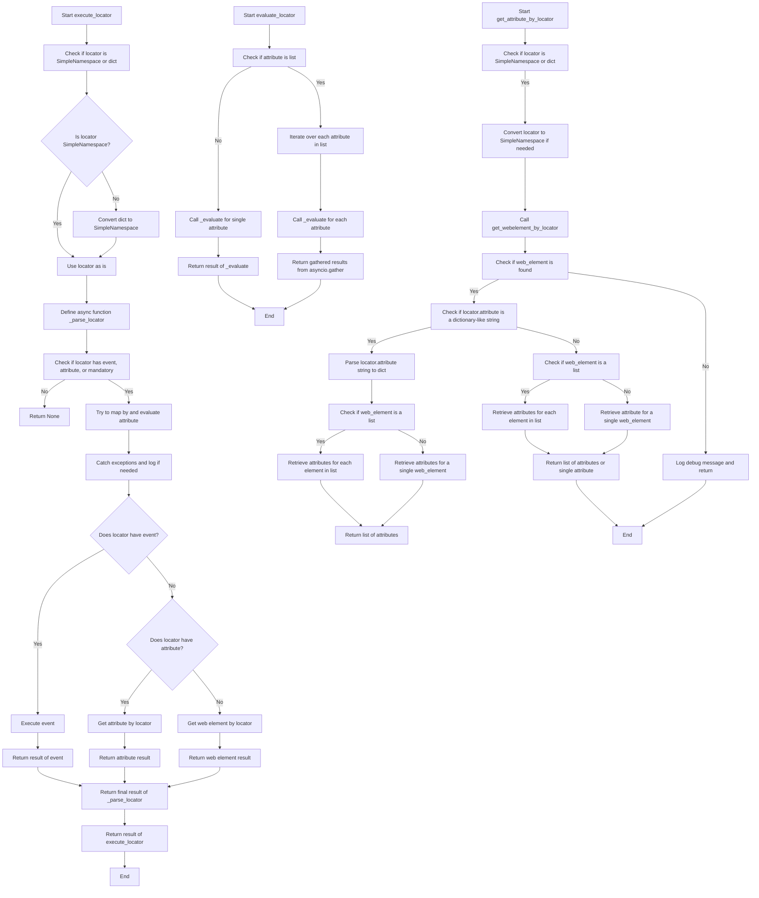
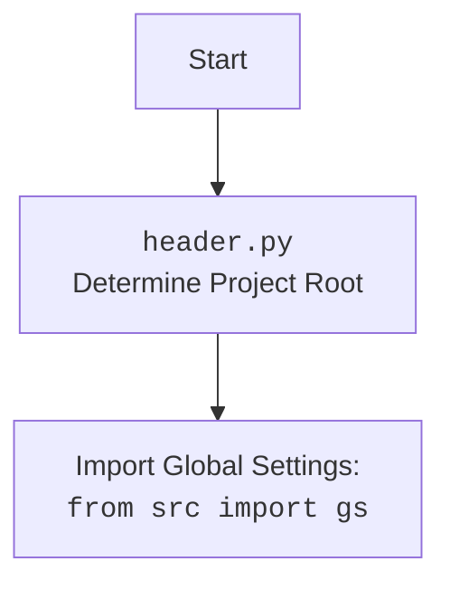

## `executor.py` Documentation

### <алгоритм>

**Общий алгоритм работы модуля `executor.py`:**

1.  **Инициализация:**
    *   Создается экземпляр класса `ExecuteLocator`, принимающий объект `WebDriver` (опционально) и режим работы (`mode`).
    *   Инициализируется словарь `by_mapping`, связывающий строковые представления локаторов с методами `By` из Selenium.
    *   Если передан объект `WebDriver`, создается объект `ActionChains` для выполнения сложных действий.

2.  **Выполнение локатора (`execute_locator`):**
    *   Принимает на вход локатор (в виде словаря или `SimpleNamespace`).
    *   Если локатор - словарь, конвертирует его в `SimpleNamespace` для удобства доступа к атрибутам.
    *   Определяет асинхронную функцию `_parse_locator`, которая обрабатывает локатор.
    *   Проверяет наличие атрибутов `event`, `attribute` или `mandatory` в локаторе. Если ни один из них не присутствует, возвращает `None`.
    *   Пытается применить локатор с помощью метода `_evaluate`, перехватывая исключения.
    *   В зависимости от наличия атрибута `event` или `attribute`, выполняет событие, получает атрибут или просто извлекает веб-элемент(ы).
    *   Возвращает результат работы в зависимости от того, что было запрошено в локаторе.

3.  **Оценка локатора (`evaluate_locator`):**
    *   Принимает на вход локатор.
    *   Проверяет, является ли атрибут `attribute` списком.
    *   Если `attribute` - список, то итерирует по каждому атрибуту из списка, вызывая метод `_evaluate` для каждого элемента и собирает результаты.
    *   Если `attribute` - не список, то вызывает метод `_evaluate` для данного атрибута.
    *   Возвращает результат, полученный из метода `_evaluate`.

4.  **Получение атрибута по локатору (`get_attribute_by_locator`):**
    *   Принимает на вход локатор.
    *   Если локатор является словарем, то конвертируется в `SimpleNamespace`.
    *   Вызывает метод `get_webelement_by_locator` для получения веб-элемента(ов).
    *   Если веб-элемент(ы) не найдены, возвращает `None` и выводит отладочное сообщение.
    *   Проверяет, является ли атрибут `attribute` строкой, похожей на словарь. Если да, преобразует строку в словарь.
    *   Если получен один веб-элемент, то извлекает атрибут для него.
    *   Если получен список веб-элементов, то извлекает атрибуты для каждого элемента.
    *   Возвращает атрибут(ы) найденного веб-элемента(ов).

5.  **Получение веб-элемента по локатору (`get_webelement_by_locator`):**
    *   Принимает на вход локатор.
    *   Использует информацию из локатора (`by` и `selector`) для поиска элемента(ов) на веб-странице.
    *   Возвращает найденный(е) веб-элемент(ы).

6.  **Выполнение события (`execute_event`):**
    *   Принимает на вход локатор.
    *   Извлекает из локатора информацию о событии (например, `click()`).
    *   Ищет веб-элемент(ы) по локатору.
    *   Выполняет событие над веб-элементом(ами).
    *   Возвращает результат выполненного события.

7. **Отправка сообщения (`send_message`)**
    * Принимает на вход локатор и сообщение.
    * Ищет веб-элемент по локатору.
    * Отправляет сообщение в найденный веб-элемент.

**Пример обработки локатора (псевдокод):**

```
locator = {
    "by": "ID",
    "selector": "my_button",
    "event": "click()"
}
execute_locator(locator)
    # Проверяется, что locator это словарь
    # Преобразуется словарь в SimpleNamespace
    # Вызывается _parse_locator
    # В _parse_locator проверяется, что есть атрибут event
    # Вызывается execute_event
        # ищется элемент по ID 'my_button'
        # выполняется click() на найденном элементе
    # _parse_locator возвращает результат клика
    # execute_locator возвращает результат _parse_locator
```

**Поток данных:**

1.  Локатор (словарь или `SimpleNamespace`) поступает в `execute_locator`.
2.  `execute_locator` использует `_parse_locator` для обработки локатора.
3.  `_parse_locator` может использовать `get_webelement_by_locator` для поиска элемента.
4.  `_parse_locator` может вызывать `execute_event` для выполнения действий над элементом.
5.  `_parse_locator` может вызывать `get_attribute_by_locator` для получения атрибута.
6.  Результат выполнения действия или полученный атрибут возвращается в `_parse_locator`, затем в `execute_locator` и затем вызывающей стороне.

### <mermaid>



**Объяснение зависимостей `mermaid`:**

*   Диаграмма состоит из узлов (нод) и стрелок, показывающих поток выполнения.
*   Каждая нода представляет собой шаг или условие в алгоритме.
*   Текст внутри нод описывает действие или условие.
*   Стрелки показывают последовательность выполнения.
*   `-->` обозначает переход к следующему шагу.
*   `-->|Yes|` и `-->|No|` обозначают переходы по условию.
*   Диаграмма `execute_locator` описывает основной процесс обработки локатора. Она проверяет тип локатора, вызывает `_parse_locator`, обрабатывает события и атрибуты.
*   Диаграмма `evaluate_locator` описывает процесс оценки атрибутов локатора.
*   Диаграмма `get_attribute_by_locator` описывает процесс извлечения атрибутов из веб-элемента.

### <объяснение>

**Импорты:**

*   `selenium`:
    *   Используется для автоматизации браузера и взаимодействия с веб-элементами.
    *   `webdriver`: Предоставляет интерфейс для управления браузером.
    *   `webdriver.remote.webdriver.WebDriver`: Базовый класс для драйверов веб-браузеров.
    *   `webdriver.common.by.By`: Используется для определения методов поиска веб-элементов (ID, CSS, XPath и т.д.).
    *   `webdriver.support.ui`: Содержит классы для работы с ожиданиями.
    *   `webdriver.common.action_chains.ActionChains`: Класс для выполнения цепочки действий (например, клик, перетаскивание и т.д.).
*   `asyncio`:
    *   Модуль для работы с асинхронными операциями, позволяет выполнять код параллельно.
    *   Используется для выполнения асинхронных функций.
*   `re`:
    *   Используется для работы с регулярными выражениями, например, для извлечения данных из текста.
*   `dataclasses`:
    *   Используется для создания классов данных с автоматической генерацией методов, таких как `__init__` и `__repr__`.
    *   `dataclass`: Декоратор для создания классов данных.
*   `enum`:
    *   Используется для создания перечислений.
    *   `Enum`: Базовый класс для перечислений.
*   `pathlib`:
    *   Используется для работы с путями файлов в кроссплатформенном режиме.
    *   `Path`: Класс для представления путей файлов и папок.
*   `types`:
    *   Используется для создания динамических пространств имен (`SimpleNamespace`).
    *   `SimpleNamespace`: Класс для создания объектов с произвольными атрибутами.
*   `typing`:
    *   Используется для добавления статической типизации к Python коду.
    *   `Any`, `List`, `Optional`, `Union`, `Dict`, `Callable`, `Awaitable`: Типы данных и аннотации.
*  `src.settings.settings`:
     *  Используется для получения глобальных настроек из файла `settings.py`
     *  `gs`: экземпляр класса Settings.
*  `src.utils.logger`:
     *  Используется для логирования событий и ошибок.
     *  `log`: Функция для логирования.

**Классы:**

*   `ExecuteLocator`:
    *   **Роль:** Центральный класс для выполнения действий над веб-элементами на основе локаторов.
    *   **Атрибуты:**
        *   `driver`: Экземпляр `WebDriver`, используется для взаимодействия с браузером.
        *   `actions`: Экземпляр `ActionChains` для выполнения сложных действий.
        *   `by_mapping`: Словарь, связывающий строковые представления локаторов с методами `By` из Selenium (например, `id` -> `By.ID`).
        *   `mode`: Режим работы (`debug`, `dev`, и т.д.).
    *   **Методы:**
        *   `__post_init__`: Инициализирует `ActionChains`, если был передан драйвер.
        *   `execute_locator`: Выполняет действия с веб-элементами на основе предоставленного локатора.
        *   `evaluate_locator`: Оценивает атрибуты локатора.
        *   `get_attribute_by_locator`: Получает атрибуты веб-элемента(ов).
        *   `get_webelement_by_locator`: Получает веб-элемент(ы) на основе локатора.
        *   `get_webelement_as_screenshot`: Делает скриншот веб-элемента.
        *   `execute_event`: Выполняет события, связанные с локатором.
        *  `send_message`: Отправляет сообщение в веб-элемент.
        *   `_parse_locator`: Асинхронный метод для обработки локатора и выполнения действий.
        *   `_evaluate`: Асинхронный метод для оценки атрибута.

**Функции:**

*  `_parse_locator`:
    *   **Аргументы:** `locator` - локатор в виде SimpleNamespace.
    *  **Возвращаемое значение:** Результат выполнения события, получения атрибута или веб-элемент.
    *  **Назначение:** Обрабатывает локатор, вызывая необходимые методы для выполнения действий.

*   `_evaluate`:
    *   **Аргументы:** `locator` - локатор в виде SimpleNamespace.
    *   **Возвращаемое значение:** Результат выполнения.
    *   **Назначение:** Оценивает локатор и вызывает другие методы для получения данных.

**Переменные:**

*   `by_mapping`:
    *   **Тип:** `Dict[str, Callable]`.
    *   **Назначение:** Словарь, связывающий строки (например, `"ID"`) с соответствующими методами `By` из Selenium (например, `By.ID`).
    *  Например: `"ID"` -> `By.ID`, `"CSS_SELECTOR"` -> `By.CSS_SELECTOR`, `"XPATH"` -> `By.XPATH`
*   `driver`:
    *  **Тип:** `Optional[WebDriver]`
    *  **Назначение:** Экземпляр `WebDriver` для управления браузером.
* `mode`:
    *  **Тип:** `str`
    *  **Назначение:** Режим работы (`debug`, `dev` и т.д.).
*   `actions`:
    *   **Тип:** `Optional[ActionChains]`
    *   **Назначение:** Экземпляр `ActionChains` для выполнения цепочки действий (например, клик, перетаскивание).
*   `gs`:
    *  **Тип:** `Settings`
    *  **Назначение:** экземпляр класса Settings, хранящий глобальные настройки.

**Потенциальные ошибки и области для улучшения:**

*   **Обработка ошибок**:
    *   Ошибки обрабатываются с помощью `try...except`, но для разных типов ошибок можно сделать более конкретную обработку.
    *   Логирование ошибок можно улучшить, добавив контекст и уровни важности.
*   **Гибкость локаторов**:
    *  Локаторы принимаются в виде словаря или SimpleNamespace, но можно добавить поддержку других форматов (например, JSON-строки).
    *  Можно добавить поддержку `custom by` (например поиск по тексту)
*   **Асинхронность**:
    *   Большинство методов используют `async`, но можно улучшить асинхронность операций, если это необходимо для производительности.
*  **Тестирование**:
   * Необходимо добавить больше тестов, для каждого метода.
*   **Документация:**
    * Необходимо добавить примеры для каждого метода.
    * Необходимо добавить примеры локаторов.
*  **Разделение**:
    * Логику работы методов можно разделить на несколько более простых методов.
    * Можно вынести логику работы с `ActionChains` в отдельный класс.

**Взаимосвязь с другими частями проекта:**

*   Модуль `executor.py` зависит от `src.settings` для получения глобальных настроек проекта, таких как режим работы (`mode`).
*   Модуль `executor.py` использует `src.utils.logger` для логирования ошибок.
*   Модуль `executor.py` используется в других частях проекта для автоматизации взаимодействия с веб-страницами (например, `test_cases`).
*   Модуль `executor.py` использует `src.webdriver` для управления браузером.

В целом, модуль `executor.py` представляет собой мощный и гибкий инструмент для автоматизации тестирования веб-приложений, предоставляя абстракцию над сложными взаимодействиями с веб-элементами. Он также имеет хорошую структуру и предоставляет возможности для расширения и улучшения.

