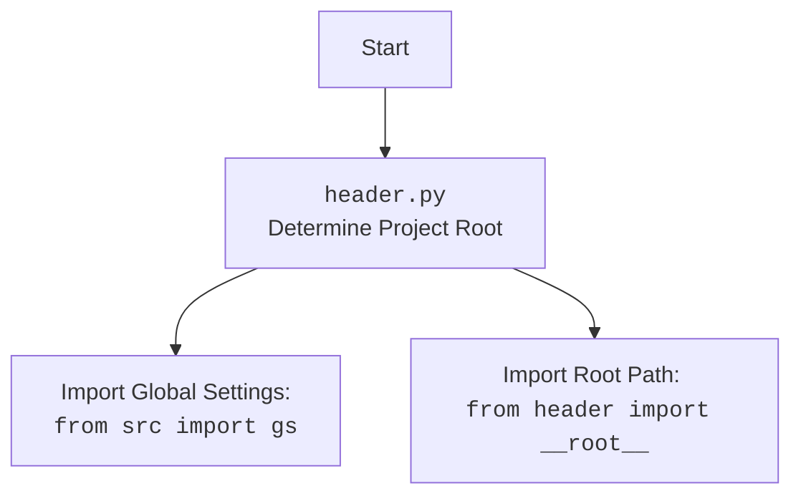

### Проект `hypotez`
### Роль `code explainer`

## ИНСТРУКЦИЯ:

Анализ предоставленного кода подробно объясняет его функциональность. Ответ включает три раздела:

1.  **<алгоритм>**: Описание рабочего процесса в виде пошаговой блок-схемы, включая примеры для каждого логического блока, и иллюстрация потока данных между функциями, классами или методами.
2.  **<mermaid>**: Написание кода для диаграммы в формате `mermaid`, анализ и объяснение всех зависимостей, которые импортируются при создании диаграммы.
    **ВАЖНО!** Убедитесь, что все имена переменных, используемые в диаграмме `mermaid`, имеют осмысленные и описательные имена. Имена переменных вроде `A`, `B`, `C`, и т.д., не допускаются!

    **Дополнительно**: Если в коде есть импорт `import header`, добавьте блок `mermaid` flowchart, объясняющий `header.py`:

    ```mermaid
    flowchart TD
        Start --> Header[<code>header.py</code><br> Determine Project Root]

        Header --> import[Import Global Settings: <br><code>from src import gs</code>]
    ```
3.  **<объяснение>**: Предоставление подробных объяснений:
    - **Импорты**: Их назначение и взаимосвязь с другими пакетами `src.`.
    - **Классы**: Их роль, атрибуты, методы и взаимодействие с другими компонентами проекта.
    - **Функции**: Их аргументы, возвращаемые значения, назначение и примеры.
    - **Переменные**: Их типы и использование.
    - Выделение потенциальных ошибок или областей для улучшения.

Дополнительно, построение цепочки взаимосвязей с другими частями проекта (если применимо).

Это обеспечивает всесторонний и структурированный анализ кода.

## Анализ кода

### 1. <алгоритм>

```mermaid
graph TD
    A[Начало: Инициализация Playwrid] --> B{Определение настроек запуска браузера};
    B -- "Вызов _set_launch_options" --> C{Конфигурация headless, user_agent, options};
    C -- user_agent установлен --> D{Добавление user_agent в launch_options};
    C -- options установлены --> E{Расширение args в launch_options};
    D --> F[Возврат launch_options];
    E --> F;
    C -- user_agent и options не установлены --> F;
    F --> G[Инициализация PlaywrightExecutor];
    G --> H[Вызов PlaywrightCrawler.__init__];
    H --> I{Проверка наличия метода set_launch_options};
    I -- "Да" --> J[Вызов set_launch_options];
    I -- "Нет" --> K[Обработка launch_options другим способом];
    J --> L[Запуск Playwrid.start(url)];
    K --> L;
    L --> M{Запуск executor.start()};
    M --> N{Переход по URL: executor.goto(url)};
    N --> O[Запуск PlaywrightCrawler.run(url)];
    O --> P{Получение crawling_context};
    P --> Q[Присвоение crawling_context в self.context];
    Q --> R[Конец: Playwrid запущен];
    R --> S{Получение current_url};
    S --> T{Проверка наличия self.context и self.context.page};
    T -- "Да" --> U[Возврат self.context.page.url];
    T -- "Нет" --> V[Возврат None];
    R --> W{Получение HTML контента страницы: get_page_content()};
    W --> X{Проверка наличия self.context и self.context.page};
    X -- "Да" --> Y[Возврат self.context.page.content()];
    X -- "Нет" --> Z[Возврат None];
    R --> AA{Получение HTML контента элемента по селектору: get_element_content(selector)};
    AA --> BB{Проверка наличия self.context и self.context.page};
    BB -- "Да" --> CC[Получение элемента по селектору: self.context.page.locator(selector)];
    CC --> DD{Возврат element.inner_html()};
    BB -- "Нет" --> EE[Возврат None];
    DD --> FF[Конец];
    R --> GG{Получение значения элемента по XPath: get_element_value_by_xpath(xpath)};
    GG --> HH{Проверка наличия self.context и self.context.page};
    HH -- "Да" --> II[Получение элемента по XPath: self.context.page.locator(f'xpath={xpath}')];
    II --> JJ{Возврат element.text_content()};
    HH -- "Нет" --> KK[Возврат None];
    JJ --> LL[Конец];
    R --> MM{Клик на элемент по селектору: click_element(selector)};
    MM --> NN{Проверка наличия self.context и self.context.page};
    NN -- "Да" --> OO[Получение элемента по селектору: self.context.page.locator(selector)];
    OO --> PP{Клик на элемент: element.click()};
    NN -- "Нет" --> QQ[Конец];
    R --> RR{Исполнение локатора: execute_locator(locator, message, typing_speed)};
    RR --> SS[Возврат self.executor.execute_locator(locator, message, typing_speed)];
    SS --> TT[Конец];

```

### 2. <mermaid>

```mermaid
flowchart TD
    Start --> PlaywridInit[Playwrid Initialization]
    PlaywridInit --> SetLaunchOptions[_set_launch_options]
    SetLaunchOptions --> ConfigBrowserOptions{Configure Browser Options}
    ConfigBrowserOptions -- UserAgentProvided? --> AddUserAgent[Add User-Agent to Options]
    ConfigBrowserOptions -- CustomOptionsProvided? --> MergeOptions[Merge Custom Options with Defaults]
    AddUserAgent --> ReturnLaunchOptions[Return Launch Options]
    MergeOptions --> ReturnLaunchOptions
    ConfigBrowserOptions -- NoOptions --> ReturnLaunchOptions
    ReturnLaunchOptions --> PlaywrightCrawlerInit[PlaywrightCrawler Initialization]
    PlaywrightCrawlerInit --> StartMethod[Start(url)]
    StartMethod --> ExecutorStart[executor.start()]
    ExecutorStart --> ExecutorGoto[executor.goto(url)]
    ExecutorGoto --> RunCrawler[super().run(url)]
    RunCrawler --> SetContext[self.context = self.crawling_context]
    SetContext --> End

    style Start fill:#f9f,stroke:#333,stroke-width:2px
    style End fill:#f9f,stroke:#333,stroke-width:2px
```

**Объяснение зависимостей (импортов):**

*   **asyncio**: Используется для поддержки асинхронного программирования, необходимого для выполнения асинхронных операций, таких как запуск браузера и навигация по страницам.
*   **pathlib.Path**: Применяется для работы с путями к файлам и директориям в файловой системе, что упрощает определение местоположения конфигурационных файлов и других ресурсов.
*   **typing.Optional, Dict, Any, List**: Используются для аннотации типов, что повышает читаемость и облегчает отладку кода.
*   **types.SimpleNamespace**: Предоставляет простой способ создания объектов, которые могут хранить атрибуты, доступные по имени.
*   **crawlee.crawlers.PlaywrightCrawler, crawlee.crawlers.PlaywrightCrawlingContext**:
    *   **PlaywrightCrawler**: Базовый класс для создания веб-пауков, использующих Playwright.
    *   **PlaywrightCrawlingContext**: Класс контекста, содержащий информацию о текущем состоянии обхода.
*   **header**: Пользовательский модуль, предположительно, содержащий общие настройки и переменные для проекта, включая определение корневой директории проекта.
*   **header.\_\_root\_\_**: Переменная, определяющая корневую директорию проекта.
*   **src.gs**: Глобальные настройки проекта.
*   **src.webdriver.playwright.executor.PlaywrightExecutor**: Класс, отвечающий за выполнение действий в браузере, таких как навигация, ввод данных и взаимодействие с элементами страницы.
*   **src.webdriver.js.JavaScript**: Класс, содержащий JavaScript-код, который может быть выполнен в браузере.
*   **src.utils.jjson.j\_loads\_ns**: Функция для загрузки JSON-файлов в виде объектов SimpleNamespace, что упрощает доступ к данным по атрибутам.
*   **src.logger.logger.logger**: Объект логгера для записи информации о работе программы, ошибок и предупреждений.



### 3. <объяснение>

#### Импорты:

*   `asyncio`: Для асинхронного выполнения операций.
*   `pathlib`: Для работы с путями к файлам.
*   `typing`: Для аннотации типов.
*   `types.SimpleNamespace`: Для создания объектов с атрибутами.
*   `crawlee.crawlers`: Содержит классы `PlaywrightCrawler` и `PlaywrightCrawlingContext` для обхода веб-страниц с использованием Playwright.
*   `header`: Содержит общие настройки проекта и определяет корневую директорию проекта (`__root__`).
*   `src.gs`: Глобальные настройки проекта.
*   `src.webdriver.playwright.executor`: Содержит класс `PlaywrightExecutor`, отвечающий за выполнение действий в браузере.
*   `src.webdriver.js`: Содержит класс `JavaScript` с JavaScript-кодом для выполнения в браузере.
*   `src.utils.jjson`: Содержит функцию `j_loads_ns` для загрузки JSON-файлов в виде объектов `SimpleNamespace`.
*   `src.logger.logger`: Содержит объект `logger` для записи логов.

#### Классы:

*   **`Playwrid(PlaywrightCrawler)`**:
    *   Является подклассом `PlaywrightCrawler` и предоставляет дополнительную функциональность для управления браузером Playwright.
    *   **Атрибуты:**
        *   `driver_name (str)`: Имя драйвера, по умолчанию `'playwrid'`.
        *   `base_path (Path)`: Путь к директории с файлами драйвера.
        *   `config (SimpleNamespace)`: Конфигурация драйвера, загруженная из файла `playwrid.json`.
        *   `context`: Контекст обхода, содержащий информацию о текущей странице.
    *   **Методы:**
        *   `__init__(self, user_agent: Optional[str] = None, options: Optional[List[str]] = None, *args, **kwargs) -> None`: Инициализирует драйвер, устанавливает параметры запуска браузера, user-agent и опции.
        *   `_set_launch_options(self, user_agent: Optional[str] = None, options: Optional[List[str]] = None) -> Dict[str, Any]`: Конфигурирует параметры запуска браузера, такие как `headless`, `user_agent` и другие опции.
        *   `start(self, url: str) -> None`: Запускает драйвер и переходит по указанному URL.
        *   `current_url(self) -> Optional[str]`: Возвращает текущий URL браузера.
        *   `get_page_content(self) -> Optional[str]`: Возвращает HTML-контент текущей страницы.
        *   `get_element_content(self, selector: str) -> Optional[str]`: Возвращает HTML-контент элемента по CSS-селектору.
        *   `get_element_value_by_xpath(self, xpath: str) -> Optional[str]`: Возвращает текстовое значение элемента по XPath.
        *   `click_element(self, selector: str) -> None`: Кликает на элемент по CSS-селектору.
        *    `execute_locator(self, locator: dict | SimpleNamespace, message: Optional[str] = None, typing_speed: float = 0) -> str | List[str] | bytes | List[bytes] | bool`: Выполняет локатор через executor

#### Функции:

*   `_set_launch_options`:
    *   **Аргументы:**
        *   `user_agent (Optional[str])`: User-agent для браузера.
        *   `options (Optional[List[str]])`: Список опций для запуска браузера.
    *   **Возвращаемое значение:**
        *   `Dict[str, Any]`: Словарь с параметрами запуска браузера.
    *   **Назначение:**
        *   Конфигурирует параметры запуска браузера, такие как `headless`, `user_agent` и другие опции.
*   `start`:
    *   **Аргументы:**
        *   `url (str)`: URL для перехода.
    *   **Возвращаемое значение:**
        *   `None`
    *   **Назначение:**
        *   Запускает драйвер и переходит по указанному URL.

#### Переменные:

*   `driver_name (str)`: Имя драйвера.
*   `base_path (Path)`: Путь к директории с файлами драйвера.
*   `config (SimpleNamespace)`: Конфигурация драйвера.
*   `context`: Контекст обхода.

#### Потенциальные ошибки и области для улучшения:

*   Обработка ошибок в методах `get_element_content`, `get_element_value_by_xpath` и `click_element` выполняется с помощью `try-except`, но логируется только предупреждение. Желательно добавить более детальную обработку ошибок и, возможно, повторные попытки выполнения операций.
*   В методе `_set_launch_options` используется `hasattr` для проверки наличия атрибутов в `self.config`. Это может быть заменено на более явную проверку типов или использование `getattr` с значением по умолчанию.
*   В `__init__` присутствует логика обработки `launch_options` для совместимости с разными версиями `PlaywrightCrawler`. Желательно унифицировать этот процесс.
*   В `start` используется `super().run(url)` после запуска `executor.goto(url)`. Необходимо убедиться, что порядок операций корректен и не вызывает конфликтов.
*   В примере использования в `if __name__ == "__main__":` не реализовано корректное закрытие браузера после завершения работы.

#### Взаимосвязь с другими частями проекта:

*   `Playwrid` использует `PlaywrightExecutor` для выполнения действий в браузере, что позволяет отделить логику управления браузером от логики обхода страниц.
*   Конфигурация драйвера загружается из JSON-файла с помощью `j_loads_ns`, что обеспечивает гибкость и возможность изменения параметров драйвера без изменения кода.
*   Логирование выполняется с помощью модуля `logger`, что позволяет отслеживать работу драйвера и выявлять ошибки.

```python
# Пример использования j_loads_ns
config = j_loads_ns(base_path / 'playwrid.json')
print(config.browser_type)
```

```python
# Пример логирования ошибки
try:
    element = self.context.page.locator(selector)
    await element.click()
except Exception as ex:
    logger.warning(f"Element with selector '{selector}' not found or error during click: {ex}")