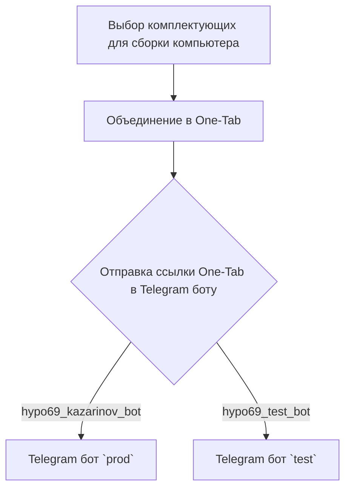
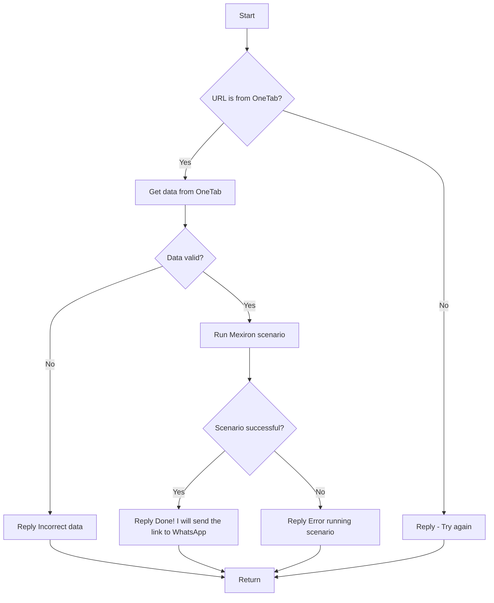

# Название модуля

## Обзор

Документация описывает функциональность модуля, предназначенного для создания прайс-листов для Казаринова. Включает описание взаимодействия с Telegram-ботами и сценариев обработки данных.

## Содержание

- [Обзор](#обзор)
- [KazarinovTelegramBot](#kazarinovtelegrambot)
- [BotHandler](#bothandler)
- [Схема взаимодействия](#схема-взаимодействия)
- [Сценарий обработки](#сценарий-обработки)
- [Далее](#далее)

## KazarinovTelegramBot

- [https://one-tab.co.il](https://one-tab.co.il)
- [https://morlevi.co.il](https://morlevi.co.il)
- [https://grandavance.co.il](https://grandavance.co.il)
- [https://ivory.co.il](https://ivory.co.il)
- [https://ksp.co.il](https://ksp.co.il)

## BotHandler

### Описание

Обработчик для Telegram-бота, взаимодействующий с пользователем и запускающий сценарии обработки.

## Схема взаимодействия

### Клиентская сторона

### Серверная сторона

- `kazarinov_bot.handle_message()` -> `kazarinov.scenarios.run_scenario()`:

## Далее

- [Казаринов бот](https://github.com/hypo69/hypo/blob/master/src/endpoints/kazarinov/kazarinov_bot.ru.md)
- [Исполнение сценария](https://github.com/hypo69/hypo/blob/master/src/endpoints/kazarinov/scenarios/readme.ru.md)