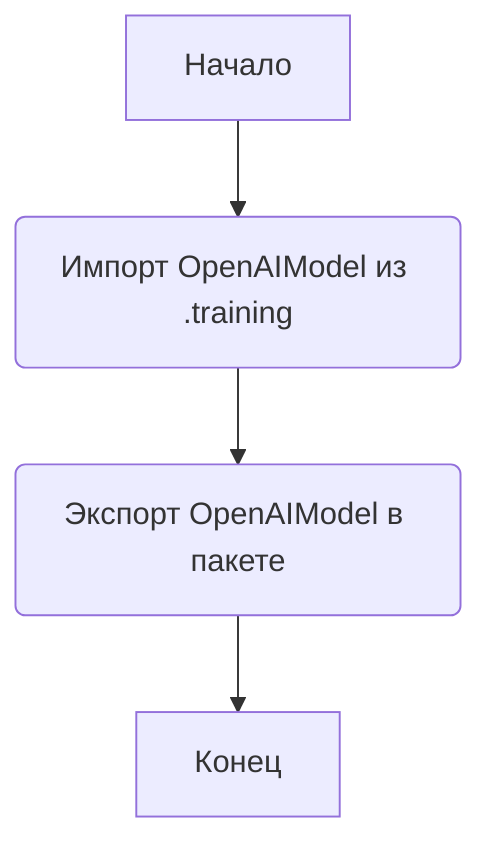
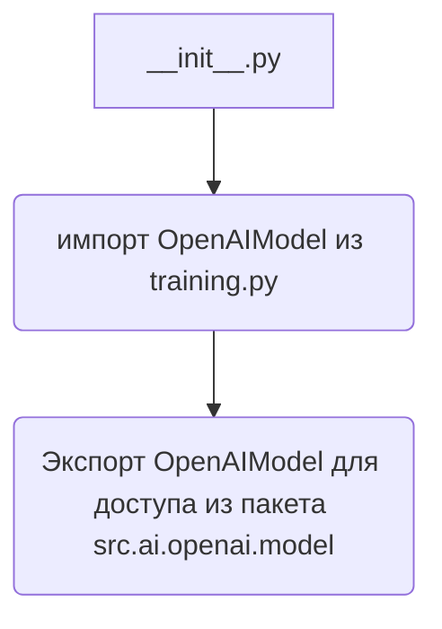

### Анализ кода `hypotez/src/ai/openai/model/__init__.py`

#### 1. Алгоритм

Этот файл является файлом инициализации пакета `src.ai.openai.model`. Он импортирует класс `OpenAIModel` из модуля `training`. Это позволяет использовать `OpenAIModel` напрямую при импорте пакета `src.ai.openai.model`.

#### 2. Mermaid

#### 3. Объяснение

- **Импорты**:
  - `from .training import OpenAIModel`: Импортирует класс `OpenAIModel` из модуля `training`, расположенного в том же пакете. Это позволяет использовать класс `OpenAIModel` при импорте пакета `src.ai.openai.model`.
- **Классы**:
  - `OpenAIModel`: Этот класс, вероятно, содержит логику для взаимодействия с OpenAI API, например, для обучения моделей или выполнения запросов. Он экспортируется для использования в других частях проекта.
- **Файлы**:
  - `__init__.py`: Этот файл делает каталог `src/ai/openai/model` пакетом Python. Когда другие модули импортируют этот пакет, код в `__init__.py` выполняется.
  - `training.py`: В этом файле находится класс `OpenAIModel`.

Этот файл служит для организации и упрощения доступа к классу `OpenAIModel`. Другие части проекта могут импортировать `src.ai.openai.model` и использовать `OpenAIModel` напрямую, без необходимости указывать модуль `training`.