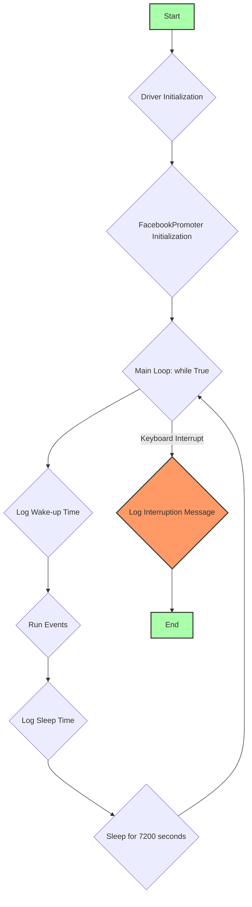
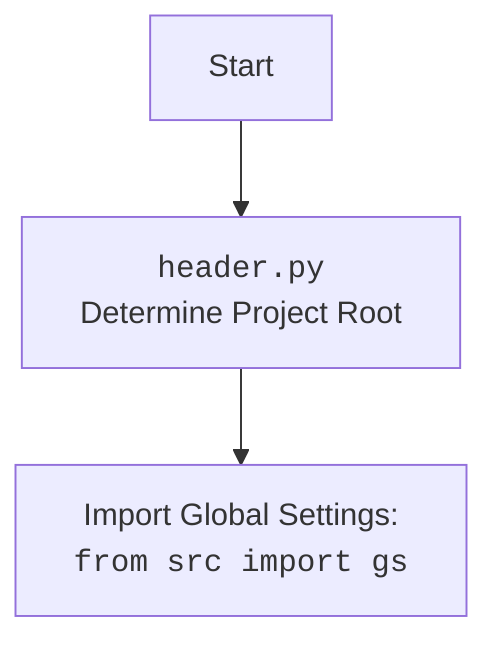

## Анализ кода `hypotez/src/endpoints/advertisement/facebook/start_event.py`

### 1. Алгоритм

1.  **Инициализация:**
    *   Импортируются необходимые модули и классы.
    *   Инициализируется драйвер `Driver` с типом `Chrome` для управления браузером.
    *   Выполняется переход на страницу Facebook.
    *   Определяются списки файлов (`filenames`, `excluded_filenames`) и названий событий (`events_names`).
    *   Создается экземпляр класса `FacebookPromoter` с передачей драйвера, списка файлов групп и указанием на отсутствие видео.
2.  **Основной цикл:**
    *   Запускается бесконечный цикл `while True`.
    *   В цикле логируется время начала работы.
    *   Вызывается метод `run_events` у экземпляра `promoter` с передачей списка названий событий и списка файлов групп.
    *   Логируется время ухода в сон.
    *   Выполняется ожидание в течение 7200 секунд (2 часа).
3.  **Обработка прерывания:**
    *   При возникновении прерывания с клавиатуры (KeyboardInterrupt) логируется сообщение о прерывании продвижения кампании.

**Примеры для каждого логического блока:**

*   **Инициализация драйвера:**

    ```python
    d = Driver(Chrome)
    d.get_url(r"https://facebook.com")
    ```

    Здесь создается экземпляр драйвера Chrome и выполняется переход на сайт Facebook.
*   **Инициализация `FacebookPromoter`:**

    ```python
    promoter:FacebookPromoter = FacebookPromoter(d, group_file_paths=filenames, no_video = True)
    ```

    Создается объект `FacebookPromoter`, который будет заниматься продвижением мероприятий в Facebook. Ему передаются необходимые параметры, такие как драйвер, список файлов с группами и флаг, указывающий на отсутствие видео.
*   **Основной цикл:**

    ```python
    while True:
        logger.debug(f"waikig up {time.strftime('%H:%M:%S')}",None,False)
        promoter.run_events(events_names = events_names, group_file_paths = filenames)
        logger.debug(f"going to sleep at {time.strftime('%H:%M:%S')}",None,False)
        time.sleep(7200)
    ```

    В этом цикле происходит основная работа: логируется время, запускаются события, логируется время, и программа засыпает на 2 часа.
*   **Обработка прерывания:**

    ```python
    except KeyboardInterrupt:
        logger.info("Campaign promotion interrupted.")
    ```

    Если пользователь прерывает выполнение программы с помощью клавиатуры (например, нажав Ctrl+C), выводится сообщение о прерывании.

### 2. Mermaid



**Объяснение зависимостей:**

*   `Driver Initialization`: Инициализация драйвера для управления браузером. Зависит от классов `Driver` и `Chrome` из модуля `src.webdriver.driver`.
*   `FacebookPromoter Initialization`: Инициализация класса `FacebookPromoter`, отвечающего за продвижение в Facebook. Зависит от класса `FacebookPromoter` из модуля `src.endpoints.advertisement.facebook`.
*   `Run Events`: Запуск событий с использованием метода `run_events` класса `FacebookPromoter`. Зависит от логики, реализованной в классе `FacebookPromoter`.
*   `Log Wake-up Time` и `Log Sleep Time`: Логирование времени начала и окончания работы. Зависит от модуля `src.logger.logger` для логирования и модуля `time` для получения текущего времени.
*   `Sleep for 7200 seconds`: Ожидание в течение 2 часов. Зависит от модуля `time`.
*   `Log Interruption Message`: Логирование сообщения о прерывании. Зависит от модуля `src.logger.logger`.



### 3. Объяснение

#### Импорты:

*   `math.log`: Используется для логарифмических вычислений (хотя в данном коде не используется).
*   `header`: Выполняет определение корневой директории проекта.
*   `time`: Используется для работы со временем (получение текущего времени, ожидание).
*   `src.utils.jjson.j_loads`: Используется для загрузки JSON-данных из файлов.
*   `src.webdriver.driver.Driver`, `src.webdriver.driver.Chrome`: Классы для управления браузером Chrome.
*   `src.endpoints.advertisement.facebook.FacebookPromoter`: Класс, отвечающий за продвижение мероприятий в Facebook.
*   `src.logger.logger.logger`: Модуль для логирования.

#### Классы:

*   `Driver`: Класс для управления веб-браузером. В данном случае используется для управления Chrome.
    *   Атрибуты: Неизвестны из данного кода.
    *   Методы: `get_url` - открывает указанный URL в браузере.
    *   Взаимодействие: Используется для навигации по сайту Facebook.
*   `FacebookPromoter`: Класс, отвечающий за продвижение мероприятий в Facebook.
    *   Атрибуты: `group_file_paths`, `no_video`.
    *   Методы: `run_events` - запускает продвижение событий.
    *   Взаимодействие: Использует `Driver` для управления браузером и выполняет действия по продвижению.

#### Функции:

*   Отсутствуют явно определенные функции, кроме методов классов.

#### Переменные:

*   `d`: Экземпляр класса `Driver`, используемый для управления браузером.
*   `filenames`: Список строк, содержащий имена JSON-файлов с информацией о группах Facebook.
*   `excluded_filenames`: Список строк, содержащий имена JSON-файлов, которые следует исключить из обработки.
*   `events_names`: Список строк, содержащий имена событий для продвижения.
*   `promoter`: Экземпляр класса `FacebookPromoter`, используемый для запуска продвижения.

#### Потенциальные ошибки и области для улучшения:

*   Обработка ошибок при загрузке JSON-файлов: Если какой-либо из файлов не будет найден или будет поврежден, программа может завершиться с ошибкой. Необходимо добавить обработку исключений при загрузке файлов.
*   Отсутствие обработки ошибок внутри `run_events`: Если в процессе выполнения `run_events` возникнет ошибка, программа может просто прекратить работу. Необходимо добавить обработку исключений внутри этого метода.
*   Жестко заданные имена файлов: Имена файлов групп и событий жестко заданы в коде. Было бы лучше, если бы они передавались в качестве параметров или считывались из конфигурационного файла.
*   Отсутствие механизма повторного входа в систему: Если сессия Facebook истечет, программа просто продолжит попытки продвижения, которые будут безуспешными. Необходимо добавить механизм автоматического повторного входа в систему.
*   Отсутствие логики для обработки исключенных групп: В коде определен список `excluded_filenames`, но не ясно, как он используется в `FacebookPromoter`. Необходимо убедиться, что исключенные группы действительно не обрабатываются.
*   Не используется `math.log`: Импорт `math.log` отсутствует в текущей реализации и может быть удален.

#### Цепочка взаимосвязей:

1.  Скрипт инициирует `Driver` (Chrome) для управления браузером.
2.  Использует `FacebookPromoter` для продвижения событий в Facebook, передавая ему драйвер и список файлов групп.
3.  `FacebookPromoter` использует `Driver` для выполнения действий в браузере (например, публикации в группах).
4.  `j_loads` используется для загрузки данных о группах из JSON-файлов.
5.  `logger` используется для логирования процесса работы.
6.  `time` используется для ожидания между запусками продвижения.