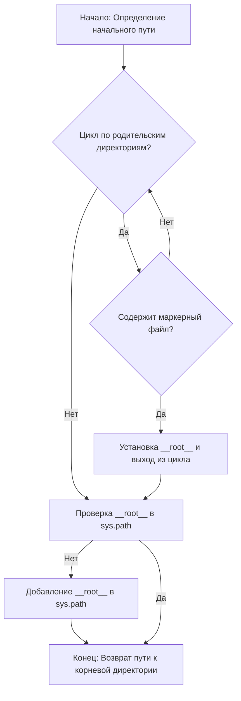

# Анализ кода `hypotez/src/endpoints/emil/header.py`

## 1. <алгоритм>

### Блок-схема рабочего процесса функции `set_project_root`:



**Примеры для каждого логического блока:**

- **A**: Начальный путь определяется как директория, содержащая текущий файл (`__file__`).
  - Пример: Если `__file__` это `/path/to/project/src/endpoints/emil/header.py`, тогда начальный путь будет `/path/to/project/src/endpoints/emil`.
- **B**: Цикл проходит по родительским директориям, поднимаясь вверх по структуре каталогов.
  - Пример: Из `/path/to/project/src/endpoints/emil` переходим к `/path/to/project/src/endpoints`, затем к `/path/to/project/src`, и так далее.
- **C**: Проверяется наличие маркерных файлов (например, `.git`, `__root__`) в текущей директории.
  - Пример: Проверяется, существует ли файл `/path/to/project/.git`.
- **D**: Если маркерный файл найден, текущая директория устанавливается как корневая директория проекта (`__root__`), и цикл прерывается.
  - Пример: Если `.git` найден в `/path/to/project`, тогда `__root__` становится `/path/to/project`.
- **E**: Проверяется, находится ли корневая директория проекта в `sys.path`.
  - Пример: Проверяется, есть ли строка `/path/to/project` в списке путей поиска модулей `sys.path`.
- **F**: Если корневая директория отсутствует в `sys.path`, она добавляется в начало списка.
  - Пример: Добавление `/path/to/project` в начало `sys.path`.
- **G**: Функция возвращает путь к корневой директории проекта.
  - Пример: Функция возвращает `Path('/path/to/project')`.

### Поток данных:

1. Функция `set_project_root` вызывается без аргументов или с указанием маркерных файлов.
2. Функция определяет начальный путь на основе местоположения файла `header.py`.
3. Функция ищет родительские директории, содержащие маркерные файлы.
4. Если маркерный файл найден, устанавливается корневая директория проекта.
5. Функция проверяет и, при необходимости, добавляет корневую директорию в `sys.path`.
6. Функция возвращает путь к корневой директории проекта.
7. Значение корневой директории присваивается переменной `__root__`.

## 2. <mermaid>

```mermaid
flowchart TD
    A[<code>header.py</code><br> set_project_root] --> B{Определение начального пути: <br><code>Path(__file__).resolve().parent</code>};
    B --> C{Цикл по родительским директориям};
    C --> D{Проверка наличия маркерных файлов: <br><code>any((parent / marker).exists() for marker in marker_files)</code>};
    D -- Да --> E[Установка корневой директории: <br><code>__root__ = parent</code>];
    D -- Нет --> C;
    E --> F{Проверка __root__ в sys.path};
    F -- Нет --> G[Добавление __root__ в sys.path: <br><code>sys.path.insert(0, str(__root__))</code>];
    F -- Да --> H[Возврат __root__];
    G --> H[Возврат __root__];
    H --> I[Присвоение __root__ глобальной переменной];

    style A fill:#f9f,stroke:#333,stroke-width:2px
    style I fill:#ccf,stroke:#333,stroke-width:2px
```

### Объяснение зависимостей:

- **`import sys`**: Модуль `sys` используется для работы с системными параметрами и функциями, такими как `sys.path`, который содержит список путей, где Python ищет модули.
- **`from pathlib import Path`**: Класс `Path` из модуля `pathlib` используется для представления путей к файлам и директориям, а также для выполнения операций над ними, таких как проверка существования файла или директории.

## 3. <объяснение>

### Импорты:

- **`import sys`**: Модуль `sys` предоставляет доступ к некоторым переменным и функциям, взаимодействующим с интерпретатором Python. В данном случае используется для модификации `sys.path`, чтобы добавить корневую директорию проекта в список путей поиска модулей.
- **`from pathlib import Path`**: Класс `Path` из модуля `pathlib` используется для представления путей к файлам и директориям в объектно-ориентированном стиле. Он упрощает выполнение операций с файловой системой, таких как проверка существования файлов и директорий.

### Классы:

- В данном коде нет классов.

### Функции:

- **`set_project_root(marker_files: tuple = ('__root__', '.git')) -> Path`**:
  - **Аргументы**:
    - `marker_files` (tuple, optional): Список имен файлов или директорий, которые используются для определения корневой директории проекта. По умолчанию `('__root__', '.git')`.
  - **Возвращаемое значение**:
    - `Path`: Путь к корневой директории проекта. Если ни один из маркерных файлов не найден, возвращается директория, в которой находится текущий файл.
  - **Назначение**:
    - Функция определяет корневую директорию проекта, начиная с директории текущего файла и двигаясь вверх по иерархии каталогов. Она ищет маркерные файлы (например, `.git` или `__root__`). Как только один из этих файлов найден, директория, содержащая этот файл, считается корневой директорией проекта. Если корневая директория не найдена в `sys.path`, она добавляется.
  - **Пример**:

    ```python
    from pathlib import Path
    import sys

    # Создаем временные файлы и директории для примера
    temp_dir = Path('/tmp/test_project')
    temp_dir.mkdir(parents=True, exist_ok=True)
    (temp_dir / '.git').touch()
    (temp_dir / 'src').mkdir(exist_ok=True)
    (temp_dir / 'src' / 'header.py').touch()

    # Заменяем __file__ на временный файл для теста
    import __main__
    __main__.__file__ = str(temp_dir / 'src' / 'header.py')

    # Вызываем функцию
    root_path = set_project_root()
    print(f"Root path: {root_path}")
    # Root path: /tmp/test_project
    print(f"Is root path in sys.path: {str(root_path) in sys.path}")
    # Is root path in sys.path: True

    # Удаляем временные файлы и директории
    import shutil
    shutil.rmtree(temp_dir)
    ```

### Переменные:

- `__root__` (Path): Глобальная переменная, содержащая путь к корневой директории проекта. Она инициализируется путем вызова функции `set_project_root()`.

### Потенциальные ошибки и области для улучшения:

- **Отсутствие обработки исключений**: В коде отсутствует обработка исключений, которые могут возникнуть при работе с файловой системой (например, `PermissionError`, если нет прав доступа к директории).
- **Зависимость от структуры каталогов**: Функция предполагает, что корневая директория может быть определена путем поиска маркерных файлов в родительских директориях. Это может не работать, если структура каталогов не соответствует ожиданиям.
- **Временное изменение `__file__` в примере**: В примере кода происходит временное изменение глобальной переменной `__file__`, что может привести к непредсказуемым последствиям в других частях программы, если не восстановить значение после использования.

### Взаимосвязи с другими частями проекта:

- Данный модуль (`header.py`) предназначен для определения корневой директории проекта и добавления ее в `sys.path`. Это позволяет другим модулям проекта импортировать модули, находящиеся в корневой директории, без необходимости указывать относительные пути.

### Дополнительно:
```mermaid
flowchart TD
    Start --> Header[<code>header.py</code><br> Determine Project Root]

    Header --> import[Import Global Settings: <br><code>from src import gs</code>]