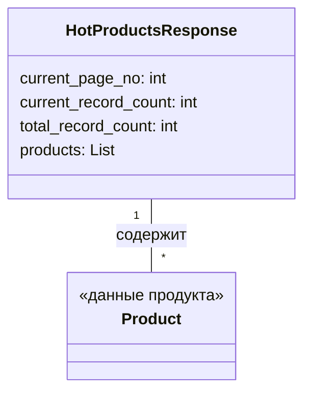

## Анализ кода `hotproducts.py`

### 1. Алгоритм

1.  **Определение класса `HotProductsResponse`**:
    *   Создается класс `HotProductsResponse` для представления ответа, содержащего список популярных продуктов.
    *   Класс имеет атрибуты для текущей страницы, количества записей на странице, общего количества записей и списка продуктов.
2.  **Импорт класса `Product`**:
    *   Импортируется класс `Product` из модуля `.product`. Этот класс, вероятно, представляет информацию об отдельном продукте.
3.  **Типизация атрибутов**:
    *   Атрибуты класса `HotProductsResponse` аннотированы типами: `current_page_no` (int), `current_record_count` (int), `total_record_count` (int) и `products` (List\[Product]).

### 2. Mermaid

**Объяснение зависимостей:**

*   `HotProductsResponse` содержит список объектов `Product`. Это означает, что для создания объекта `HotProductsResponse` необходимо иметь класс `Product`, представляющий структуру данных продукта.

### 3. Объяснение

**Импорты:**

*   `.product`: Импортируется класс `Product` из модуля `.product`, который находится в том же каталоге. Предположительно, класс `Product` содержит структуру данных для представления информации о продукте (например, имя, цена, описание).
*   `typing.List`: Используется для аннотации типа атрибута `products` как списка объектов `Product`.

**Классы:**

*   `HotProductsResponse`:
    *   **Роль:** Представляет ответ API, содержащий список популярных продуктов.
    *   **Атрибуты:**
        *   `current_page_no` (int): Номер текущей страницы в ответе.
        *   `current_record_count` (int): Количество записей (продуктов) на текущей странице.
        *   `total_record_count` (int): Общее количество записей (продуктов) во всех страницах.
        *   `products` (List\[Product]): Список объектов `Product`, представляющих популярные продукты на текущей странице.
    *   **Методы:** Отсутствуют. Класс представляет собой структуру данных.
    *   **Взаимодействие:** Используется для хранения и передачи данных о популярных продуктах, полученных из API.

**Переменные:**

*   `current_page_no`: Номер текущей страницы в ответе (целое число).
*   `current_record_count`: Количество записей на текущей странице (целое число).
*   `total_record_count`: Общее количество записей (целое число).
*   `products`: Список объектов `Product`.

**Потенциальные ошибки и области для улучшения:**

*   Отсутствует обработка ошибок. В случае, если данные из API не соответствуют ожидаемому формату, может возникнуть исключение.
*   Нет методов для сериализации/десериализации данных. Было бы полезно добавить методы для преобразования объекта `HotProductsResponse` в JSON и обратно.
*   Отсутствует документация по классу и его атрибутам.

**Взаимосвязь с другими частями проекта:**

*   Этот класс, вероятно, используется в модулях, которые взаимодействуют с API AliExpress для получения данных о популярных продуктах. Он служит для представления и структурирования данных, полученных из API, чтобы их можно было использовать в других частях проекта. Например, для отображения на веб-странице или для анализа данных.