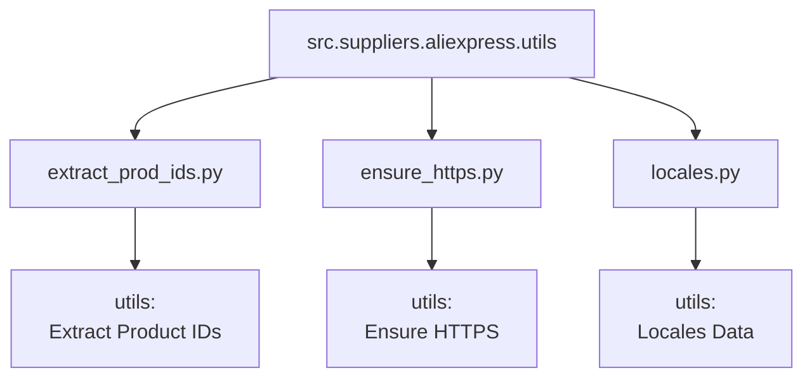

### **Анализ кода `hypotez/src/suppliers/aliexpress/utils/__init__.py`**

#### **1. <алгоритм>**:

Данный файл `__init__.py` служит для определения модуля `src.suppliers.aliexpress.utils` как пакета и импортирует в него некоторые функции и переменные, делая их доступными для использования вне этого модуля.

1.  **Импорт `extract_prod_ids`**:
    *   Пример: Пользователь вызывает `from src.suppliers.aliexpress.utils import extract_prod_ids`.
    *   Функция `extract_prod_ids` извлекает идентификаторы продуктов из URL или текста.
2.  **Импорт `ensure_https`**:
    *   Пример: Пользователь вызывает `from src.suppliers.aliexpress.utils import ensure_https`.
    *   Функция `ensure_https` проверяет и преобразует URL в HTTPS, если это необходимо.
3.  **Импорт `locales`**:
    *   Пример: Пользователь вызывает `from src.suppliers.aliexpress.utils import locales`.
    *   `locales` - это, вероятно, словарь или структура данных, содержащая информацию о локализациях (языках, странах) для AliExpress.

#### **2. <mermaid>**:

**Объяснение зависимостей в `mermaid`**:

*   `src.suppliers.aliexpress.utils` (A) - это пакет, который импортирует модули и переменные из других файлов.
*   `extract_prod_ids.py` (B) - модуль, содержащий функцию `extract_prod_ids` для извлечения идентификаторов продуктов.
*   `ensure_https.py` (C) - модуль, содержащий функцию `ensure_https` для обеспечения использования HTTPS в URL.
*   `locales.py` (D) - модуль, содержащий данные о локализациях.

#### **3. <объяснение>**:

*   **Импорты**:
    *   `from .extract_product_id import extract_prod_ids`: Импортирует функцию `extract_prod_ids` из модуля `extract_product_id.py`, находящегося в той же директории. Эта функция, вероятно, используется для извлечения идентификаторов продуктов из различных источников (например, URL страниц AliExpress).
    *   `from .ensure_https import ensure_https`: Импортирует функцию `ensure_https` из модуля `ensure_https.py`. Вероятно, она проверяет, что URL использует протокол HTTPS, и, если нет, преобразует его.
    *   `from .locales import locales`: Импортирует переменную `locales` из модуля `locales.py`. Это может быть словарь или другая структура данных, содержащая информацию о различных локализациях AliExpress (например, языки и страны).

*   **Назначение файла**:
    *   Файл `__init__.py` преобразует директорию `utils` в Python-пакет. Это позволяет другим частям проекта импортировать модули и переменные, определенные в этой директории, как единое целое.  Например, `from src.suppliers.aliexpress.utils import extract_prod_ids, ensure_https, locales`.

*   **Потенциальные улучшения**:
    *   Можно добавить документацию к каждой из импортированных функций и переменной `locales`, чтобы было понятнее их назначение и использование.
    *   Рассмотрение обработки исключений в функциях `extract_prod_ids` и `ensure_https` для обеспечения надежности.

*   **Взаимосвязь с другими частями проекта**:
    *   Этот файл является частью подсистемы, отвечающей за работу с AliExpress.  Функции и данные, предоставляемые этим пакетом, могут использоваться для извлечения данных о продуктах, обработки URL и поддержки различных локализаций AliExpress.  Например, при парсинге страниц AliExpress, идентификаторы продуктов могут быть извлечены с помощью `extract_prod_ids`, URL могут быть нормализованы с помощью `ensure_https`, а информация о локализации может быть использована для правильной интерпретации данных.