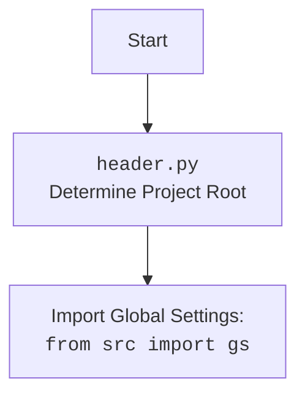

# Проект `hypotez`
# Роль `code explainer`

## АНАЛИЗ КОДА

### 1. <алгоритм>

1.  **Инициализация**:
    *   Класс `Graber` наследуется от класса `Graber` (переименованного как `Grbr`) из модуля `src.suppliers.graber`.
    *   При инициализации устанавливается префикс поставщика (`supplier_prefix`) как `'amazon'`.
    *   Вызывается конструктор родительского класса `Graber` для инициализации общих параметров, таких как `driver` и `lang_index`.
    *   Инициализируется `Context.locator_for_decorator` значением `None`.

2.  **Декоратор (закомментированный)**:
    *   Предоставлен шаблон декоратора `close_pop_up`, который предназначен для закрытия всплывающих окон перед выполнением основной логики функции.
    *   Декоратор использует `Context.locator` для выполнения локатора, который закрывает всплывающее окно.
    *   В случае ошибки выполнения локатора, информация об ошибке логируется.

3.  **Методы класса**:
    *   В классе `Graber` переопределяются или добавляются методы для обработки специфичных полей товара на странице `amazon.com`.
    *   Если требуется нестандартная обработка поля, соответствующая функция перегружается в этом классе.

4.  **Использование `Context`**:
    *   Класс `Context` используется для хранения глобальных настроек и объектов, таких как веб-драйвер.
    *   `Context.locator_for_decorator` используется для указания локатора, который должен быть выполнен декоратором `@close_pop_up`.

5.  **Логирование**:
    *   Для логирования используется модуль `logger` из `src.logger.logger`.
    *   Ошибки, возникающие при выполнении локаторов, логируются с уровнем `debug`.

### 2. <mermaid>

```mermaid
flowchart TD
    A[<code>src.suppliers.amazon.graber.py</code><br>Graber Class] --> B(Initialize Graber)
    B --> C{Set supplier_prefix to 'amazon'}
    C --> D(Call parent class Graber.__init__)
    D --> E{Initialize Context.locator_for_decorator to None}
    E --> F{Define close_pop_up decorator (commented out)}
    F --> G{Use Context.locator for decorator}
    G --> H(Handle specific fields on Amazon product page)
    H --> I{Override functions for non-standard processing}
    I --> J{Use logger for debugging}
    J --> K(End)
```



**Объяснение `mermaid` диаграммы:**

*   Диаграмма показывает основные этапы работы класса `Graber` в модуле `src.suppliers.amazon.graber.py`.
*   **A**: Начало процесса с класса `Graber`.
*   **B**: Инициализация класса `Graber`.
*   **C**: Установка префикса поставщика в значение `'amazon'`.
*   **D**: Вызов конструктора родительского класса `Graber` для инициализации общих параметров.
*   **E**: Инициализация `Context.locator_for_decorator` значением `None`.
*   **F**: Определение декоратора `close_pop_up` (закомментированного).
*   **G**: Использование `Context.locator` для декоратора.
*   **H**: Обработка специфичных полей на странице товара Amazon.
*   **I**: Переопределение функций для нестандартной обработки полей.
*   **J**: Использование модуля `logger` для логирования отладочной информации.
*   **K**: Завершение процесса.

### 3. <объяснение>

**Импорты**:

*   `header`: Импортируется для определения корневой директории проекта и загрузки глобальных настроек.
*   `src.suppliers.graber.Graber as Grbr`: Импортируется родительский класс `Graber` из модуля `src.suppliers.graber` и переименовывается в `Grbr` для краткости. Этот класс содержит общую логику для сбора данных с веб-страниц.
*   `src.suppliers.graber.Context`: Импортируется класс `Context` из модуля `src.suppliers.graber`. Этот класс используется для хранения глобальных настроек и объектов, таких как веб-драйвер.
*   `src.suppliers.graber.close_pop_up`: Импортируется функция `close_pop_up` из модуля `src.suppliers.graber`. Эта функция используется в качестве декоратора для закрытия всплывающих окон перед выполнением основной логики функции.
*   `src.webdriver.driver.Driver`: Импортируется класс `Driver` из модуля `src.webdriver.driver`. Этот класс представляет собой веб-драйвер, который используется для взаимодействия с браузером.
*   `src.logger.logger.logger`: Импортируется объект `logger` из модуля `src.logger.logger`. Этот объект используется для логирования информации о работе программы.

**Классы**:

*   `Graber`:
    *   Роль: Класс предназначен для сбора данных со страниц товаров на сайте `amazon.com`.
    *   Атрибуты:
        *   `supplier_prefix` (str): Префикс поставщика, устанавливается в значение `'amazon'`.
    *   Методы:
        *   `__init__(self, driver: Driver, lang_index: int)`: Конструктор класса. Инициализирует объект класса, устанавливает префикс поставщика, вызывает конструктор родительского класса и инициализирует `Context.locator_for_decorator` значением `None`.

**Функции**:

*   `close_pop_up(value: Any = None)`:
    *   Аргументы:
        *   `value` (Any, optional): Дополнительное значение для декоратора. По умолчанию `None`.
    *   Возвращаемое значение:
        *   `Callable`: Декоратор, оборачивающий функцию.
    *   Назначение: Создает декоратор для закрытия всплывающих окон перед выполнением основной логики функции.
    *   Пример:
        ```python
        @close_pop_up()
        async def my_function():
            ...
        ```

**Переменные**:

*   `supplier_prefix` (str): Префикс поставщика, используется для идентификации поставщика в системе.
*   `Context.locator_for_decorator` (Any): Локатор для выполнения в декораторе `@close_pop_up`. Если установлено значение, то оно будет выполнено в декораторе.

**Потенциальные ошибки и области для улучшения**:

*   Декоратор `@close_pop_up` закомментирован, что означает, что функциональность закрытия всплывающих окон не используется. Если эта функциональность необходима, декоратор следует раскомментировать и настроить.
*   Обработка ошибок выполнения локатора в декораторе выполняется только с уровнем `debug`. Возможно, следует добавить обработку ошибок с уровнем `error` для более серьезных ситуаций.

**Взаимосвязи с другими частями проекта**:

*   Класс `Graber` использует класс `Graber` из модуля `src.suppliers.graber` для общей логики сбора данных.
*   Класс `Graber` использует класс `Driver` из модуля `src.webdriver.driver` для взаимодействия с браузером.
*   Класс `Graber` использует модуль `logger` из `src.logger.logger` для логирования информации о работе программы.
*   Класс `Graber` использует класс `Context` из модуля `src.suppliers.graber` для хранения глобальных настроек и объектов.