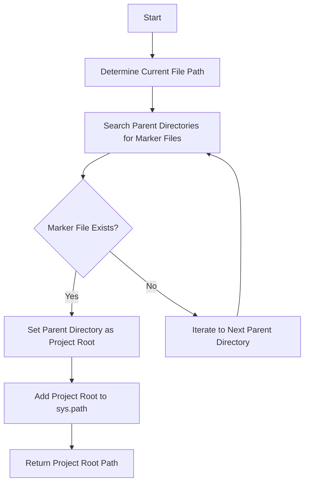
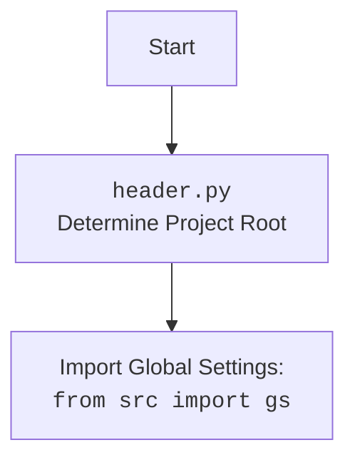

# Проект `hypotez`
# Роль `code explainer`

## АНАЛИЗ КОДА: `hypotez/src/webdriver/crawlee_python/header.py`

### 1. <алгоритм>

Этот скрипт предназначен для определения корневой директории проекта `hypotez` на основе наличия определенных файлов-маркеров (`__root__` или `.git`) в структуре каталогов. Это позволяет скрипту динамически определять, где находится корень проекта, независимо от текущего рабочего каталога.

1.  **Начало**:
    *   Скрипт начинается с импорта необходимых модулей: `sys`, `json`, `Version` (из `packaging.version`) и `Path` (из `pathlib`).
    *   Определяется функция `set_project_root`, принимающая кортеж `marker_files` в качестве аргумента, со значениями по умолчанию `('__root__', '.git')`.

2.  **Определение текущего пути**:
    *   Получает путь к текущему файлу (`__file__`) и разрешает его, чтобы получить абсолютный путь. Затем извлекает родительский каталог и сохраняет его в переменной `current_path`.

    ```python
    current_path:Path = Path(__file__).resolve().parent
    ```

    *   Пример: Если скрипт находится по адресу `/path/to/hypotez/src/webdriver/crawlee_python/header.py`, то `current_path` будет `/path/to/hypotez/src/webdriver/crawlee_python`.

3.  **Поиск корневого каталога**:

    *   Итерируется по текущему каталогу и его родительским каталогам.
    *   На каждой итерации проверяется, содержит ли текущий каталог какой-либо из файлов-маркеров.
    *   Если маркер найден, текущий каталог устанавливается как корневой каталог (`__root__`), и цикл прерывается.

    ```python
    for parent in [current_path] + list(current_path.parents):
        if any((parent / marker).exists() for marker in marker_files):
            __root__ = parent
            break
    ```

    *   Пример: Если маркер `.git` найден в `/path/to/hypotez`, то `__root__` будет `/path/to/hypotez`.

4.  **Добавление корневого каталога в `sys.path`**:

    *   Проверяет, находится ли корневой каталог уже в `sys.path`.
    *   Если нет, добавляет его в начало `sys.path`, чтобы обеспечить возможность импорта модулей из корневого каталога.

    ```python
    if __root__ not in sys.path:
        sys.path.insert(0, str(__root__))
    ```

    *   Пример: Если `__root__` это `/path/to/hypotez`, то `/path/to/hypotez` будет добавлен в `sys.path`.

5.  **Возврат корневого каталога**:

    *   Функция возвращает путь к корневому каталогу.

    ```python
    return __root__
    ```

6.  **Установка корневого каталога**:

    *   Вызывает функцию `set_project_root` для определения и сохранения корневого каталога в глобальной переменной `__root__`.

    ```python
    __root__: Path = set_project_root()
    ```

### 2. <mermaid>



**Объяснение зависимостей (импортов):**

*   **sys**: Предоставляет доступ к некоторым переменным и функциям, взаимодействующим с интерпретатором Python. Используется для изменения `sys.path`, чтобы добавить корневую директорию проекта для импорта модулей.
*   **json**: Хотя он и импортирован, в данном коде он не используется.
*   **packaging.version**: Хотя он и импортирован, в данном коде он не используется.
*   **pathlib**: Предоставляет способ представления путей файловой системы в виде объектов. Используется для определения пути к текущему файлу, поиска файлов-маркеров и управления путями к каталогам.

### 3. <объяснение>

**Импорты:**

*   `sys`: Используется для работы с системными параметрами и функциями, такими как изменение `sys.path`.
*   `json`: Модуль для работы с данными в формате JSON.
*   `packaging.version`: Используется для сравнения версий.
*   `pathlib`: Модуль для работы с файловыми путями в объектно-ориентированном стиле.

**Функция `set_project_root`:**

*   **Аргументы:**
    *   `marker_files` (tuple): Кортеж имен файлов или каталогов, которые используются для определения корневого каталога проекта. По умолчанию `('__root__', '.git')`.
*   **Возвращаемое значение:**
    *   `Path`: Путь к корневому каталогу проекта.
*   **Назначение:**
    *   Функция ищет корневой каталог проекта, начиная с каталога, в котором находится текущий файл, и двигаясь вверх по дереву каталогов. Она останавливается, когда находит каталог, содержащий один из файлов-маркеров.
    *   После обнаружения корневого каталога функция добавляет его в `sys.path`, если его там еще нет. Это позволяет импортировать модули из корневого каталога проекта.
*   **Пример:**

    Если структура каталогов выглядит следующим образом:

    ```
    /path/to/hypotez/
    ├── src/
    │   └── webdriver/
    │       └── crawlee_python/
    │           └── header.py
    └── .git
    ```

    И `header.py` вызывает `set_project_root()`, функция вернет `/path/to/hypotez/` и добавит этот путь в `sys.path`.

**Переменные:**

*   `__root__` (Path): Глобальная переменная, содержащая путь к корневому каталогу проекта. Она инициализируется путем вызова функции `set_project_root()`.
*   `current_path` (Path): Локальная переменная, содержащая путь к каталогу, в котором находится текущий файл.

**Потенциальные ошибки и области для улучшения:**

*   **Отсутствие обработки ошибок**: В коде отсутствует явная обработка ошибок.
*   **Неиспользуемые импорты**: Импортированные модули `json` и `packaging.version` не используются в данном коде.

**Взаимосвязь с другими частями проекта:**

*   Этот скрипт является частью модуля `webdriver` в проекте `hypotez`. Он используется для определения корневого каталога проекта, чтобы другие модули могли правильно импортироваться и работать.
*   Этот скрипт может использоваться другими частями проекта, которым необходимо знать расположение корневого каталога.

