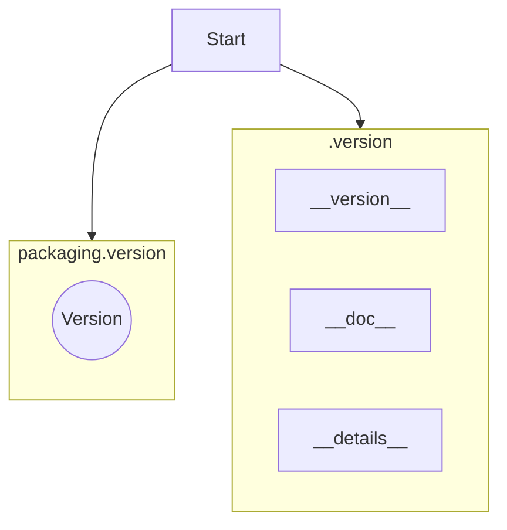

### **Анализ кода `hypotez/src/webdriver/edge/extentions/__init__.py`**

#### **1. <алгоритм>**:

1.  **Импорт `packaging.version.Version`**: Импортируется класс `Version` из модуля `packaging.version`. Этот класс используется для работы с версиями пакетов и их сравнения.

    *   Пример:

        ```python
        from packaging.version import Version
        v1 = Version('1.2.3')
        v2 = Version('2.0')
        print(v1 < v2)  # Вывод: True
        ```
2.  **Импорт из `.version`**: Импортируются переменные `__version__`, `__doc__` и `__details__` из файла `version.py`, находящегося в той же директории.

    *   Пример:

        ```python
        from .version import __version__, __doc__, __details__
        print(__version__)    # Вывод: версия пакета, например, '1.0.0'
        print(__doc__)        # Вывод: строка документации модуля
        print(__details__)    # Вывод: дополнительные детали, определенные в version.py
        ```

#### **2. <mermaid>**:



**Объяснение зависимостей в `mermaid`**:

*   `packaging.version`: Импортируется класс `Version` для работы с версиями пакетов. Это внешняя зависимость, позволяющая сравнивать и анализировать версии.
*   `.version`: Импортируются переменные `__version__`, `__doc__` и `__details__` из локального модуля `version.py`. Эти переменные содержат информацию о версии, документацию и дополнительные детали пакета.

#### **3. <объяснение>**:

*   **Импорты**:
    *   `from packaging.version import Version`: Импортирует класс `Version` из библиотеки `packaging`, который предоставляет инструменты для работы с версиями программного обеспечения. Это позволяет сравнивать версии, проверять их соответствие определенным критериям и т.д.
    *   `from .version import __version__, __doc__, __details__`: Импортирует переменные `__version__` (строка, содержащая номер версии), `__doc__` (строка документации) и `__details__` (дополнительные детали о версии или пакете) из модуля `version.py`, находящегося в той же директории.

*   **Переменные**:
    *   `__version__`: Строка, представляющая текущую версию пакета.
    *   `__doc__`: Строка документации, описывающая назначение пакета.
    *   `__details__`: Дополнительные детали, связанные с пакетом или его версией.

*   **Потенциальные области для улучшения**:
    *   Необходимо убедиться, что файл `version.py` существует и содержит корректные значения для `__version__`, `__doc__` и `__details__`.
    *   Добавить обработку исключений, если файл `version.py` не найден или содержит ошибки.

**Цепочка взаимосвязей с другими частями проекта**:

1.  `__init__.py` собирает информацию о версии и документацию из `version.py`.
2.  Эта информация может быть использована другими частями проекта для логирования, отладки или отображения информации о версии пакета.
3.  Класс `Version` из `packaging.version` позволяет сравнивать версии, что может быть полезно при проверке совместимости компонентов или при обновлении пакетов.