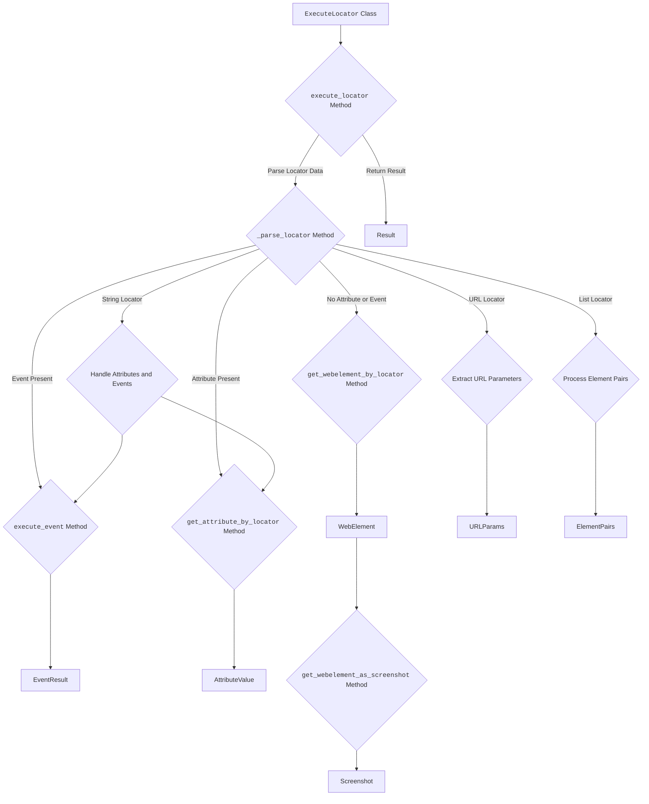
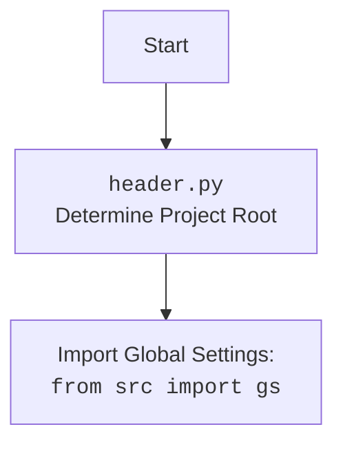

### **Анализ кода проекта `hypotez`**

=========================================================================================

#### **1. <алгоритм>**:

1.  **`ExecuteLocator` Class Initialization**:

    *   Класс `ExecuteLocator` инициализируется с драйвером (`driver`), который может быть `None`.
    *   Инициализируется объект `ActionChains`, используемый для выполнения сложных действий с веб-элементами.

    ```python
    @dataclass
    class ExecuteLocator:
        """
        Handles web element interaction using Selenium based on provided locators.
        """

        driver: Optional[object] = None
        actions: ActionChains = field(init=False)
        mode: str = "debug"

        def __post_init__(self):
            if self.driver:
                self.actions = ActionChains(self.driver)
    ```

2.  **`execute_locator` Method**:

    *   Метод принимает локатор (`locator`), тайм-аут (`timeout`), событие тайм-аута (`timeout_for_event`), сообщение (`message`) и скорость ввода (`typing_speed`).
    *   Если локатор является словарем, он преобразуется в `SimpleNamespace`.
    *   Вызывает внутренний метод `_parse_locator` для дальнейшей обработки.

    ```python
    async def execute_locator(
        self,
        locator:  dict | SimpleNamespace,
        timeout: Optional[float] = 0,
        timeout_for_event: Optional[str] = "presence_of_element_located",
        message: Optional[str] = None,
        typing_speed: Optional[float] = 0,
    ) ->  Optional[str | list | dict | WebElement | bool]:
        """
        Executes actions on a web element based on the provided locator.

        Args:
            locator: Locator data (dict or SimpleNamespace).
            timeout: Timeout for locating the element (seconds).
            timeout_for_event: Wait condition (\'presence_of_element_located\', \'visibility_of_all_elements_located\').
            message: Optional message for actions like send_keys or type.
            typing_speed: Typing speed for send_keys events (seconds).

        Returns:
            The result of the operation, which can be a string, list, dict, WebElement, bool, or None.
        """
        if isinstance(locator, dict):
            locator = SimpleNamespace(**locator)

        if not getattr(locator, "attribute", None) and not getattr(locator, "selector", None):
            logger.debug("Empty locator provided.", None, False)
            return None

        async def _parse_locator(...):
            ...
    ```

3.  **`_parse_locator` Method**:

    *   Проверяет наличие атрибутов `event` и `attribute` в локаторе.
    *   Если `locator.by` является строкой, обрабатывает атрибуты и события.
    *   Если `locator.by` является `'url'`, извлекает параметры из URL.
    *   Если `locator.event` присутствует, вызывает `execute_event`.
    *   Если `locator.attribute` присутствует, вызывает `get_attribute_by_locator`.
    *   В противном случае вызывает `get_webelement_by_locator`.
    *   Если `locator.by` является списком, обрабатывает его как пары элементов.

    ```python
    async def _parse_locator(
        locator: SimpleNamespace,
        message: Optional[str] = None,
        timeout: Optional[float] = 0,
        timeout_for_event: Optional[str] = "presence_of_element_located",
        typing_speed: Optional[float] = 0,
    ) -> Optional[str | list | dict | WebElement | bool]:
        """Parses and executes locator instructions."""

        if locator.event and locator.attribute and locator.mandatory is None:
            logger.debug(f"Locator with event and attribute but missing mandatory flag. Skipping. {print(locator.__dict__, text_color=\'yellow\')} ",None,False)
            return None

        if isinstance(locator.by, str):
            try:
                locator.by = locator.by.lower()
                if locator.attribute:
                    locator.attribute = self._evaluate_locator(locator.attribute)

                    if locator.by == "value":
                        return locator.attribute

                    if locator.by == 'url':
                        if not locator.attribute:
                            logger.error(f"Attribute is missing for \'URL\' locator: {print(locator.__dict__, text_color=\'yellow\')}")
                            return False

                        url = self.driver.current_url
                        parsed_url = urlparse(url)
                        query_params = parse_qs(parsed_url.query)
                        return query_params.get(locator.attribute, None)[0]

            except Exception as ex:
                logger.error(f"Error getting attribute by \'VALUE\': {print(locator.__dict__, text_color=\'yellow\')}, error:",ex)
                return None

            if locator.event:
                return await self.execute_event(locator, timeout, timeout_for_event, message, typing_speed)

            if locator.attribute:
                return await self.get_attribute_by_locator(locator, timeout, timeout_for_event)

            return await self.get_webelement_by_locator(locator, timeout, timeout_for_event)

        elif isinstance(locator.selector, list) and isinstance(locator.by, list):
            if locator.sorted == "pairs":
                elements_pairs = []

                for n in len(locator.by):
                
                    l = SimpleNamespace(
                        **{
                            "attribute": locator.attribute[n],
                            "by": locator.by[n],
                            "selector": locator.selector[n],
                            "if_list": locator.if_list if isinstance(locator.if_list, str) else locator.if_list[n],
                            "mandatory": locator.mandatory if isinstance(locator.mandatory, str) else locator.mandatory[n],
                            "event": locator.event if isinstance(locator.event, str) else locator.event[n],
                            "timeout": locator.timeout if isinstance(locator.timeout, str) else locator.timeout[n],
                            "timeout_for_event": locator.timeout_for_event if isinstance(locator.timeout_for_event, str) else locator.timeout_for_event[n],
                            "locator_description": locator.locator_description,
                        }
                    )
                    elements_pairs.append(await _parse_locator(l, message, timeout, timeout_for_event, message, typing_speed))

                zipped_pairs = list(zip_longest(*elements_pairs, fillvalue=None))
                return zipped_pairs

        else:
            logger.warning("Locator does not contain \'selector\' and \'by\' lists or invalid \'sorted\' value.")
    ```

4.  **`_evaluate_locator` Method**:

    *   Оценивает атрибут локатора, заменяя специальные символы клавиш, если они есть.

    ```python
    def _evaluate_locator(self, attribute: str | List[str] | dict) -> Optional[str | List[str] | dict]:
        """
        Evaluates and processes locator attributes.

        Args:
            attribute: Attribute to evaluate (can be a string, list of strings, or a dictionary).

        Returns:
            The evaluated attribute, which can be a string, list of strings, or dictionary.
        """

        def _evaluate(attr: str) -> Optional[str]:
            """Evaluates single attribute string."""
            return getattr(Keys, re.findall(r"%(\\w+)%", attr)[0], None) if re.match(r"^%\\w+%", attr) else attr

        if isinstance(attribute, list):
            return  [_evaluate(attr) for attr in attribute]
        return  _evaluate(str(attribute))
    ```

5.  **`get_attribute_by_locator` Method**:

    *   Получает атрибуты веб-элемента, используя предоставленный локатор.
    *   Использует `get_webelement_by_locator` для получения веб-элемента.
    *   Обрабатывает атрибуты в формате словаря.

    ```python
    async def get_attribute_by_locator(
        self,
        locator: SimpleNamespace | dict,
        timeout: Optional[float] = 0,
        timeout_for_event: str = "presence_of_element_located",
        message: Optional[str] = None,
        typing_speed: float = 0,
    ) -> Optional[WebElement | list[WebElement]]:
        """
        Retrieves attributes from a web element or a list of web elements.

        Args:
            locator: Locator data (dict or SimpleNamespace).
            timeout: Timeout for locating the element (seconds).
            timeout_for_event: Wait condition (\'presence_of_element_located\', \'visibility_of_all_elements_located\').
            message: Not used in this function.
            typing_speed: Not used in this function.

        Returns:
            The attribute value(s) as a WebElement, list of WebElements, or None if not found.
        """
        locator = (
            locator if isinstance(locator, SimpleNamespace) else SimpleNamespace(**locator) if isinstance(locator, dict) else None
        )

        web_element: WebElement = await self.get_webelement_by_locator(locator, timeout, timeout_for_event)
        if not web_element:
            if locator.mandatory: 
                logger.debug(f"Element not found: {print(locator, text_color=\'yellow\')}")
            return None

        def _parse_dict_string(attr_string: str) -> dict | None:
            """Parses a string like \'{attr1:attr2}\' into a dictionary."""
            try:
                return {
                    k.strip(): v.strip()
                    for k, v in (pair.split(":") for pair in attr_string.strip("{}").split(","))
                }
            except ValueError as ex:
                logger.debug(f"Invalid attribute string format: {attr_string!r}", ex)
                return None

        def _get_attributes_from_dict(web_element: WebElement, attr_dict: dict) -> dict:
            """Retrieves attribute values from a WebElement based on a dictionary."""
            result = {}
            for key, value in attr_dict.items():
                try:
                    attr_key = web_element.get_attribute(key)
                    attr_value = web_element.get_attribute(value)
                    result[attr_key] = attr_value
                except Exception as ex:
                    logger.debug(f"Error retrieving attributes \'{key}\' or \'{value}\' from element.", ex)
                    return {}
            return result

        if web_element:
            if isinstance(locator.attribute, str) and locator.attribute.startswith("{"):
                attr_dict = _parse_dict_string(locator.attribute)
                if isinstance(web_element, list):
                    return [_get_attributes_from_dict(el, attr_dict) for el in web_element]
                return _get_attributes_from_dict(web_element, attr_dict)

            if isinstance(web_element, list):
                ret: list = []
                try:
                    for e in web_element:
                        ret.append(f\'{e.get_attribute(locator.attribute)}\')
                    return ret if len(ret) > 1 else ret[0]
                except Exception as ex:
                    logger.debug(f"Error in get_attribute(): {locator=}", ex)
                    return None

            return web_element.get_attribute(locator.attribute)
        return None
    ```

6.  **`get_webelement_by_locator` Method**:

    *   Получает веб-элемент или список элементов на основе предоставленного локатора.
    *   Использует `WebDriverWait` для ожидания появления элементов, если указан тайм-аут.
    *   Вызывает `_parse_elements_list` для фильтрации списка элементов.

    ```python
    async def get_webelement_by_locator(
        self,
        locator: dict | SimpleNamespace,
        timeout: Optional[float] = 0,
        timeout_for_event: Optional[str] = "presence_of_element_located",
    ) -> Optional[WebElement | List[WebElement]]:
        """
        Retrieves a web element or list of elements based on the provided locator.

        Args:
            locator: Locator data (dict or SimpleNamespace).
            timeout: Timeout for locating the element (seconds).
            timeout_for_event: Wait condition (\'presence_of_element_located\', \'visibility_of_all_elements_located\').

        Returns:
           WebElement, list of WebElements, or None if not found.
        """
        timeout = timeout if timeout > 0 else getattr(locator, \'timeout\', 0)

        async def _parse_elements_list(
            web_elements: WebElement | List[WebElement], locator: SimpleNamespace
        ) ->  Optional[WebElement | List[WebElement]]:
            """Filters a list of web elements based on the if_list attribute."""
            if not isinstance(web_elements, list):
                return web_elements

            if_list = locator.if_list

            if if_list == "all":
                return web_elements
            elif if_list == "first":
                return web_elements[0]
            elif if_list == "last":
                return web_elements[-1]
            elif if_list == "even":
                return [web_elements[i] for i in range(0, len(web_elements), 2)]
            elif if_list == "odd":
                return [web_elements[i] for i in range(1, len(web_elements), 2)]
            elif isinstance(if_list, list):
                return [web_elements[i] for i in if_list]
            elif isinstance(if_list, int):
                return web_elements[if_list - 1]

            return web_elements

        driver = self.driver
        locator = SimpleNamespace(**locator) if isinstance(locator, dict) else locator

        if not locator:
            logger.error("Invalid locator provided.")
            return None

        web_elements = None
        try:
            if timeout == 0:
                web_elements = await asyncio.to_thread(
                    driver.find_elements, locator.by, locator.selector
                )
            else:
                condition = (
                    EC.presence_of_all_elements_located
                    if timeout_for_event == "presence_of_all_elements_located"
                    else EC.visibility_of_all_elements_located
                )
                web_elements = await asyncio.to_thread(
                    WebDriverWait(driver, timeout).until,
                    condition((locator.by, locator.selector)),
                )

            return await _parse_elements_list(web_elements, locator) if web_elements else None

        except TimeoutException as ex:
            logger.error(f"Timeout for locator: {print(locator.__dict__, text_color=\'yellow\')}", ex, False)
            return None

        except Exception as ex:
            logger.error(f"Error locating element: {print(locator.__dict__, text_color=\'yellow\')}", ex, False)
            return None
    ```

7.  **`get_webelement_as_screenshot` Method**:

    *   Делает скриншот найденного веб-элемента.
    *   Использует `get_webelement_by_locator` для получения веб-элемента, если он не был передан.

    ```python
    async def get_webelement_as_screenshot(
        self,
        locator: SimpleNamespace | dict,
        timeout: float = 5,
        timeout_for_event: str = "presence_of_element_located",
        message: Optional[str] = None,
        typing_speed: float = 0,
        webelement: Optional[WebElement] = None,
    ) -> Optional[BinaryIO]:
        """
        Takes a screenshot of the located web element.

        Args:
            locator: Locator data (dict or SimpleNamespace).
            timeout: Timeout for locating the element (seconds).
            timeout_for_event: Wait condition (\'presence_of_element_located\', \'visibility_of_all_elements_located\').
            message: Not used in this function.
            typing_speed: Not used in this function.
            webelement: Optional pre-fetched web element.

        Returns:
           BinaryIO stream of the screenshot or None if failed.
        """
        locator = (
            locator if isinstance(locator, SimpleNamespace) else SimpleNamespace(**locator) if isinstance(locator, dict) else None
        )

        if not webelement:
            webelement = await self.get_webelement_by_locator(
                locator=locator, timeout=timeout, timeout_for_event=timeout_for_event
            )

        if not webelement:
            return None

        try:
            return webelement.screenshot_as_png
        except Exception as ex:
            logger.error(f"Failed to take screenshot", ex)
            return None
    ```

8.  **`execute_event` Method**:

    *   Выполняет событие, связанное с локатором, такое как клик, пауза, загрузка медиа, скриншот, очистка или отправка клавиш.

    ```python
    async def execute_event(
        self,
        locator: SimpleNamespace | dict,
        timeout: float = 5,
        timeout_for_event: str = "presence_of_element_located",
        message: str = None,
        typing_speed: float = 0,
    ) -> Optional[str | list[str] | bytes | list[bytes] | bool]:
        """
        Executes an event associated with a locator.

        Args:
            locator: Locator data (dict or SimpleNamespace).
            timeout: Timeout for locating the element (seconds).
            timeout_for_event: Wait condition (\'presence_of_element_located\', \'visibility_of_all_elements_located\').
            message: Optional message to send with the event.
            typing_speed: Typing speed for send_keys events (seconds).

        Returns:
            The result of the event execution (str, list of str, bytes, list of bytes, or bool).
        """
        locator = (
            locator if isinstance(locator, SimpleNamespace) else SimpleNamespace(**locator) if isinstance(locator, dict) else None
        )
        events = str(locator.event).split(";")
        result: list = []

        webelement = await self.get_webelement_by_locator(locator, timeout, timeout_for_event)
        if not webelement:
            return False
        webelement = webelement[0] if isinstance(webelement, list) else webelement

        for event in events:
            if event == "click()":
                try:
                    webelement.click()
                    continue
                except ElementClickInterceptedException as ex:
                    if locator.mandatory:
                        logger.error(f"Element click intercepted: {print(locator)}", ex, False)
                        return False
                except Exception as ex:
                    if locator.mandatory:
                        logger.error(f"Element click error:\\n {print(locator)} \\n", ex, False)
                        # try:
                        #     self.driver.execute_script("arguments[0].click();", webelement)
                        #     continue
                        # except Exception as ex:
                        #     logger.error(f"Element click error after javascript execution: {locator=}", ex)
                        #     return False
                        return False

            elif event.startswith("pause("):
                match = re.match(r"pause\\((\\d+)\\)", event)
                if match:
                    pause_duration = int(match.group(1))
                    await asyncio.sleep(pause_duration)
                    result.append(True)
                    continue
                if locator.mandatory:
                    logger.debug(f"Pause event parsing failed: {print(locator)}")
                    return False

            elif event == "upload_media()":
                if not message and locator.mandatory:
                    logger.debug(f"Message is required for upload_media event. Message: {print(message)}")
                    return False
                try:
                    await asyncio.to_thread(webelement.send_keys, message)
                    result.append(True)
                    continue
                except Exception as ex:
                    if locator.mandatory:
                        logger.debug(f"Error uploading media: {message=}", ex)
                        return False

            elif event == "screenshot()":
                try:
                    result.append(await self.get_webelement_as_screenshot(locator, webelement=webelement))
                except Exception as ex:
                    logger.error(f"Error taking screenshot: {locator=}", ex, False)
                    return False

            elif event == "clear()":
                try:
                    await asyncio.to_thread(webelement.clear)
                except Exception as ex:
                    logger.error(f"Error clearing element: {locator=}", ex, False)
                    return False

            elif event.startswith("send_keys("):\n                keys_to_send = event.replace("send_keys(", "").replace(")", "").split("+")
                try:
                    actions = ActionChains(self.driver)
                    for key in keys_to_send:
                        key = key.strip().strip("\'")
                        if hasattr(Keys, key):
                            key_to_send = getattr(Keys, key)
                            actions.send_keys(key_to_send)
                    await asyncio.to_thread(actions.perform)\n                except Exception as ex:\n                    logger.error(f"Error sending keys: {locator=}", ex, False)\n                    return False\n\n            elif event.startswith("type("):\n                message = event.replace("type(", "").replace(")", "")\n                if typing_speed:\n                    for character in message:\n                        await asyncio.to_thread(webelement.send_keys, character)\n                        await asyncio.sleep(typing_speed)\n                else:\n                    await asyncio.to_thread(webelement.send_keys, message)

        return result if result else True
    ```

9.  **`send_message` Method**:

    *   Отправляет сообщение веб-элементу, используя указанную скорость ввода.

    ```python
    async def send_message(
        self,
        locator: SimpleNamespace | dict,
        timeout: float = 5,
        timeout_for_event: str = "presence_of_element_located",
        message: str = None,
        typing_speed: float = 0,
    ) -> bool:
        """
        Sends a message to a web element.

        Args:
            locator: Locator data (dict or SimpleNamespace).
            timeout: Timeout for locating the element (seconds).
            timeout_for_event: Wait condition (\'presence_of_element_located\', \'visibility_of_all_elements_located\').
            message: Message to send to the web element.
            typing_speed: Typing speed for send_keys events (seconds).

        Returns:
            True if the message was sent successfully, False otherwise.
        """
        locator = (
            locator
            if isinstance(locator, SimpleNamespace)
            else SimpleNamespace(**locator) if isinstance(locator, dict) else None
        )

        def type_message(
            el: WebElement,
            message: str,
            replace_dict: dict = {";": "SHIFT+ENTER"},
            typing_speed: float = typing_speed,
        ) -> bool:
            """Types a message into a web element with a specified typing speed."""
            message = message.split(" ")
            for word in message:
                word += " "
                try:
                    for letter in word:
                        if letter in replace_dict.keys():
                            self.actions.key_down(Keys.SHIFT).send_keys(Keys.ENTER).key_up(Keys.SHIFT)
                        else:
                            self.actions.send_keys(letter)
                            self.actions.pause(typing_speed)
                            self.actions.perform()
                except Exception as ex:
                    logger.error(f"Error typing message:/n message={print(message)},/n word={print(letter)},/n letter={print(letter)}/n", ex, False)
                    continue
            return True

        webelement = await self.get_webelement_by_locator(
            locator=locator, timeout=timeout, timeout_for_event=timeout_for_event
        )
        if not webelement or (isinstance(webelement, list) and len(webelement) == 0):
            logger.debug("Web element was not found for sending message.")
            return False
        webelement = webelement[0] if isinstance(webelement, list) else webelement
        self.actions.move_to_element(webelement)
        type_message(
            el=webelement,
            message=message,
            replace_dict={";": "SHIFT+ENTER"},
            typing_speed=typing_speed,
        )
        return True
    ```

#### **2. <mermaid>**:



**Объяснение зависимостей в диаграмме:**

*   **`ExecuteLocator` Class**: Основной класс, обрабатывающий взаимодействие с веб-элементами.
*   **`execute_locator` Method**: Главный метод, координирующий выполнение действий на основе предоставленных локаторов.
*   **`_parse_locator` Method**: Внутренний метод, анализирующий и направляющий выполнение в зависимости от типа локатора и наличия атрибутов/событий.
*   **`get_attribute_by_locator` Method**: Метод, извлекающий атрибуты веб-элементов.
*   **`get_webelement_by_locator` Method**: Метод, получающий веб-элемент на основе локатора.
*   **`get_webelement_as_screenshot` Method**: Метод, делающий скриншот веб-элемента.
*   **`execute_event` Method**: Метод, выполняющий события, связанные с веб-элементом.



#### **3. <объяснение>**:

*   **Импорты**:

    *   `asyncio`: Для асинхронного программирования.
    *   `re`: Для работы с регулярными выражениями.
    *   `dataclasses`: Для создания классов данных.
    *   `typing`: Для аннотации типов.
    *   `itertools`: Для работы с итераторами.
    *   `urllib.parse`: Для разбора URL.
    *   `selenium`: Для автоматизации браузера.
    *   `header`: Определяет корень проекта.
    *   `src.logger.logger`: Для логирования.
    *   `src.utils.printer`: Для красивого вывода.

*   **Классы**:

    *   **`ExecuteLocator`**:
        *   **Роль**: Обработка взаимодействия с веб-элементами.
        *   **Атрибуты**:
            *   `driver`: Объект веб-драйвера Selenium.
            *   `actions`: Объект `ActionChains` для выполнения сложных действий.
            *   `mode`: Режим работы (например, `debug`).
        *   **Методы**:
            *   `__post_init__`: Инициализирует `ActionChains` после создания экземпляра класса.
            *   `execute_locator`: Выполняет действия на веб-элементе на основе предоставленного локатора.
            *   `_parse_locator`: Анализирует и выполняет инструкции локатора.
            *   `_evaluate_locator`: Оценивает атрибуты локатора.
            *   `get_attribute_by_locator`: Получает атрибуты веб-элемента.
            *   `get_webelement_by_locator`: Получает веб-элемент по локатору.
            *   `get_webelement_as_screenshot`: Делает скриншот веб-элемента.
            *   `execute_event`: Выполняет событие, связанное с локатором.
            *   `send_message`: Отправляет сообщение веб-элементу.

*   **Функции**:

    *   `execute_locator`:
        *   **Аргументы**:
            *   `locator` (dict | SimpleNamespace): Данные локатора.
            *   `timeout` (Optional[float]): Тайм-аут для поиска элемента.
            *   `timeout_for_event` (Optional[str]): Условие ожидания.
            *   `message` (Optional[str]): Сообщение для отправки.
            *   `typing_speed` (Optional[float]): Скорость ввода.
        *   **Возвращаемое значение**: Optional[str | list | dict | WebElement | bool]
        *   **Назначение**: Выполняет действия на веб-элементе на основе предоставленного локатора.

    *   `_parse_locator`:
        *   **Аргументы**:
            *   `locator` (SimpleNamespace): Данные локатора.
            *   `message` (Optional[str]): Сообщение для отправки.
            *   `timeout` (Optional[float]): Тайм-аут для поиска элемента.
            *   `timeout_for_event` (Optional[str]): Условие ожидания.
            *   `typing_speed` (Optional[float]): Скорость ввода.
        *   **Возвращаемое значение**: Optional[str | list | dict | WebElement | bool]
        *   **Назначение**: Анализирует и выполняет инструкции локатора.

    *   `_evaluate_locator`:
        *   **Аргументы**:
            *   `attribute` (str | List[str] | dict): Атрибут для оценки.
        *   **Возвращаемое значение**: Optional[str | List[str] | dict]
        *   **Назначение**: Оценивает атрибуты локатора, заменяя специальные символы клавиш.

    *   `get_attribute_by_locator`:
        *   **Аргументы**:
            *   `locator` (SimpleNamespace | dict): Данные локатора.
            *   `timeout` (Optional[float]): Тайм-аут для поиска элемента.
            *   `timeout_for_event` (str): Условие ожидания.
        *   **Возвращаемое значение**: Optional[WebElement | list[WebElement]]
        *   **Назначение**: Получает атрибуты веб-элемента.

    *   `get_webelement_by_locator`:
        *   **Аргументы**:
            *   `locator` (dict | SimpleNamespace): Данные локатора.
            *   `timeout` (Optional[float]): Тайм-аут для поиска элемента.
            *   `timeout_for_event` (Optional[str]): Условие ожидания.
        *   **Возвращаемое значение**: Optional[WebElement | List[WebElement]]
        *   **Назначение**: Получает веб-элемент по локатору.

    *   `get_webelement_as_screenshot`:
        *   **Аргументы**:
            *   `locator` (SimpleNamespace | dict): Данные локатора.
            *   `timeout` (float): Тайм-аут для поиска элемента.
            *   `timeout_for_event` (str): Условие ожидания.
            *   `webelement` (Optional[WebElement]): Предопределенный веб-элемент.
        *   **Возвращаемое значение**: Optional[BinaryIO]
        *   **Назначение**: Делает скриншот веб-элемента.

    *   `execute_event`:
        *   **Аргументы**:
            *   `locator` (SimpleNamespace | dict): Данные локатора.
            *   `timeout` (float): Тайм-аут для поиска элемента.
            *   `timeout_for_event` (str): Условие ожидания.
            *   `message` (str): Сообщение для отправки.
            *   `typing_speed` (float): Скорость ввода.
        *   **Возвращаемое значение**: Optional[str | list[str] | bytes | list[bytes] | bool]
        *   **Назначение**: Выполняет событие, связанное с локатором.

    *   `send_message`:
        *   **Аргументы**:
            *   `locator` (SimpleNamespace | dict): Данные локатора.
            *   `timeout` (float): Тайм-аут для поиска элемента.
            *   `timeout_for_event` (str): Условие ожидания.
            *   `message` (str): Сообщение для отправки.
            *   `typing_speed` (float): Скорость ввода.
        *   **Возвращаемое значение**: bool
        *   **Назначение**: Отправляет сообщение веб-элементу.

*   **Переменные**:

    *   `locator` (dict | SimpleNamespace): Данные локатора, содержащие информацию о том, как найти веб-элемент.
    *   `timeout` (float): Время ожидания элемента в секундах.
    *   `timeout_for_event` (str): Условие, которое должно быть выполнено для элемента (например, `presence_of_element_located`).
    *   `message` (str): Сообщение для отправки элементу.
    *   `typing_speed` (float): Скорость ввода текста в элемент.
    *   `web_elements` (List[WebElement]): Список найденных веб-элементов.
    *   `web_element` (WebElement): Найденный веб-эле