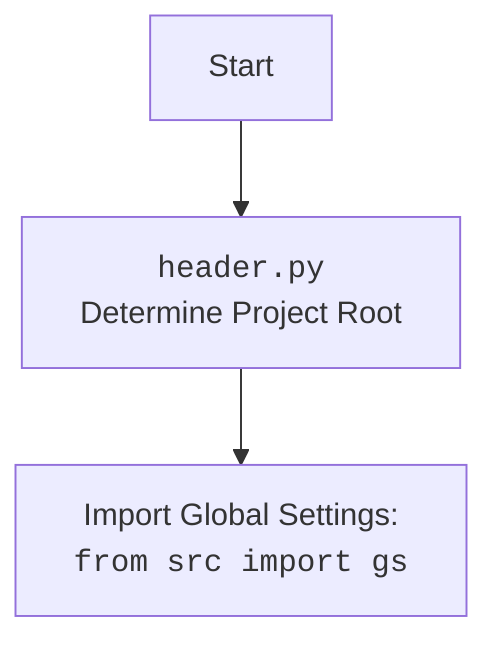

# Проект `hypotez`
# Роль `code explainer`

## АЛГОРИТМ:

1.  **`set_project_root(marker_files)`**:
    *   Начинает с определения текущего пути к файлу.
    *   Итерируется по родительским каталогам, начиная с текущего.
    *   Проверяет наличие хотя бы одного из файлов-маркеров (`marker_files`) в каждом каталоге.
    *   Если маркер найден, устанавливает этот каталог как корневой (`__root__`).
    *   Добавляет корневой каталог в `sys.path`, если его там еще нет.
    *   Возвращает путь к корневому каталогу.
    *   *Пример*: Если `marker_files` содержат `'.git'`, функция будет искать первый родительский каталог, содержащий каталог `.git`, и установит его как корень проекта.

2.  **Инициализация `__root__`**:
    *   Вызывает `set_project_root()` для определения корневого каталога.
    *   Сохраняет путь к корневому каталогу в переменной `__root__`.

3.  **Чтение конфигурации**:
    *   Пытается открыть файл `config.json`, расположенный в подкаталоге `src` относительно корневого каталога.
    *   Если файл найден и успешно прочитан, его содержимое загружается в словарь `config`.
    *   Если файл не найден или не является валидным JSON, обработка ошибок пропускается (обозначено `...`).
    *   *Пример*: Если `config.json` содержит `{"project_name": "hypotez", "version": "1.0.0"}`, то после успешного чтения `config` будет содержать этот словарь.

4.  **Чтение документации**:
    *   Пытается открыть файл `README.MD`, расположенный в подкаталоге `src` относительно корневого каталога.
    *   Если файл найден и успешно прочитан, его содержимое сохраняется в строке `doc_str`.
    *   Если файл не найден, обработка ошибок пропускается (обозначено `...`).

5.  **Инициализация переменных проекта**:
    *   Инициализирует переменные проекта (`__project_name__`, `__version__`, `__doc__`, `__details__`, `__author__`, `__copyright__`) на основе значений, полученных из `config`.
    *   Если `config` не был успешно загружен, устанавливает значения по умолчанию для этих переменных.
    *   *Пример*: Если `config` содержит `"project_name": "hypotez"`, то `__project_name__` будет установлен в `"hypotez"`. В противном случае он будет установлен в значение по умолчанию `"hypotez"`.

## MERMAID:

```mermaid
flowchart TD
    Start --> SetProjectRoot[set_project_root()]
    SetProjectRoot --> FindRoot[Найти корневой каталог проекта]
    FindRoot --> CheckMarkerFiles[Проверить наличие файлов-маркеров]
    CheckMarkerFiles -- Маркер найден --> SetRoot[Установить корневой каталог]
    CheckMarkerFiles -- Маркер не найден --> CheckParentDir[Проверить родительский каталог]
    CheckParentDir --> FindRoot
    SetRoot --> AddToSysPath[Добавить корневой каталог в sys.path]
    AddToSysPath --> EndRoot[Возврат корневого каталога]
    EndRoot --> ImportGs[Импорт global settings: src.gs]
    ImportGs --> ReadConfig[Чтение конфигурации из config.json]
    ReadConfig -- Успешно --> ReadReadme[Чтение документации из README.MD]
    ReadConfig -- Ошибка --> ReadReadme
    ReadReadme -- Успешно --> InitProjectVars[Инициализация переменных проекта]
    ReadReadme -- Ошибка --> InitProjectVars
    InitProjectVars --> End[Конец]
```

**Объяснение зависимостей в mermaid-диаграмме:**

*   `set_project_root()`: Функция, определяющая корень проекта на основе наличия файлов-маркеров.
*   `src.gs`: Глобальные настройки проекта, импортируемые для доступа к путям и другим конфигурациям.
*   `config.json`: Файл конфигурации, содержащий настройки проекта (имя, версия и т.д.).
*   `README.MD`: Файл документации, содержащий общее описание проекта.



## ОБЪЯСНЕНИЕ:

**Импорты:**

*   `sys`: Предоставляет доступ к некоторым переменным и функциям, взаимодействующим с интерпретатором Python. Используется для добавления корневого каталога проекта в `sys.path`.
*   `json`: Используется для работы с данными в формате JSON, например, для чтения файла конфигурации `config.json`.
*   `packaging.version.Version`: Используется для сравнения версий.
*   `pathlib.Path`: Предоставляет объектно-ориентированный способ работы с путями к файлам и каталогам.

**Функции:**

*   `set_project_root(marker_files)`:
    *   **Аргументы**:
        *   `marker_files` (tuple): Кортеж имен файлов или каталогов, используемых для определения корневого каталога проекта. По умолчанию `('__root__', '.git')`.
    *   **Возвращаемое значение**:
        *   `Path`: Путь к корневому каталогу проекта.
    *   **Назначение**:
        *   Функция ищет корневой каталог проекта, начиная с текущего каталога, и поднимаясь вверх по иерархии каталогов. Она останавливается, когда находит каталог, содержащий один из файлов-маркеров.
        *   После определения корневого каталога, он добавляется в `sys.path`, чтобы обеспечить возможность импорта модулей из этого каталога.
    *   *Пример*:
        ```python
        root_path = set_project_root(marker_files=('.git',))
        print(root_path) # Вывод: /path/to/project
        ```

**Переменные:**

*   `__root__` (Path): Путь к корневому каталогу проекта. Инициализируется путем вызова функции `set_project_root()`.
*   `config` (dict): Словарь, содержащий параметры конфигурации проекта, считанные из файла `config.json`. Если файл не найден или не может быть прочитан, значение остается `None`.
*   `doc_str` (str): Строка, содержащая содержимое файла `README.MD`. Если файл не найден или не может быть прочитан, значение остается `None`.
*   `__project_name__` (str): Имя проекта. Если параметр `project_name` присутствует в `config`, то используется его значение, иначе используется значение по умолчанию `'hypotez'`.
*   `__version__` (str): Версия проекта. Если параметр `version` присутствует в `config`, то используется его значение, иначе используется значение по умолчанию `''`.
*   `__doc__` (str): Описание проекта, взятое из `doc_str`.
*   `__details__` (str): Дополнительные сведения о проекте. В текущей версии кода всегда инициализируется пустой строкой.
*   `__author__` (str): Автор проекта. Если параметр `author` присутствует в `config`, то используется его значение, иначе используется значение по умолчанию `''`.
*   `__copyright__` (str): Информация об авторских правах. Если параметр `copyright` присутствует в `config`, то используется его значение, иначе используется значение по умолчанию `''`.
*   `__cofee__` (str): Строка, содержащая сообщение о поддержке разработчика.

**Взаимосвязи с другими частями проекта:**

*   Этот модуль является частью подсистемы `ai.gemini` и отвечает за настройку окружения и загрузку метаданных проекта.
*   Он использует модуль `src.gs` для получения глобальных настроек проекта.
*   Переменные, определенные в этом модуле, могут использоваться другими модулями для получения информации о проекте, такой как имя, версия и описание.

**Потенциальные ошибки и области для улучшения:**

*   Обработка ошибок при чтении файлов `config.json` и `README.MD` ограничена (`...`).  В реальном проекте следует добавить более информативное логирование ошибок и, возможно, предусмотреть альтернативные действия в случае, если файлы не найдены или повреждены.  Рассмотрите возможность использования модуля `logger` из `src.logger.logger` для логирования ошибок.
*   Переменная `__details__` всегда инициализируется пустой строкой.  Возможно, стоит предусмотреть возможность загрузки этой информации из отдельного файла или конфигурационного параметра.
*   В коде присутствует опечатка в названии переменной `__copyrihgnt__`. Следует исправить на `__copyright__`.
*   Не используется `j_loads` или `j_loads_ns` для чтения JSON или конфигурационных файлов.

```python
# Правильно:
data = j_loads('config.json')
```