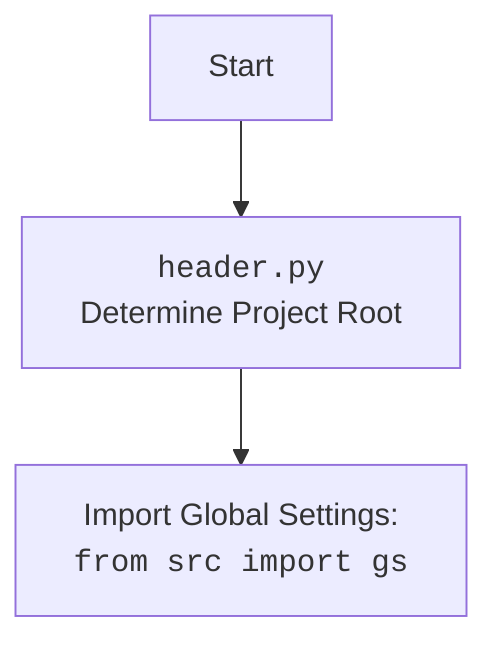
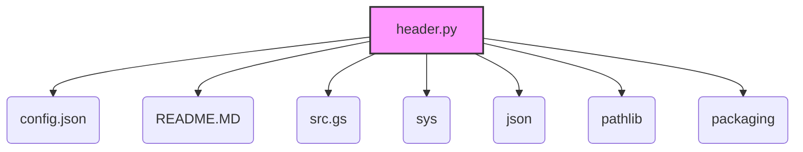

### **Анализ кода `header.py`**

```md
# Проект `hypotez`
# Роль `code explainer`

## 1. <алгоритм>

1.  **Определение корневой директории проекта**:
    *   Функция `set_project_root` ищет корневую директорию проекта, начиная с директории, где расположен текущий файл.
    *   Она поднимается вверх по дереву директорий, пока не найдет директорию, содержащую один из файлов-маркеров (например, `__root__` или `.git`).
    *   Если такая директория найдена, она считается корневой. В противном случае, корневой считается директория, где находится скрипт.
    *   Пример: Если `header.py` находится в `/path/to/project/src/ai/gradio/`, а файл `.git` находится в `/path/to/project/`, то корневой директорией будет `/path/to/project/`.

2.  **Добавление корневой директории в `sys.path`**:
    *   Если корневая директория не находится в `sys.path`, она добавляется в начало `sys.path`, чтобы обеспечить возможность импорта модулей из корневой директории.
    *   Пример: Если `sys.path` изначально `['/usr/lib/python38', '/opt/myapp']`, а корневая директория `/path/to/project`, то `sys.path` станет `['/path/to/project', '/usr/lib/python38', '/opt/myapp']`.

3.  **Чтение конфигурационного файла**:
    *   Пытается прочитать файл `config.json`, расположенный в директории `src` относительно корневой директории проекта.
    *   Если файл найден и успешно прочитан, его содержимое сохраняется в переменной `config`.
    *   Пример: Если `config.json` содержит `{"project_name": "hypotez", "version": "1.0"}`, то `config` станет `{'project_name': 'hypotez', 'version': '1.0'}`.

4.  **Чтение файла `README.MD`**:
    *   Пытается прочитать файл `README.MD`, расположенный в директории `src` относительно корневой директории проекта.
    *   Если файл найден и успешно прочитан, его содержимое сохраняется в переменной `doc_str`.
    *   Пример: Если `README.MD` содержит `"This is the hypotez project."`, то `doc_str` станет `"This is the hypotez project."`.

5.  **Извлечение информации из конфигурации**:
    *   Извлекает значения `project_name`, `version`, `author`, `copyrihgnt` и `cofee` из конфигурационного файла (если он был успешно прочитан) и сохраняет их в соответствующие переменные.
    *   Если конфигурационный файл не был прочитан или не содержит нужных ключей, используются значения по умолчанию.
    *   Пример: Если `config` содержит `{'project_name': 'hypotez', 'version': '1.0', 'author': 'John Doe'}`, то `__project_name__` станет `"hypotez"`, `__version__` станет `"1.0"`, а `__author__` станет `"John Doe"`.

```

## 2. <mermaid>

```mermaid
flowchart TD
    Start --> FindRoot[Find Project Root Directory]
    FindRoot --> set_project_root[<code>set_project_root()</code><br>marker_files: '__root__', '.git']
    set_project_root --> CheckMarkerFiles[Check for marker files in parent directories]
    CheckMarkerFiles --> FoundRoot{Marker file found?}
    FoundRoot -- Yes --> SetRoot[Set project root]
    FoundRoot -- No --> UseCurrentDir[Use current directory as root]
    SetRoot --> AddToSysPath{Add root to sys.path?}
    UseCurrentDir --> AddToSysPath
    AddToSysPath -- Yes --> InsertSysPath[Insert root to sys.path]
    AddToSysPath -- No --> Continue[Continue]
    InsertSysPath --> Continue
    Continue --> ReadConfig[Read <code>config.json</code>]
    ReadConfig --> j_loads[<code>j_loads()</code> or <code>j_loads_ns()</code><br>from src import gs]
    ReadConfig --> HandleConfigFileError{Config file exists?}
    HandleConfigFileError -- Yes --> ContinueReadMe[Continue to read README.MD]
    HandleConfigFileError -- No --> UseDefaultValues[Use default config values]
    ContinueReadMe --> ReadMe[Read <code>README.MD</code>]
    ReadMe --> HandleReadMeFileError{README.MD exists?}
    HandleReadMeFileError -- Yes --> ExtractConfig[Extract config values]
    HandleReadMeFileError -- No --> UseDefaultDocStr[Use default doc_str]
    UseDefaultValues --> ExtractConfig
    UseDefaultDocStr --> ExtractConfig
    ExtractConfig --> SetGlobalVars[Set global variables: <br><code>__project_name__</code>, <code>__version__</code>, etc.]
    SetGlobalVars --> End

    style FindRoot fill:#f9f,stroke:#333,stroke-width:2px
    style set_project_root fill:#ccf,stroke:#333,stroke-width:2px
    style CheckMarkerFiles fill:#ccf,stroke:#333,stroke-width:2px
    style FoundRoot fill:#f9f,stroke:#333,stroke-width:2px
    style SetRoot fill:#ccf,stroke:#333,stroke-width:2px
    style UseCurrentDir fill:#ccf,stroke:#333,stroke-width:2px
    style AddToSysPath fill:#f9f,stroke:#333,stroke-width:2px
    style InsertSysPath fill:#ccf,stroke:#333,stroke-width:2px
    style Continue fill:#ccf,stroke:#333,stroke-width:2px
    style ReadConfig fill:#ccf,stroke:#333,stroke-width:2px
    style j_loads fill:#ccf,stroke:#333,stroke-width:2px
    style HandleConfigFileError fill:#f9f,stroke:#333,stroke-width:2px
    style ContinueReadMe fill:#ccf,stroke:#333,stroke-width:2px
    style ReadMe fill:#ccf,stroke:#333,stroke-width:2px
    style HandleReadMeFileError fill:#f9f,stroke:#333,stroke-width:2px
    style ExtractConfig fill:#ccf,stroke:#333,stroke-width:2px
    style SetGlobalVars fill:#ccf,stroke:#333,stroke-width:2px
    style End fill:#ccf,stroke:#333,stroke-width:2px
    style UseDefaultValues fill:#ccf,stroke:#333,stroke-width:2px
    style UseDefaultDocStr fill:#ccf,stroke:#333,stroke-width:2px
```



## 3. <объяснение>

### **Импорты**:

*   `sys`: Используется для работы с системными параметрами и функциями, такими как `sys.path`.
*   `json`: Используется для работы с JSON-файлами, в частности, для чтения файла конфигурации `config.json`.
*   `packaging.version.Version`: Используется для сравнения версий.
*   `pathlib.Path`: Используется для представления путей к файлам и директориям в объектно-ориентированном стиле.
*   `src.gs`: Этот импорт предполагает наличие модуля `gs` в пакете `src`, который, вероятно, содержит глобальные настройки и константы проекта.

### **Функции**:

*   `set_project_root(marker_files: tuple = ('__root__', '.git')) -> Path`:
    *   **Аргументы**:
        *   `marker_files` (tuple): Список файлов или директорий, которые используются для определения корневой директории проекта. По умолчанию `('__root__', '.git')`.
    *   **Возвращаемое значение**:
        *   `Path`: Путь к корневой директории проекта.
    *   **Назначение**:
        *   Функция определяет корневую директорию проекта, начиная с директории, в которой находится текущий файл, и поднимаясь вверх по дереву директорий, пока не найдет директорию, содержащую один из файлов-маркеров.
        *   Если корневая директория не находится в `sys.path`, она добавляется в начало `sys.path`.
    *   **Пример**:

```python
    from pathlib import Path
    
    # Предположим, что файл находится в /path/to/project/src/ai/gradio/header.py
    # и в /path/to/project/ находится файл .git
    root_path = set_project_root()
    print(root_path)  # Вывод: /path/to/project
```

### **Переменные**:

*   `__root__`:
    *   Тип: `Path`
    *   Назначение: Содержит путь к корневой директории проекта.
*   `config`:
    *   Тип: `dict`
    *   Назначение: Содержит словарь с конфигурационными параметрами, прочитанными из файла `config.json`.
*   `doc_str`:
    *   Тип: `str`
    *   Назначение: Содержит строку с содержимым файла `README.MD`.
*   `__project_name__`:
    *   Тип: `str`
    *   Назначение: Содержит название проекта, полученное из конфигурационного файла или значение по умолчанию `'hypotez'`.
*   `__version__`:
    *   Тип: `str`
    *   Назначение: Содержит версию проекта, полученную из конфигурационного файла или пустую строку `''`.
*   `__doc__`:
    *   Тип: `str`
    *   Назначение: Содержит описание проекта, прочитанное из файла `README.MD` или пустую строку `''`.
*   `__details__`:
    *   Тип: `str`
    *   Назначение: Содержит дополнительные детали о проекте. Инициализируется пустой строкой `''`.
*   `__author__`:
    *   Тип: `str`
    *   Назначение: Содержит имя автора проекта, полученное из конфигурационного файла или пустую строку `''`.
*   `__copyright__`:
    *   Тип: `str`
    *   Назначение: Содержит информацию об авторских правах проекта, полученную из конфигурационного файла или пустую строку `''`.
*   `__cofee__`:
    *   Тип: `str`
    *   Назначение: Содержит сообщение с предложением угостить разработчика чашкой кофе.

### **Потенциальные ошибки и области для улучшения**:

1.  **Обработка исключений**:
    *   Используются блоки `try...except` для обработки исключений `FileNotFoundError` и `json.JSONDecodeError` при чтении файлов `config.json` и `README.MD`, но в блоках `except` стоит `...`, что не позволяет полноценно обработать исключение (например, залогировать ошибку).
    *   **Рекомендация**: Добавить логирование ошибок с использованием модуля `logger` из `src.logger.logger`.

2.  **Использование `j_loads` или `j_loads_ns`**:
    *   Для чтения JSON или конфигурационных файлов рекомендуется использовать `j_loads` или `j_loads_ns` вместо стандартного использования `open` и `json.load`.
    *   **Рекомендация**: Заменить `open` и `json.load` на `j_loads` или `j_loads_ns`.

3.  **Использование `settings.get`**:
    *   В коде используется `settings.get("cofee", ...)` вместо `config.get("cofee", ...)`. Вероятно, это опечатка и следует использовать `config.get`.
    *   **Рекомендация**: Исправить `settings.get` на `config.get`.

### **Взаимосвязи с другими частями проекта**:

*   Файл `header.py` является важной частью проекта, так как он определяет корневую директорию проекта, читает конфигурационный файл и устанавливает глобальные переменные, которые используются в других модулях.
*   Он взаимодействует с модулем `src.gs`, который, вероятно, содержит глобальные настройки проекта.
*   Он также взаимодействует с файлами `config.json` и `README.MD`, которые содержат конфигурационную информацию и документацию проекта.

