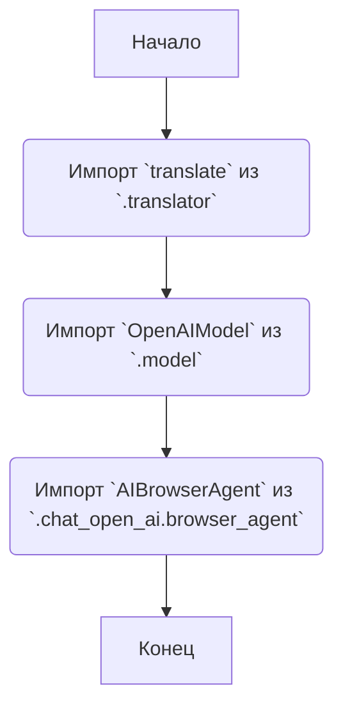
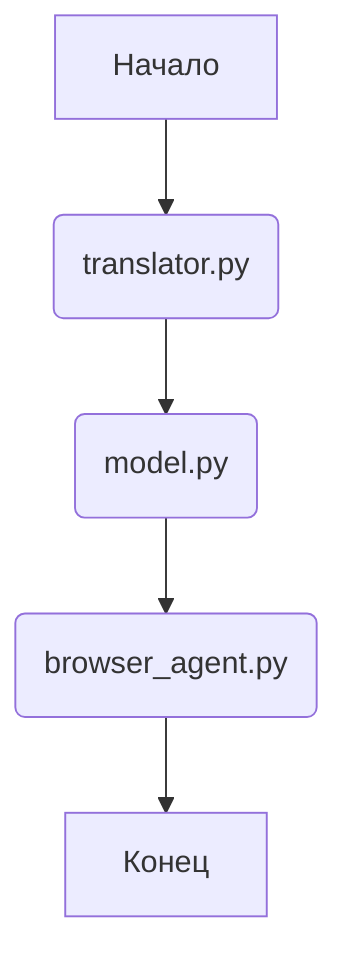

# Анализ кода модуля `src.ai.openai`

## 1. <алгоритм>

### Блок-схема рабочего процесса модуля `src.ai.openai`



**Описание шагов:**

1.  **Начало**: Начало работы модуля `src.ai.openai`.
2.  **Импорт `translate`**: Импорт функции `translate` из подмодуля `.translator`. Эта функция, вероятно, отвечает за перевод текста с использованием моделей OpenAI.
    *   Пример: `from .translator import translate`
3.  **Импорт `OpenAIModel`**: Импорт класса `OpenAIModel` из подмодуля `.model`. Этот класс, вероятно, представляет собой общую модель OpenAI и содержит методы для взаимодействия с API OpenAI.
    *   Пример: `from .model import OpenAIModel`
4.  **Импорт `AIBrowserAgent`**: Импорт класса `AIBrowserAgent` из подмодуля `.chat_open_ai.browser_agent`. Этот класс, вероятно, представляет собой агента, который использует OpenAI для взаимодействия с веб-браузером.
    *   Пример: `from .chat_open_ai.browser_agent import AIBrowserAgent`
5.  **Конец**: Завершение работы модуля.

## 2. <mermaid>



**Объяснение зависимостей:**

*   `translator.py`: Этот модуль содержит функциональность для перевода текста, вероятно, с использованием моделей OpenAI.
*   `model.py`: Этот модуль определяет класс `OpenAIModel`, который предоставляет интерфейс для взаимодействия с API OpenAI.
*   `browser_agent.py`: Этот модуль содержит класс `AIBrowserAgent`, который использует OpenAI для автоматизации задач в веб-браузере.

## 3. <объяснение>

### Импорты:

*   `.translator`: Этот модуль, вероятно, содержит функции для перевода текста с использованием моделей OpenAI. Функция `translate` используется для выполнения этой задачи.
*   `.model`: Этот модуль определяет класс `OpenAIModel`, который служит абстракцией для работы с различными моделями OpenAI. Он может включать методы для отправки запросов к API OpenAI, обработки ответов и управления параметрами модели.
*   `.chat_open_ai.browser_agent`: Этот модуль содержит класс `AIBrowserAgent`, который представляет собой агента, способного взаимодействовать с веб-браузером с использованием возможностей OpenAI. Это может включать автоматическое заполнение форм, навигацию по сайтам и выполнение других задач.

### Классы:

*   `OpenAIModel`: Класс, представляющий модель OpenAI. Он, вероятно, содержит методы для взаимодействия с API OpenAI, такие как отправка запросов и получение ответов.
    *   Атрибуты: Могут включать параметры модели, такие как используемая модель, максимальное количество токенов и температура.
    *   Методы: Могут включать методы для отправки запросов к API OpenAI, обработки ответов и управления параметрами модели.
*   `AIBrowserAgent`: Класс, представляющий агента, который использует OpenAI для взаимодействия с веб-браузером.
    *   Атрибуты: Могут включать экземпляр браузера, параметры OpenAI и другие настройки.
    *   Методы: Могут включать методы для навигации по веб-страницам, заполнения форм, извлечения данных и выполнения других задач.

### Функции:

*   `translate`: Функция, которая переводит текст с использованием моделей OpenAI.
    *   Аргументы: Исходный текст, язык перевода, параметры модели.
    *   Возвращаемое значение: Переведенный текст.
    *   Пример:
        ```python
        translated_text = translate('Hello, world!', 'fr')
        print(translated_text)  # Bonjour, monde !
        ```

### Переменные:

В данном коде явно не определены переменные, но при использовании импортированных модулей и классов могут быть использованы различные переменные для хранения экземпляров классов, параметров и результатов выполнения функций.

### Потенциальные ошибки и области для улучшения:

*   Отсутствие обработки исключений: В коде не предусмотрена обработка возможных исключений, которые могут возникнуть при взаимодействии с API OpenAI или при работе с браузером.
*   Недостаточная документация: Код требует более подробной документации, особенно в отношении параметров и возвращаемых значений функций и методов.
*   Отсутствие тестов: Для обеспечения надежности и правильности работы кода необходимо добавить модульные тесты.

### Взаимосвязь с другими частями проекта:

Этот модуль является частью системы искусственного интеллекта (`ai`) проекта `hypotez` и отвечает за интеграцию с API OpenAI. Он предоставляет функциональность для перевода текста и взаимодействия с веб-браузером с использованием возможностей OpenAI. Этот модуль может использоваться другими частями проекта для выполнения различных задач, таких как автоматическое создание контента, анализ данных и автоматизация задач в веб-браузере.