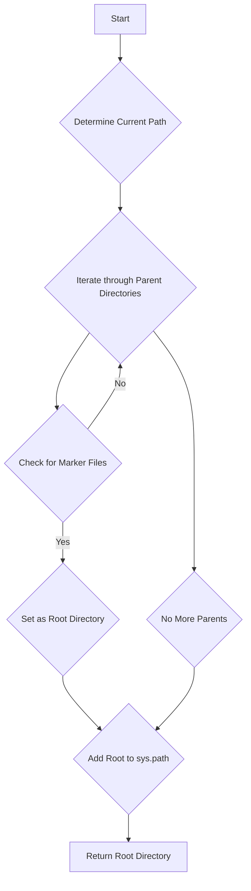

# Проект `hypotez`
# Роль `code explainer`
## ИНСТРУКЦИЯ  :

Анализируй предоставленный код подробно и объясни его функциональность. Ответ должен включать три раздела:  

1. **<алгоритм>**: Опиши рабочий процесс в виде пошаговой блок-схемы, включая примеры для каждого логического блока, и проиллюстрируй поток данных между функциями, классами или методами.  
2. **<mermaid>**: Напиши код для диаграммы в формате `mermaid`, проанализируй и объясни все зависимости, 
    которые импортируются при создании диаграммы. 
    **ВАЖНО!** Убедитесь, что все имена переменных, используемые в диаграмме `mermaid`, 
    имеют осмысленные и описательные имена. Имена переменных вроде `A`, `B`, `C`, и т.д., не допускаются!  
    
    **Дополнительно**: Если в коде есть импорт `import header`, добавьте блок `mermaid` flowchart, объясняющий `header.py`:\
    ```mermaid
    flowchart TD
        Start --> Header[<code>header.py</code><br> Determine Project Root]
    
        Header --> import[Import Global Settings: <br><code>from src import gs</code>] 
    ```

3. **<объяснение>**: Предоставь подробные объяснения:  
   - **Импорты**: Их назначение и взаимосвязь с другими пакетами `src.`.  
   - **Классы**: Их роль, атрибуты, методы и взаимодействие с другими компонентами проекта.  
   - **Функции**: Их аргументы, возвращаемые значения, назначение и примеры.  
   - **Переменные**: Их типы и использование.  
   - Выдели потенциальные ошибки или области для улучшения.  

Дополнительно, постройте цепочку взаимосвязей с другими частями проекта (если применимо).  

Это обеспечивает всесторонний и структурированный анализ кода.
## Формат ответа: `.md` (markdown)


## Твое поведение при анализе кода:
- всегда смотри системную инструкцию для обработки кода проекта `hypotez`;
- анализируй расположение файла в проекте. Это поможет понять его назначение и взаимосвязь с другими файлами. Расположение файла ты найдешь в самой превой строке кода, начинающейся с `## \\file /...`;
- запоминай предоставленный код и анализируй его связь с другими частями проекта `hypotez`;

**КОНЕЦ ИНСТРУКЦИИ**
```markdown
## \\file /src/ai/openai/chat_openai/header.py

### **<алгоритм>**

1.  **Начало**: Функция `set_project_root` вызывается без аргументов, используя значения по умолчанию для `marker_files` (("__root__", ".git")).
2.  **Определение текущего пути**: Определяется текущий путь к файлу (`__file__`) и его родительский каталог сохраняется в переменной `current_path`.

    ```python
    current_path:Path = Path(__file__).resolve().parent
    # Пример: Если __file__ == "/Users/user/hypotez/src/ai/openai/chat_openai/header.py",
    # то current_path == "/Users/user/hypotez/src/ai/openai/chat_openai"
    ```
3.  **Поиск корневого каталога**:
    *   Начинается итерация по каталогам: текущий каталог и все его родительские каталоги до корня файловой системы.
    *   На каждой итерации проверяется, содержит ли текущий каталог хотя бы один из файлов или каталогов, указанных в `marker_files`.

        ```python
        if any((parent / marker).exists() for marker in marker_files):
            # Пример: Если parent == "/Users/user/hypotez" и в этом каталоге есть файл ".git",
            # то условие выполняется.
        ```
    *   Если маркерный файл найден, текущий каталог устанавливается как корневой (`__root__`), и цикл прерывается.
4.  **Добавление корневого каталога в `sys.path`**:
    *   Проверяется, находится ли корневой каталог (`__root__`) уже в списке путей поиска модулей (`sys.path`).
    *   Если нет, корневой каталог добавляется в начало списка `sys.path`, чтобы обеспечить приоритетный поиск модулей в корне проекта.

        ```python
        if __root__ not in sys.path:
            sys.path.insert(0, str(__root__))
            # Пример: Если __root__ == "/Users/user/hypotez" и его нет в sys.path,
            # то он добавляется в начало sys.path.
        ```
5.  **Возврат значения**: Функция возвращает путь к корневому каталогу проекта (`__root__`).

    ```python
    return __root__
    # Пример: Возвращается Path("/Users/user/hypotez")
    ```

### **<mermaid>**



**Dependencies Analysis:**

*   `sys`: Используется для модификации `sys.path`, что позволяет добавлять корневую директорию проекта в список путей поиска модулей.
*   `json`: Не используется.
*   `packaging.version`: Не используется.
*   `pathlib`: Используется для работы с путями к файлам и директориям, а именно для определения текущего местоположения файла, поиска родительских директорий и проверки существования файлов.

### **<объяснение>**

*   **Импорты**:
    *   `sys`: Этот модуль предоставляет доступ к некоторым переменным и функциям, взаимодействующим с интерпретатором Python. В данном случае используется для изменения `sys.path`, что позволяет добавлять путь к корневой директории проекта для упрощения импорта модулей.
    *   `json`: Этот модуль предоставляет инструменты для работы с данными в формате JSON. Однако в предоставленном коде этот модуль не используется.
    *   `packaging.version`: Этот модуль предназначен для сравнения версий программного обеспечения. В предоставленном коде этот модуль не используется.
    *   `pathlib`: Этот модуль предоставляет способ представления путей к файлам и директориям в виде объектов. Он упрощает операции с файловой системой, такие как определение текущего местоположения файла, поиск родительских директорий и проверка существования файлов.
*   **Классы**:
    В предоставленном коде нет определения классов.
*   **Функции**:
    *   `set_project_root(marker_files: tuple = ('__root__', '.git')) -> Path`:
        *   Аргументы:
            *   `marker_files` (tuple): Кортеж, содержащий имена файлов или каталогов, которые используются для определения корневого каталога проекта. По умолчанию используются '__root__' и '.git'.
        *   Возвращаемое значение:
            *   `Path`: Объект `Path`, представляющий путь к корневому каталогу проекта.
        *   Назначение:
            *   Функция определяет корневой каталог проекта путем поиска вверх по иерархии каталогов, начиная с каталога, в котором находится текущий файл. Поиск останавливается, когда обнаруживается каталог, содержащий один из маркерных файлов или каталогов. Затем этот каталог добавляется в `sys.path`, если его там еще нет, чтобы обеспечить правильную работу импортов.
        *   Пример:

            ```python
            root_path = set_project_root()
            print(root_path)  # Вывод: /путь/к/корневому/каталогу/проекта
            ```
*   **Переменные**:
    *   `__root__`:
        *   Тип: `Path`
        *   Использование: Глобальная переменная, хранящая путь к корневому каталогу проекта. Она инициализируется путем вызова функции `set_project_root()`.
*   **Потенциальные ошибки и области для улучшения**:
    *   В текущей реализации функция `set_project_root` ищет маркерные файлы только в родительских каталогах текущего файла. Это может не работать, если структура проекта отличается (например, если маркерный файл находится в другом месте).
    *   Использование `json` и `packaging.version` импортированы, но не используются.
*   **Взаимосвязи с другими частями проекта**:
    *   Этот модуль предназначен для определения корневого каталога проекта, что важно для правильной работы импортов по всему проекту. Другие модули могут использовать переменную `__root__` для построения путей к файлам и каталогам внутри проекта.
```