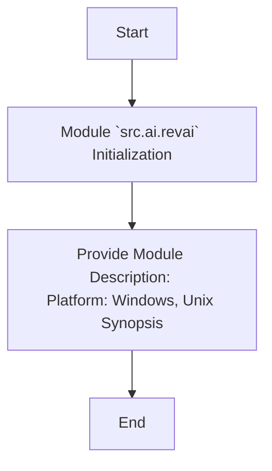

## Анализ кода модуля `src.ai.revai`

### 1. <алгоритм>

1.  **Начало**: Модуль `src.ai.revai` инициализируется.
2.  **Описание модуля**: Предоставляется общая информация о модуле, включая его платформы (Windows, Unix) и краткое описание (synopsis).
3.  **Завершение**: Инициализация модуля завершена.

### 2. <mermaid>

**Объяснение зависимостей `mermaid`**:

-   `flowchart TD`: Определяет тип диаграммы как блок-схему с направлением сверху вниз.
-   `Start`: Начало процесса инициализации модуля.
-   `ModuleInit`: Обозначает инициализацию модуля `src.ai.revai`.
-   `Description`: Описывает предоставление информации о модуле, включая платформы и краткое описание.
-   `End`: Завершение процесса.

### 3. <объяснение>

**Импорты**:

-   Отсутствуют явные импорты в предоставленном коде.

**Классы**:

-   Отсутствуют классы в предоставленном коде.

**Функции**:

-   Отсутствуют функции в предоставленном коде.

**Переменные**:

-   Отсутствуют переменные в предоставленном коде.

**Потенциальные ошибки или области для улучшения**:

-   Модуль `src.ai.revai` в текущем виде содержит только метаданные и не имеет функциональности. Необходимо добавить классы, функции и логику для реализации AI-функциональности, связанной с `revai`.

**Взаимосвязи с другими частями проекта**:

-   Так как в коде отсутствуют импорты и функциональность, сложно определить взаимосвязи с другими частями проекта `hypotez`. Однако, предполагается, что этот модуль будет взаимодействовать с другими AI-компонентами проекта.