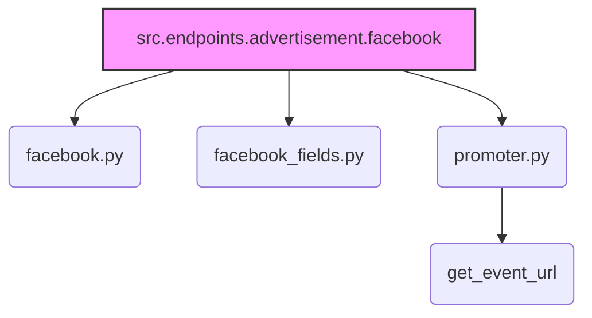

### **Анализ кода `hypotez/src/endpoints/advertisement/facebook/__init__.py`**

#### **1. <алгоритм>**:

1.  **Импорт модулей**: Импортируются три модуля: `Facebook`, `FacebookFields` и `FacebookPromoter`, а также функция `get_event_url` из модуля `promoter`.
2.  **Предоставление доступа**: Файл `__init__.py` используется для упрощения доступа к классам и функциям из пакета `facebook`. Это позволяет импортировать их напрямую из пакета, а не из отдельных модулей.

Пример:

```python
from .facebook import Facebook
from .facebook_fields import FacebookFields
from .promoter import FacebookPromoter, get_event_url

# Теперь можно использовать классы и функции напрямую:
# fb = Facebook()
# fields = FacebookFields()
# promoter = FacebookPromoter()
# url = get_event_url()
```

#### **2. <mermaid>**:



**Объяснение диаграммы:**

-   `src.endpoints.advertisement.facebook`: Это текущий модуль `__init__.py`, который собирает вместе элементы из других модулей.
-   `facebook.py`: Модуль, содержащий класс `Facebook`.
-   `facebook_fields.py`: Модуль, содержащий класс `FacebookFields`.
-   `promoter.py`: Модуль, содержащий класс `FacebookPromoter` и функцию `get_event_url`.
-   `get_event_url`: Функция, импортируемая из `promoter.py`.

Все эти модули и функция импортируются в `__init__.py` для удобства доступа к ним из пакета `facebook`.

#### **3. <объяснение>**:

**Импорты**:

*   `.facebook import Facebook`: Импортирует класс `Facebook` из модуля `facebook.py`. Этот класс, вероятно, содержит логику для взаимодействия с Facebook API.
*   `.facebook_fields import FacebookFields`: Импортирует класс `FacebookFields` из модуля `facebook_fields.py`. Этот класс, вероятно, определяет поля, используемые в Facebook API.
*   `.promoter import FacebookPromoter, get_event_url`: Импортирует класс `FacebookPromoter` и функцию `get_event_url` из модуля `promoter.py`. `FacebookPromoter`, вероятно, содержит логику для продвижения контента через Facebook, а `get_event_url` - функция для получения URL события.

**Взаимосвязь с другими пакетами `src`**:

Этот модуль, вероятно, является частью более крупной системы для управления рекламой в Facebook. Он может взаимодействовать с другими частями проекта для получения данных, необходимых для создания и управления рекламными кампаниями. Например, он может взаимодействовать с модулями, отвечающими за сбор данных о пользователях, или с модулями, отвечающими за анализ эффективности рекламы.

**Классы**:

*   `Facebook`: Представляет собой класс для работы с Facebook API. Он может содержать методы для аутентификации, публикации контента, управления рекламой и т.д.
*   `FacebookFields`: Представляет собой класс, определяющий поля, используемые в Facebook API. Он может содержать константы, определяющие имена полей, типы данных и другие параметры.
*   `FacebookPromoter`: Представляет собой класс для продвижения контента через Facebook. Он может содержать методы для создания рекламных кампаний, определения целевой аудитории, выбора бюджета и т.д.

**Функции**:

*   `get_event_url`: Функция для получения URL события. Она может использоваться для получения URL события, которое будет продвигаться через Facebook.

**Переменные**:

В данном файле нет явно объявленных переменных, но импортированные классы и функции могут использовать переменные внутри себя.

**Потенциальные ошибки или области для улучшения**:

*   Отсутствие документации для классов и функций. Добавление документации поможет другим разработчикам понять, как использовать эти компоненты.
*   Отсутствие обработки ошибок. Необходимо добавить обработку ошибок, чтобы обеспечить надежную работу модуля.
*   Отсутствие тестов. Необходимо добавить тесты, чтобы убедиться, что модуль работает правильно.

**Цепочка взаимосвязей с другими частями проекта**:

Этот модуль является частью системы управления рекламой в Facebook. Он взаимодействует с другими частями проекта для получения данных, необходимых для создания и управления рекламными кампаниями. Например, он может взаимодействовать с модулями, отвечающими за сбор данных о пользователях, или с модулями, отвечающими за анализ эффективности рекламы.