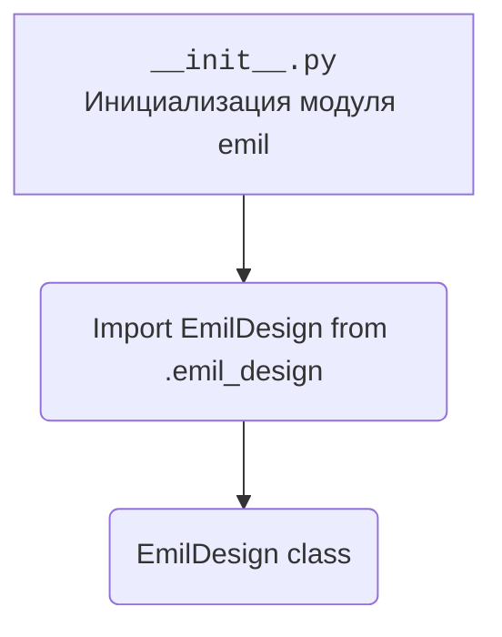

## <алгоритм>

1.  **Импорт `EmilDesign`**: Импортируется класс `EmilDesign` из модуля `.emil_design`. Этот класс, вероятно, содержит логику, связанную с обработкой или представлением данных, специфичных для "Emil".
2.  **Использование `EmilDesign`**: В данном коде дальнейшее использование класса `EmilDesign` не показано, но подразумевается, что он будет использоваться в других частях проекта для выполнения каких-либо операций, связанных с дизайном или представлением данных "Emil".

## <mermaid>

**Объяснение зависимостей:**

*   `__init__.py`: Файл инициализации пакета `emil`, который импортирует модуль `emil_design`.
*   `.emil_design`: Модуль, содержащий класс `EmilDesign`.

## <объяснение>

**Импорты:**

*   `.emil_design`: Импортируется класс `EmilDesign` из модуля `emil_design`, находящегося в той же директории. Этот класс, вероятно, используется для определения структуры и поведения, связанного с дизайном "Emil".

**Классы:**

*   `EmilDesign`: Класс, который, вероятно, содержит логику для работы с дизайном "Emil". Без дополнительного контекста сложно определить его конкретные атрибуты и методы, но можно предположить, что он предоставляет функциональность для создания, изменения или визуализации дизайнов "Emil".

**Функции:**

В данном коде функции отсутствуют.

**Переменные:**

В явном виде переменные не используются.

**Потенциальные ошибки и области для улучшения:**

*   Отсутствие документации внутри модуля `__init__.py`, а также отсутствие примера использования класса `EmilDesign` затрудняет понимание назначения данного модуля.
*   Недостаточно информации для определения взаимосвязи с другими частями проекта. Необходимо рассмотреть, где и как используется класс `EmilDesign` в других модулях.