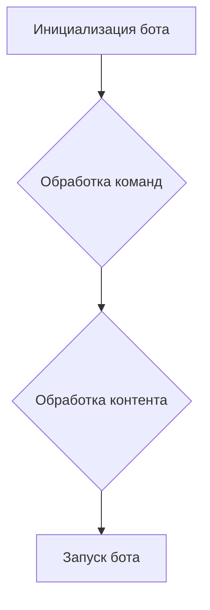
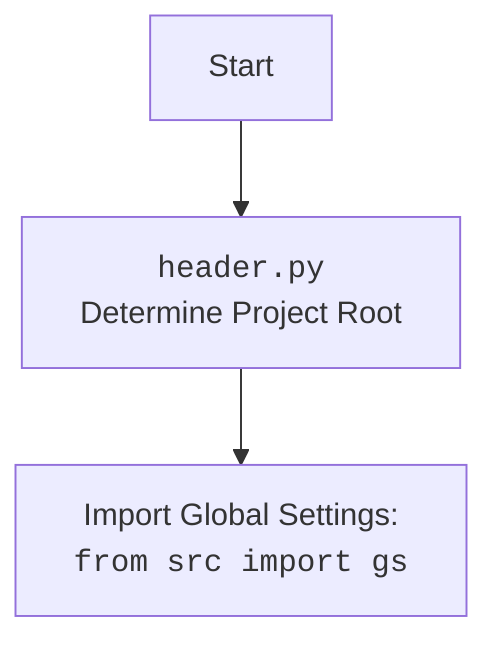

# Проект `hypotez`
# Роль `code explainer`

## <алгоритм>

1.  **Инициализация бота**:
    *   Загрузка переменных окружения из `.env` с использованием `load_dotenv()`.
    *   Инициализация объектов `Config` и `BotHandler`.
    *   Создание экземпляра `telebot.TeleBot` с использованием токена, полученного из конфигурации.
2.  **Обработка команд**:
    *   Бот обрабатывает команды `/start`, `/help`, `/info`, `/time`, `/photo` с помощью декораторов `@bot.message_handler`.
    *   Для каждой команды вызывается соответствующая функция, которая отправляет пользователю сообщение или выполняет определенные действия.
3.  **Обработка контента**:
    *   Бот обрабатывает голосовые сообщения и документы с помощью декораторов `@bot.message_handler`.
    *   Для голосовых сообщений вызывается функция `handle_voice_message`, которая передает сообщение обработчику `handler` для дальнейшей обработки.
    *   Для документов вызывается функция `handle_document_message`, которая передает сообщение обработчику `handler` для дальнейшей обработки.
    *   Бот обрабатывает текстовые сообщения, не начинающиеся с `/`, с помощью декоратора `@bot.message_handler`.
    *   Для текстовых сообщений вызывается функция `handle_text_message`, которая передает сообщение обработчику `handler` для дальнейшей обработки.
    *   Бот обрабатывает неизвестные команды, начинающиеся с `/`, с помощью декоратора `@bot.message_handler`.
    *   Для неизвестных команд вызывается функция `handle_unknown_command`, которая отправляет пользователю сообщение о неизвестной команде.
4.  **Запуск бота**:
    *   Бот запускается в режиме опроса с помощью `bot.polling(none_stop=True)`.



## <mermaid>

```mermaid
graph TD
    Start --> LoadEnv[load_dotenv()];
    LoadEnv --> ConfigClass[Config Class];
    ConfigClass --> BotHandlerClass[BotHandler Class];
    BotHandlerClass --> TeleBot[telebot.TeleBot(config.BOT_TOKEN)];

    subgraph Command Handlers
        TeleBot --> StartCommand["/start Command"];
        TeleBot --> HelpCommand["/help Command"];
        TeleBot --> InfoCommand["/info Command"];
        TeleBot --> TimeCommand["/time Command"];
        TeleBot --> PhotoCommand["/photo Command"];
    end

    subgraph Content Handlers
        TeleBot --> VoiceMessageHandler[Voice Message Handler];
        TeleBot --> DocumentMessageHandler[Document Message Handler];
        TeleBot --> TextMessageHandler[Text Message Handler];
        TeleBot --> UnknownCommandHandler[Unknown Command Handler];
    end
    
    VoiceMessageHandler --> BotHandlerClass;
    DocumentMessageHandler --> BotHandlerClass;
    TextMessageHandler --> BotHandlerClass;
    UnknownCommandHandler --> ConfigClass;
    
    StartCommand --> TeleBot;
    HelpCommand --> BotHandlerClass;
    InfoCommand --> TeleBot;
    TimeCommand --> TeleBot;
    PhotoCommand --> TeleBot;

    style LoadEnv fill:#f9f,stroke:#333,stroke-width:2px
    style ConfigClass fill:#ccf,stroke:#333,stroke-width:2px
    style BotHandlerClass fill:#ccf,stroke:#333,stroke-width:2px
    style TeleBot fill:#f9f,stroke:#333,stroke-width:2px
```

Диаграмма `mermaid` описывает архитектуру Telegram-бота.

*   `LoadEnv`: Загружает переменные окружения из файла `.env` с помощью функции `load_dotenv()`.
*   `ConfigClass`: Класс `Config`, который содержит параметры конфигурации бота, такие как токен, идентификатор канала и пути к файлам.
*   `BotHandlerClass`: Класс `BotHandler`, который обрабатывает различные типы сообщений и команд, полученных от пользователя.
*   `TeleBot`: Класс `telebot.TeleBot`, который представляет собой экземпляр Telegram-бота и используется для взаимодействия с Telegram API.
*   `Command Handlers`: Обработчики команд, которые вызываются при получении команд от пользователя, таких как `/start`, `/help`, `/info`, `/time` и `/photo`.
*   `Content Handlers`: Обработчики контента, которые вызываются при получении голосовых сообщений, документов, текстовых сообщений и неизвестных команд от пользователя.



## <объяснение>

*   **Импорты**:
    *   `telebot`: Библиотека для создания Telegram-ботов.
    *   `os`: Модуль для работы с операционной системой.
    *   `datetime`: Модуль для работы с датой и временем.
    *   `random`: Модуль для генерации случайных чисел.
    *   `pathlib.Path`: Класс для работы с путями к файлам и каталогам.
    *   `dotenv.load_dotenv`: Функция для загрузки переменных окружения из файла `.env`.
    *   `header`: Модуль, определяющий корень проекта.
    *   `src.gs`: Глобальные настройки проекта.
    *   `src.logger.logger`: Модуль для логирования событий.
    *   `src.ai.gemini.GoogleGenerativeAI`: Класс для взаимодействия с моделью Gemini AI.
    *   `src.endpoints.kazarinov.scenarios.scenario.fetch_target_urls_onetab`: Функция для извлечения URL из OneTab.
    *   `src.endpoints.kazarinov.scenarios.scenario.Scenario`: Класс для выполнения сценариев.
    *   `src.utils.url.is_url`: Функция для проверки, является ли строка URL.
    *   `src.utils.printer.pprint`: Функция для красивой печати данных.
*   **Классы**:
    *   `BotHandler`: Класс, который обрабатывает сообщения, полученные от бота.
        *   `base_dir`: Путь к базовой директории.
        *   `__init__`: Инициализирует обработчик событий телеграм-бота.
        *   `handle_message`: Обрабатывает текстовые сообщения.
        *   `_send_user_flowchart`: Отправляет схему user\_flowchart.
        *   `_handle_url`: Обрабатывает URL, присланный пользователем.
        *   `_handle_next_command`: Обрабатывает команду `--next` и её аналоги.
        *   `help_command`: Обрабатывает команду `/help`.
        *   `send_pdf`: Обрабатывает команду `/sendpdf` для отправки PDF.
        *   `handle_voice`: Обрабатывает голосовые сообщения.
        *   `_transcribe_voice`: Транскрибирует голосовое сообщение (заглушка).
        *   `handle_document`: Обрабатывает полученные документы.
    *   `Config`: Класс, который содержит конфигурацию бота.
        *   `BOT_TOKEN`: Токен бота, полученный из переменной окружения или глобальных настроек.
        *   `CHANNEL_ID`: Идентификатор канала.
        *   `PHOTO_DIR`: Путь к директории с фотографиями.
        *   `COMMAND_INFO`: Информация о боте.
        *   `UNKNOWN_COMMAND_MESSAGE`: Сообщение о неизвестной команде.
        *   `START_MESSAGE`: Стартовое сообщение бота.
        *   `HELP_MESSAGE`: Сообщение справки бота.
*   **Функции**:
    *   `command_start`: Обрабатывает команду `/start`.
    *   `command_help`: Обрабатывает команду `/help`.
    *   `command_info`: Обрабатывает команду `/info`.
    *   `command_time`: Обрабатывает команду `/time`.
    *   `command_photo`: Обрабатывает команду `/photo`.
    *   `handle_voice_message`: Обрабатывает голосовые сообщения.
    *   `handle_document_message`: Обрабатывает документы.
    *   `handle_text_message`: Обрабатывает текстовые сообщения.
    *   `handle_unknown_command`: Обрабатывает неизвестные команды.
*   **Переменные**:
    *   `ENDPOINT`: Имя endpoint.
    *   `USE_ENV`: Флаг, определяющий, откуда брать ключи (из `.env` или базы данных).
    *   `config`: Экземпляр класса `Config`.
    *   `handler`: Экземпляр класса `BotHandler`.
    *   `bot`: Экземпляр класса `telebot.TeleBot`.

```python
## \file /src/endpoints/emil/minibot.py
# -*- coding: utf-8 -*-
#! .pyenv/bin/python3

"""
.. module:: src.endpoints.emil.minibot 
	:platform: Windows, Unix
	:synopsis: Простой бот для телеграма, обслуживаююий запросы для emil-design.com

"""

import telebot
import os
import datetime
import random
from pathlib import Path
import asyncio

from dotenv import load_dotenv
load_dotenv()

import header
from header import __root__
from src import gs
from src.logger import logger
from src.ai.gemini import GoogleGenerativeAI
from src.endpoints.kazarinov.scenarios.scenario import fetch_target_urls_onetab, Scenario

from src.utils.url import is_url
from src.utils.printer import pprint as print

##############################################################

ENDPOINT = 'emil'
USE_ENV:bool = True # <- Определает откуда брать ключи. Если False - то из базы данных с паролями, иначе из .env

#############################################################

class BotHandler:
    """Исполнитель команд, полученных ботом."""

    base_dir: Path = __root__ / 'src' / 'endpoints' / 'kazarinov'

    def __init__(self):
        """Инициализация обработчика событий телеграм-бота."""
        self.scenario = Scenario()
        self.model = GoogleGenerativeAI(os.getenv('GEMINI_API')) 
        self.questions_list = ['Я не понял?', 'Объясни пожалуйста']


    def handle_message(self, bot:telebot, message:'message'):
        """Обработка текстовых сообщений."""
        text = message.text
        if text == '?':
            self._send_user_flowchart(bot, message.chat.id)
        elif is_url(text):
            self._handle_url(bot, message)
        elif text in ('--next', '-next', '__next', '-n', '-q'):
            self._handle_next_command(bot, message)
        else:
            try:
                answer = self.model.chat(text)
                bot.send_message(message.chat.id, answer)
            except Exception as ex:
                logger.error(f"Error during model interaction: {ex}")
                bot.send_message(message.chat.id, "Произошла ошибка при обработке сообщения.")


    def _send_user_flowchart(self, bot, chat_id):
        """Отправка схемы user_flowchart."""
        photo_path = self.base_dir / 'assets' / 'user_flowchart.png'
        try:
            with open(photo_path, 'rb') as photo:
                bot.send_photo(chat_id, photo)
        except FileNotFoundError:
            logger.error(f"File not found: {photo_path}")
            bot.send_message(chat_id, "Схема не найдена.")

    def _handle_url(self, bot, message:'message'):
        """Обработка URL, присланного пользователем."""
        url = message.text
        if not url.startswith(('https://one-tab.com', 'https://www.one-tab.com')):
            bot.send_message(message.chat.id, 'Мне на вход нужен URL `https://one-tab.com` Проверь, что ты мне посылаешь')
            return

        # Parsing https//one-tab.com/XXXXXXXXX page
        try:
           price, mexiron_name, urls = fetch_target_urls_onetab(url)
           bot.send_message(message.chat.id, f'Получил мехирон {mexiron_name} - {price} шек')
        except Exception as ex:
            logger.error(f"Error fetching URLs from OneTab: {ex}")
            bot.send_message(message.chat.id, "Произошла ошибка при получении данных из OneTab.")
            return
        if not urls:
            bot.send_message(message.chat.id, 'Некорректные данные. Не получил список URL комплектующих')
            return

        try:
            asyncio.run(
                self.scenario.run_scenario(
                        bot=bot,
                        chat_id=message.chat.id,
                        urls=list(urls), 
                        price=price,
                        mexiron_name=mexiron_name
                ))

        except Exception as ex:
            logger.error(f"Error during scenario execution: {ex}")
            bot.send_message(message.chat.id, f"Произошла ошибка при выполнении сценария. {print(ex.args)}")


    def _handle_next_command(self, bot, message):
        """Обработка команды '--next' и её аналогов."""
        try:
            question = random.choice(self.questions_list)
            answer = self.model.ask(question)
            bot.send_message(message.chat.id, question)
            bot.send_message(message.chat.id, answer)
        except Exception as ex:
            logger.error(f'Ошибка чтения вопросов: {ex}')
            bot.send_message(message.chat.id, 'Произошла ошибка при чтении вопросов.')


    def help_command(self, bot, message):
        """Обработка команды /help."""
        bot.send_message(
            message.chat.id,
            'Available commands:\n'
            '/start - Start the bot\n'
            '/help - Show this help message\n'
            '/sendpdf - Send a PDF file'
        )


    def send_pdf(self, bot, message, pdf_file):
        """Обработка команды /sendpdf для отправки PDF."""
        try:
            with open(pdf_file, 'rb') as pdf_file_obj:
                bot.send_document(message.chat.id, document=pdf_file_obj)
        except Exception as ex:
            logger.error(f'Ошибка при отправке PDF-файла: {ex}')
            bot.send_message(message.chat.id, 'Произошла ошибка при отправке PDF-файла. Попробуй ещё раз.')

    def handle_voice(self, bot, message):
        """Обработка голосовых сообщений."""
        try:
            file_info = bot.get_file(message.voice.file_id)
            file = bot.download_file(file_info.file_path)
            file_path = gs.path.temp / f'{message.voice.file_id}.ogg'
            with open(file_path, 'wb') as f:
                f.write(file)
            transcribed_text = self._transcribe_voice(file_path)
            bot.send_message(message.chat.id, f'Распознанный текст: {transcribed_text}')
        except Exception as ex:
            logger.error(f'Ошибка при обработке голосового сообщения: {ex}')
            bot.send_message(message.chat.id, 'Произошла ошибка при обработке голосового сообщения. Попробуй ещё раз.')


    def _transcribe_voice(self, file_path):
        """Транскрибирование голосового сообщения (заглушка)."""
        return 'Распознавание голоса ещё не реализовано.'


    def handle_document(self, bot, message):
        """Обработка полученных документов."""
        try:
            file_info = bot.get_file(message.document.file_id)
            file = bot.download_file(file_info.file_path)
            tmp_file_path = gs.path.temp / message.document.file_name
            with open(tmp_file_path, 'wb') as f:
                f.write(file)
            bot.send_message(message.chat.id, f'Файл сохранен в {tmp_file_path}')
            return True
        except Exception as ex:
            logger.error(f'Ошибка при обработке документа: {ex}')
            bot.send_message(message.chat.id, 'Произошла ошибка при обработке документа. Попробуй ещё раз.')
            return False

# --- config.py -----------------
class Config:
    BOT_TOKEN = os.getenv('TELEGRAM_BOT_TOKEN') if USE_ENV else gs.credentials.telegram.hypo69_emil_design_bot
    CHANNEL_ID = '@onela'
    PHOTO_DIR = Path(__root__ / 'endpoints' / 'kazarinov' / 'assets')
    COMMAND_INFO = 'This is a simple bot. Use /help to see commands.'
    UNKNOWN_COMMAND_MESSAGE = 'Unknown command. Use /help to see available commands.'
    START_MESSAGE = "Howdy, how are you doing?"
    HELP_MESSAGE = """
    Here are the available commands:
    /start - Starts the bot.
    /help - Shows this help message.
    /info - Shows information about the bot.
    /time - Shows the current time.
    /photo - Sends a random photo.
    """
# --- config.py end -----------------

# --- bot.py ---
config = Config()
handler = BotHandler()
bot = telebot.TeleBot(config.BOT_TOKEN)

@bot.message_handler(commands=['start'])
def command_start(message):
    logger.info(f"User {message.from_user.username} send /start command")
    bot.send_message(message.chat.id, config.START_MESSAGE)

@bot.message_handler(commands=['help'])
def command_help(message):
    logger.info(f"User {message.from_user.username} send /help command")
    handler.help_command(bot, message)

@bot.message_handler(commands=['info'])
def command_info(message):
    logger.info(f"User {message.from_user.username} send /info command")
    bot.send_message(message.chat.id, config.COMMAND_INFO)

@bot.message_handler(commands=['time'])
def command_time(message):
    logger.info(f"User {message.from_user.username} send /time command")
    now = datetime.datetime.now()
    current_time = now.strftime("%H:%M:%S")
    bot.send_message(message.chat.id, f"Current time: {current_time}")

@bot.message_handler(commands=['photo'])
def command_photo(message):
    logger.info(f"User {message.from_user.username} send /photo command")
    try:
        photo_files = os.listdir(config.PHOTO_DIR)
        if photo_files:
            random_photo = random.choice(photo_files)
            photo_path = os.path.join(config.PHOTO_DIR, random_photo)
            with open(photo_path, 'rb') as photo:
                bot.send_photo(message.chat.id, photo)
        else:
            bot.send_message(message.chat.id, "No photos in the folder.")
    except FileNotFoundError:
        bot.send_message(message.chat.id, "Photo directory not found.")

@bot.message_handler(content_types=['voice'])
def handle_voice_message(message):
    logger.info(f"User {message.from_user.username} send voice message")
    handler.handle_voice(bot, message)

@bot.message_handler(content_types=['document'])
def handle_document_message(message):
    logger.info(f"User {message.from_user.username} send document message")
    handler.handle_document(bot, message)

@bot.message_handler(func=lambda message: message.text and not message.text.startswith('/'))
def handle_text_message(message):
    logger.info(f"User {message.from_user.username} sent message: {message.text}")
    handler.handle_message(bot, message )

@bot.message_handler(func=lambda message: message.text and message.text.startswith('/'))
def handle_unknown_command(message):
    logger.info(f"User {message.from_user.username} send unknown command: {message.text}")
    bot.send_message(message.chat.id, config.UNKNOWN_COMMAND_MESSAGE)

bot.polling(none_stop=True)
# --- bot.py end ---