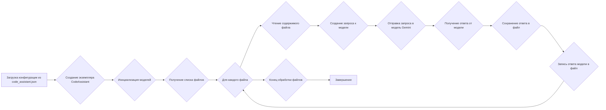
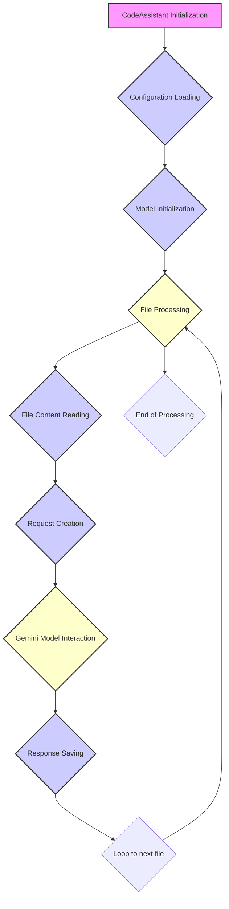
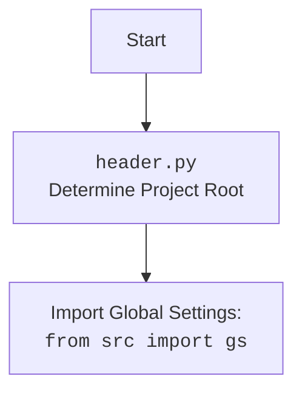

## <алгоритм>

### Общая схема работы модуля `code_assistant.py`

1.  **Инициализация**:
    *   Загрузка конфигурации из `code_assistant.json`.
    *   Создание экземпляра класса `CodeAssistant` с указанием роли, языка и списка моделей.
    *   Инициализация выбранных моделей (в данном случае, Gemini).
2.  **Обработка файлов**:
    *   Получение списка файлов для обработки из указанных стартовых директорий.
    *   Для каждого файла:
        *   Чтение содержимого файла.
        *   Создание запроса к модели на основе содержимого файла, роли и языка.
        *   Отправка запроса в модель Gemini.
        *   Получение ответа от модели.
        *   Сохранение ответа в файл с соответствующим суффиксом.
3.  **Сохранение результатов**:
    *   Создание директории для сохранения результатов, если она не существует.
    *   Запись ответа модели в файл.
4.  **Запуск**:
    *   Инициализация `CodeAssistant` с указанием роли, языка и моделей.
    *   Запуск процесса обработки файлов `process_files`.

### Блок-схема



### Пример для логического блока "Создание запроса к модели"

Предположим, у нас есть файл `example.py` с содержимым:

```python
def hello_world():
    print("Hello, World!")
```

Роль установлена как `code_explainer_md`, язык — `ru`, а инструкция для кода (code instruction) — "Объясни этот код".

Тогда запрос к модели будет выглядеть примерно так:

```json
{
    "role": "Объясни код в формате Markdown",
    "output_language": "ru",
    "Path to file:": "example.py",
    "instruction": "Объясни этот код",
    "input_code": "```python\ndef hello_world():\n    print(\"Hello, World!\")\n```"
}
```

## <mermaid>



### Описание зависимостей в диаграмме `mermaid`

*   **CodeAssistant Initialization**: Начальный этап, представляющий создание экземпляра класса `CodeAssistant`.
*   **Configuration Loading**: Загрузка конфигурационных данных из файла `code_assistant.json`.
*   **Model Initialization**: Инициализация используемой модели машинного обучения (например, Gemini).
*   **File Processing**: Основной этап, включающий обработку файлов.
*   **File Content Reading**: Чтение содержимого каждого файла.
*   **Request Creation**: Формирование запроса к модели на основе содержимого файла и заданных параметров.
*   **Gemini Model Interaction**: Взаимодействие с моделью Gemini для получения ответа на запрос.
*   **Response Saving**: Сохранение полученного ответа от модели.
*    **Loop to next file**: переход к следующему файлу
*   **End of Processing**: Завершение процесса обработки файлов.

### Дополнительный `mermaid` flowchart для `header.py`



## <объяснение>

### Импорты

*   `asyncio`: Для асинхронного выполнения операций.
*   `argparse`: Для разбора аргументов командной строки.
*   `sys`: Для работы с системными параметрами и функциями.
*   `os`: Для взаимодействия с операционной системой.
*   `pathlib.Path`: Для удобной работы с путями к файлам и директориям.
*   `typing.Iterator, List, Optional`: Для аннотации типов.
*   `types.SimpleNamespace`: Для создания объектов с произвольными атрибутами.
*   `signal`: Для обработки системных сигналов, таких как прерывания.
*   `time`: Для измерения времени выполнения операций.
*   `re`: Для работы с регулярными выражениями.
*   `fnmatch`: Для сопоставления имен файлов с шаблонами.
*   `header`: Локальный модуль для определения корневой директории проекта.
    *   Импортирует `__root__` из `header`, который определяет корень проекта.
*   `src.gs`: Локальный модуль, содержащий глобальные настройки проекта.
    *   Используется для доступа к путям, учетным данным и другим глобальным параметрам.
*   `src.utils.jjson.j_loads, j_loads_ns`: Функции для загрузки JSON-файлов.
    *   `j_loads` и `j_loads_ns` упрощают чтение JSON-файлов и конфигураций.
*   `src.ai.gemini.GoogleGenerativeAI`: Класс для взаимодействия с моделью Gemini.
    *   Отвечает за отправку запросов в модель Gemini и получение ответов.
*   `src.ai.openai.OpenAIModel`: Класс для взаимодействия с моделью OpenAI.
*   `src.utils.path.get_relative_path`: Функция для получения относительного пути к файлу.
    *   Используется для формирования запросов к модели.
*   `src.logger.logger.logger`: Объект логгера для записи информации о работе модуля.
    *   Позволяет отслеживать ошибки и ход выполнения программы.
*   `src.endpoints.hypo69.code_assistant.make_summary.make_summary`: Функция для создания сводки по проекту.
*   `src.USE_ENV`: Флаг, указывающий на использование переменных окружения.

### Классы

#### `Config`

*   Роль: Хранение конфигурационных параметров для `CodeAssistant`.
*   Атрибуты:
    *   `base_path`: Путь к директории `code_assistant`.
    *   `config`: Объект `SimpleNamespace` с параметрами конфигурации из `code_assistant.json`.
    *   `role`: Роль, используемая при обработке файлов (по умолчанию `doc_writer_md`).
    *   `lang`: Язык, используемый при обработке файлов (по умолчанию `ru`).
    *   `system_instruction`: Инструкция для системы.
    *   `gemini`: Объект `SimpleNamespace` с параметрами для модели Gemini (имя модели, API-ключ, тип ответа).
*   Методы: Отсутствуют.

#### `CodeAssistant`

*   Роль: Класс для работы с моделью машинного обучения для анализа кодовой базы, создания документации, примеров кода и тестов.
*   Атрибуты:
    *   `role`: Роль для выполнения задачи.
    *   `lang`: Язык выполнения задачи.
    *   `base_path`: Базовый путь к директории `code_assistant`.
    *   `config`: Конфигурация, загруженная из JSON.
    *   `gemini_model`: Экземпляр класса `GoogleGenerativeAI` для взаимодействия с моделью Gemini.
    *   `openai_model`: Экземпляр класса `OpenAIModel` для взаимодействия с моделью OpenAI.
*   Методы:
    *   `__init__`: Инициализация ассистента с заданными параметрами.
    *   `_initialize_models`: Инициализация моделей на основе заданных параметров.
    *   `code_instruction`: Чтение инструкции для кода.
    *   `translations`: Загрузка переводов для ролей и языков.
    *   `send_file`: Отправка файла в модель.
    *   `process_files`: Компиляция, отправка запроса и сохранение результата.
    *   `_create_request`: Создание запроса с учетом роли и языка.
    *   `_yield_files_content`: Генерация содержимого файлов по указанным шаблонам.
    *   `_save_response`: Сохранение ответа модели в файл с добавлением суффикса.
    *   `_remove_outer_quotes`: Удаление внешних кавычек в начале и в конце строки, если они присутствуют.
    *   `run`: Запуск процесса обработки файлов.
    *   `_signal_handler`: Обработка прерывания выполнения.

### Функции

*   `parse_args`: Разбор аргументов командной строки.
*   `main`: Функция запускает бесконечный цикл, в котором выполняется обработка файлов с учетом ролей и языков, указанных в конфигурации.

### Переменные

*   `__root__`: Корневая директория проекта.
*   `gs`: Объект с глобальными настройками.
*   `USE_ENV`: Флаг, указывающий на использование переменных окружения.

### Потенциальные ошибки и области для улучшения

1.  **Обработка ошибок**:
    *   В некоторых местах используется `...` для обработки ошибок, что затрудняет отладку. Следует добавить более информативные сообщения об ошибках и логирование.
    *   В функции `_initialize_models` при возникновении ошибки возвращается `False`, но не предпринимается никаких действий для обработки этой ситуации.
2.  **Конфигурация**:
    *   Конфигурация загружается в каждом цикле в функции `main`, что может быть неэффективно. Следует рассмотреть возможность загрузки конфигурации только при изменении файла конфигурации.
3.  **Асинхронность**:
    *   В функции `process_files` используется `asyncio.sleep(20)`, что может замедлить обработку файлов. Следует рассмотреть возможность использования более эффективных методов для управления скоростью обработки.
4.  **Безопасность**:
    *   При чтении файлов следует добавить обработку исключений, связанных с правами доступа.
5.  **Логирование**:
    *   Некоторые сообщения логирования не содержат достаточно информации для отладки. Следует добавить больше контекстной информации в сообщения логирования.
6.  **Валидация**:
     *  Необходимо добавить валидацию входных параметров в `__init__` методе класса `CodeAssistant`.

### Связи с другими частями проекта

*   Модуль `header` используется для определения корневой директории проекта.
*   Модуль `src.gs` используется для доступа к глобальным настройкам проекта.
*   Модули `src.utils.jjson` используются для загрузки JSON-файлов.
*   Модули `src.ai.gemini` и `src.ai.openai` используются для взаимодействия с моделями машинного обучения.
*   Модуль `src.utils.path` используется для получения относительного пути к файлу.
*   Модуль `src.logger.logger` используется для логирования.