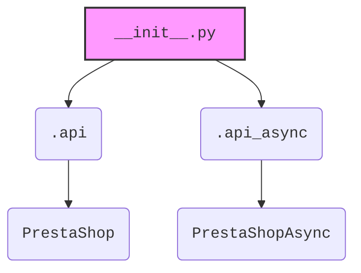

### **Анализ кода `hypotez/src/endpoints/prestashop/api/__init__.py`**

#### **1. <алгоритм>**:
1. **Импорт `PrestaShop`**: Импортируется класс `PrestaShop` из модуля `.api`. Этот класс, вероятно, предоставляет функциональность для взаимодействия с API PrestaShop.
2. **Импорт `PrestaShopAsync`**: Импортируется класс `PrestaShopAsync` из модуля `.api_async`. Этот класс, вероятно, предоставляет асинхронную функциональность для взаимодействия с API PrestaShop.

#### **2. <mermaid>**:

**Объяснение `mermaid`**:
- `__init__.py`: Файл инициализации пакета `src.endpoints.prestashop.api`.
- `.api`: Модуль, содержащий класс `PrestaShop` для синхронного взаимодействия с API PrestaShop.
- `.api_async`: Модуль, содержащий класс `PrestaShopAsync` для асинхронного взаимодействия с API PrestaShop.
- `PrestaShop`: Класс для синхронной работы с API PrestaShop.
- `PrestaShopAsync`: Класс для асинхронной работы с API PrestaShop.

#### **3. <объяснение>**:

**Импорты**:
- `from .api import PrestaShop`: Импортирует класс `PrestaShop` из модуля `.api`. Этот класс предназначен для работы с API PrestaShop.
- `from .api_async import PrestaShopAsync`: Импортирует класс `PrestaShopAsync` из модуля `.api_async`. Этот класс предназначен для асинхронной работы с API PrestaShop.

**Назначение**:
Файл `__init__.py` служит для инициализации пакета `src.endpoints.prestashop.api`. Он импортирует классы `PrestaShop` и `PrestaShopAsync`, делая их доступными для использования при импорте пакета.

**Взаимосвязи**:
- Модуль `src.endpoints.prestashop.api` предоставляет интерфейс для взаимодействия с API PrestaShop.
- Классы `PrestaShop` и `PrestaShopAsync` предоставляют синхронные и асинхронные методы для работы с API PrestaShop соответственно.

**Потенциальные улучшения**:
- Добавить документацию на уровне пакета, описывающую общее назначение и структуру пакета `src.endpoints.prestashop.api`.