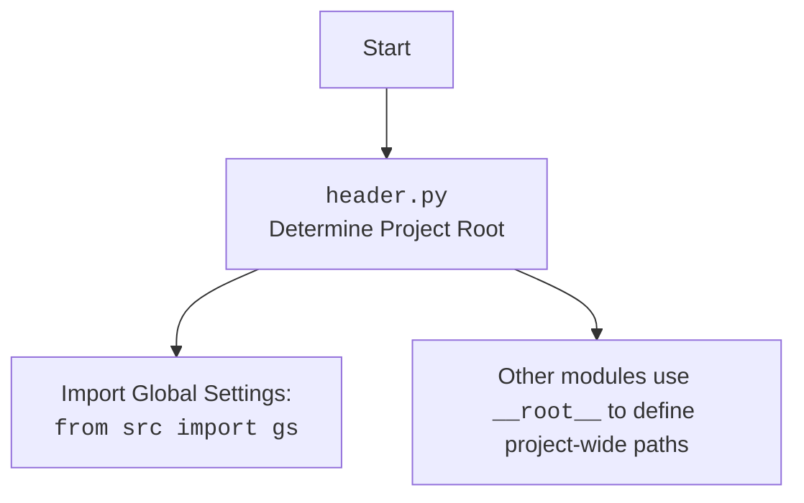

# Анализ кода `hypotez/src/endpoints/prestashop/api/header.py`

## Алгоритм

1.  **`set_project_root(marker_files)`**:
    *   Начинает с директории, где находится текущий файл (`__file__`).
    *   Переходит вверх по дереву директорий, пока не найдет один из файлов-маркеров (по умолчанию `__root__` или `.git`).
    *   Если маркер найден, устанавливает эту директорию в качестве корневой (`__root__`).
    *   Добавляет корневую директорию в `sys.path`, если её там ещё нет.
    *   Возвращает путь к корневой директории.

    ```python
    # Пример:
    # Если файл находится в /path/to/project/src/module.py, и в /path/to/project/ есть файл .git,
    # то функция вернет Path('/path/to/project') и добавит эту директорию в sys.path.
    ```
2.  После определения корневой директории, она сохраняется в глобальной переменной `__root__`.

## Mermaid

```mermaid
flowchart TD
    Start --> FindFileDir[Determine directory of the current file]
    FindFileDir --> LoopThroughParents[Iterate over parent directories]
    LoopThroughParents --> CheckForMarker{Check for marker files ('.git', '__root__')}
    CheckForMarker -- Yes --> SetRootDir[Set current parent as root directory]
    CheckForMarker -- No --> LoopThroughParents
    SetRootDir --> AddToSysPath{Add root directory to sys.path if not present}
    AddToSysPath --> End[Return root directory]
    Start --> End
```

**Объяснение зависимостей (импортов) для диаграммы mermaid:**

*   `pathlib`: Модуль `pathlib` используется для манипулирования путями к файлам и директориям.
*   `sys`: Модуль `sys` используется для доступа к системным переменным и функциям, в данном случае для изменения `sys.path`.

## Объяснение

**Импорты:**

*   `import sys`: Модуль `sys` предоставляет доступ к некоторым переменным и функциям, взаимодействующим с интерпретатором Python. Здесь используется для модификации `sys.path`, чтобы добавить корневую директорию проекта в пути поиска модулей.
*   `from pathlib import Path`: Модуль `pathlib` предоставляет способ представления путей к файлам и директориям в виде объектов. Это упрощает операции с файловой системой.

**Классы:**

В данном коде нет классов.

**Функции:**

*   `set_project_root(marker_files: tuple[str, ...]=('__root__', '.git')) -> Path`:
    *   **Аргументы:**
        *   `marker_files` (tuple): Кортеж имен файлов или директорий, которые используются для определения корневой директории проекта. По умолчанию `('__root__', '.git')`.
    *   **Возвращаемое значение:**
        *   `Path`: Объект `Path`, представляющий корневую директорию проекта.
    *   **Назначение:**
        Функция определяет корневую директорию проекта, начиная с директории, где находится текущий файл. Она ищет вверх по дереву директорий, пока не найдет директорию, содержащую один из файлов-маркеров. Если маркер найден, эта директория считается корневой.
    *   **Пример:**

    ```python
    from pathlib import Path
    import sys

    # Пример использования функции set_project_root
    root_dir = set_project_root()
    print(f"Root directory: {root_dir}")

    # Проверка, добавлена ли корневая директория в sys.path
    if str(root_dir) in sys.path:
        print("Root directory added to sys.path")
    else:
        print("Root directory not added to sys.path")
    ```

**Переменные:**

*   `__root__`:
    *   **Тип:** `Path`
    *   **Использование:** Глобальная переменная, хранящая путь к корневой директории проекта. Она инициализируется результатом вызова функции `set_project_root()`.

**Потенциальные ошибки и области для улучшения:**

*   **Обработка ошибок:** В случае, если корневая директория не найдена (нет файлов-маркеров), функция возвращает директорию, в которой находится скрипт. Это может быть не всегда желаемым поведением. Можно добавить явную обработку этого случая, например, выбрасывать исключение или возвращать `None`.
*   **Конфигурируемость:** Список `marker_files` задан по умолчанию. Можно сделать его более гибким, например, позволить передавать его через переменную окружения или конфигурационный файл.

**Взаимосвязь с другими частями проекта:**

Эта часть кода важна для всего проекта, так как определяет корневую директорию, от которой зависят все остальные модули. Она позволяет использовать абсолютные пути для импорта модулей, что упрощает структуру проекта и делает его более переносимым.

