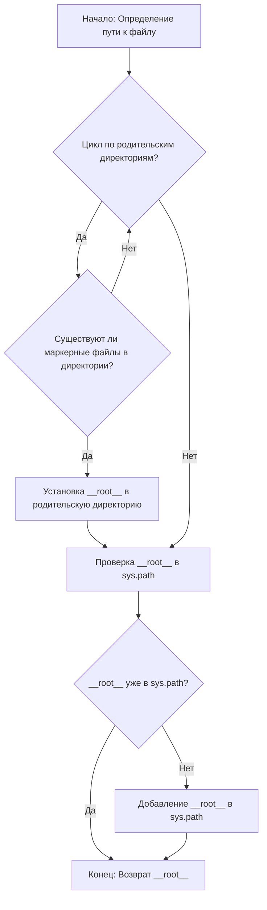

# Проект `hypotez`
# Роль `code explainer`
## ИНСТРУКЦИЯ  :

Анализируй предоставленный код подробно и объясни его функциональность. Ответ должен включать три раздела:  

1. **<алгоритм>**: Опиши рабочий процесс в виде пошаговой блок-схемы, включая примеры для каждого логического блока, и проиллюстрируй поток данных между функциями, классами или методами.  
2. **<mermaid>**: Напиши код для диаграммы в формате `mermaid`, проанализируй и объясни все зависимости, 
    которые импортируются при создании диаграммы. 
    **ВАЖНО!** Убедитесь, что все имена переменных, используемые в диаграмме `mermaid`, 
    имеют осмысленные и описательные имена. Имена переменных вроде `A`, `B`, `C`, и т.д., не допускаются!  
    
    **Дополнительно**: Если в коде есть импорт `import header`, добавьте блок `mermaid` flowchart, объясняющий `header.py`:\
    ```mermaid
    flowchart TD
        Start --> Header[<code>header.py</code><br> Determine Project Root]
    
        Header --> import[Import Global Settings: <br><code>from src import gs</code>] 
    ```

3. **<объяснение>**: Предоставь подробные объяснения:  
   - **Импорты**: Их назначение и взаимосвязь с другими пакетами `src.`.  
   - **Классы**: Их роль, атрибуты, методы и взаимодействие с другими компонентами проекта.  
   - **Функции**: Их аргументы, возвращаемые значения, назначение и примеры.  
   - **Переменные**: Их типы и использование.  
   - Выдели потенциальные ошибки или области для улучшения.  

Дополнительно, постройте цепочку взаимосвязей с другими частями проекта (если применимо).  

Это обеспечивает всесторонний и структурированный анализ кода.
## Формат ответа: `.md` (markdown)


## Твое поведение при анализе кода:
- всегда смотри системную инструкцию для обработки кода проекта `hypotez`;
- анализируй расположение файла в проекте. Это поможет понять его назначение и взаимосвязь с другими файлами. Расположение файла ты найдешь в самой превой строке кода, начинающейся с `## \\file /...`;
- запоминай предоставленный код и анализируй его связь с другими частями проекта `hypotez`;


**КОНЕЦ ИНСТРУКЦИИ**
```

```md
## Анализ кода `hypotez/src/endpoints/prestashop/product_fields/header.py`

### 1. <алгоритм>



**Примеры:**

1.  **Начало**: Скрипт начинает выполнение, и `Path(__file__).resolve().parent` определяет директорию, где расположен текущий файл.
    *   Пример: Если файл расположен в `/home/user/project/src/module/file.py`, то `current_path` будет `/home/user/project/src/module`.

2.  **Цикл по родительским директориям**: Цикл перебирает все родительские директории, начиная с текущей.
    *   Пример: Если `current_path` это `/home/user/project/src/module`, цикл будет перебирать `/home/user/project/src/module`, `/home/user/project/src`, `/home/user/project`, `/home/user`, `/`.

3.  **Существуют ли маркерные файлы в директории**: Проверяется наличие файлов или директорий, указанных в `marker_files` (например, `__root__` или `.git`).
    *   Пример: Проверяется наличие `/home/user/project/src/module/__root__`, `/home/user/project/src/__root__`, `/home/user/project/__root__` и т.д. Если найден файл `.git` в `/home/user/project`, то устанавливается `__root__ = /home/user/project`.

4.  **Установка `__root__` в родительскую директорию**: Если маркерный файл найден, то переменная `__root__` устанавливается в эту директорию.
    *   Пример: Если `.git` найден в `/home/user/project`, то `__root__` становится `/home/user/project`.

5.  **Проверка `__root__` в `sys.path`**: Проверяется, добавлена ли директория `__root__` в `sys.path`.

6.  **Добавление `__root__` в `sys.path`**: Если `__root__` отсутствует в `sys.path`, она добавляется в начало списка.
    *   Пример: Если `sys.path` не содержит `/home/user/project`, то она добавляется в начало списка `sys.path`.

7.  **Возврат `__root__`**: Функция возвращает значение `__root__`, которое является путем к корневой директории проекта.

### 2. <mermaid>

```mermaid
flowchart TD
    A[Start: Determine Project Root] --> B{Find Marker Files (.git, __root__)?};
    B -- Yes --> C[Set Project Root];
    B -- No --> D[Use Current Directory];
    C --> E{Project Root in sys.path?};
    D --> E;
    E -- No --> F[Add Project Root to sys.path];
    E -- Yes --> G[Return Project Root];
    F --> G;
    G[End];
```

**Объяснение диаграммы:**

1.  **Start: Determine Project Root**: Начало процесса определения корневой директории проекта.
2.  **Find Marker Files (.git, `__root__`)?**: Проверка наличия маркерных файлов (например, `.git` или `__root__`) в текущей и родительских директориях.
3.  **Yes**: Если маркерные файлы найдены, корневая директория проекта устанавливается в директорию, содержащую эти файлы.
4.  **No**: Если маркерные файлы не найдены, используется текущая директория.
5.  **Project Root in `sys.path`?**: Проверка, добавлена ли корневая директория проекта в `sys.path`.
6.  **No**: Если корневая директория не добавлена, она добавляется в `sys.path`.
7.  **Yes**: Если корневая директория уже в `sys.path`, переходим к возврату значения.
8.  **Return Project Root**: Функция возвращает путь к корневой директории проекта.
9.  **End**: Конец процесса.

### 3. <объяснение>

**Импорты**:

*   `import sys`: Модуль `sys` предоставляет доступ к некоторым переменным и функциям, взаимодействующим с интерпретатором Python. Используется для модификации `sys.path`.
*   `from pathlib import Path`: Класс `Path` из модуля `pathlib` предоставляет объектно-ориентированный способ работы с путями к файлам и директориям.

**Функции**:

*   `set_project_root(marker_files: tuple = ('__root__', '.git')) -> Path`:
    *   **Аргументы**:
        *   `marker_files` (tuple): Кортеж с именами файлов или директорий, которые используются для определения корневой директории проекта. По умолчанию `('__root__', '.git')`.
    *   **Возвращаемое значение**:
        *   `Path`: Объект `Path`, представляющий корневую директорию проекта.
    *   **Назначение**: Функция определяет корневую директорию проекта путем поиска маркерных файлов в текущей и родительских директориях. Если маркерный файл найден, директория, содержащая этот файл, считается корневой. Затем функция добавляет корневую директорию в `sys.path`, если она там отсутствует.
    *   **Пример**:

        ```python
        from pathlib import Path
        import sys

        # Пример использования функции
        root_path = set_project_root()
        print(f"Root path: {root_path}")
        print(f"Is root path in sys.path: {str(root_path) in sys.path}")
        ```

**Переменные**:

*   `__root__`:
    *   **Тип**: `Path`
    *   **Использование**: Хранит путь к корневой директории проекта. Инициализируется путем вызова функции `set_project_root()`.

**Потенциальные ошибки и области для улучшения**:

*   **Обработка исключений**: В текущей реализации отсутствует обработка исключений. Если во время поиска корневой директории возникают какие-либо ошибки (например, отсутствует доступ к директории), это может привести к неожиданному поведению.
*   **Конфигурация маркерных файлов**: Список `marker_files` задан по умолчанию. Можно улучшить, добавив возможность конфигурации этого списка через переменные окружения или параметры командной строки.

**Взаимосвязь с другими частями проекта**:

*   Этот модуль устанавливает корневую директорию проекта и добавляет ее в `sys.path`. Это позволяет другим модулям проекта импортировать файлы и модули, расположенные в корневой директории, используя абсолютные пути. Расположение файла `hypotez/src/endpoints/prestashop/product_fields/header.py` говорит о том, что он используется для настройки окружения в `product_fields`.