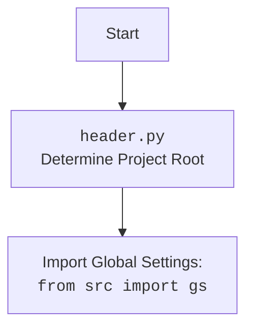

# Проект `hypotez`
# Роль `code explainer`
## ИНСТРУКЦИЯ  :

Анализируй предоставленный код подробно и объясни его функциональность. Ответ должен включать три раздела:  

1. **<алгоритм>**: Опиши рабочий процесс в виде пошаговой блок-схемы, включая примеры для каждого логического блока, и проиллюстрируй поток данных между функциями, классами или методами.  
2. **<mermaid>**: Напиши код для диаграммы в формате `mermaid`, проанализируй и объясни все зависимости, 
    которые импортируются при создании диаграммы. 
    **ВАЖНО!** Убедитесь, что все имена переменных, используемые в диаграмме `mermaid`, 
    имеют осмысленные и описательные имена. Имена переменных вроде `A`, `B`, `C`, и т.д., не допускаются!  
    
    **Дополнительно**: Если в коде есть импорт `import header`, добавьте блок `mermaid` flowchart, объясняющий `header.py`:\
    ```mermaid
    flowchart TD
        Start --> Header[<code>header.py</code><br> Determine Project Root]
    
        Header --> import[Import Global Settings: <br><code>from src import gs</code>] 
    ```

3. **<объяснение>**: Предоставь подробные объяснения:  
   - **Импорты**: Их назначение и взаимосвязь с другими пакетами `src.`.  
   - **Классы**: Их роль, атрибуты, методы и взаимодействие с другими компонентами проекта.  
   - **Функции**: Их аргументы, возвращаемые значения, назначение и примеры.  
   - **Переменные**: Их типы и использование.  
   - Выдели потенциальные ошибки или области для улучшения.  

Дополнительно, постройте цепочку взаимосвязей с другими частями проекта (если применимо).  

Это обеспечивает всесторонний и структурированный анализ кода.
## Формат ответа: `.md` (markdown)


## Твое поведение при анализе кода:
- всегда смотри системную инструкцию для обработки кода проекта `hypotez`;
- анализируй расположение файла в проекте. Это поможет понять его назначение и взаимосвязь с другими файлами. Расположение файла ты найдешь в самой превой строке кода, начинающейся с `## \\file /...`;
- запоминай предоставленный код и анализируй его связь с другими частями проекта `hypotez`;


**КОНЕЦ ИНСТРУКЦИИ**
```

## Анализ кода `hypotez/src/fast_api/fast_api.py`

### 1. <алгоритм>

1.  **Инициализация**:
    *   Загрузка переменных окружения из `.env` файла.
    *   Чтение конфигурации из `fast_api.json` с использованием `j_loads_ns`. Если файл не найден, программа завершается.

2.  **FastApiServer (Singleton)**:
    *   Создается экземпляр класса `FastApiServer`, реализованный как Singleton.
    *   При инициализации добавляются маршруты `/hello` и `/post` для тестовых функций.
    *   В `FastAPI` включается роутер.

3.  **Запуск сервера**:
    *   Функция `start_server` создает экземпляр `FastApiServer`, если он еще не создан.
    *   Функция `FastApiServer.start` запускает `uvicorn` сервер в отдельном потоке для указанного порта.

4.  **Остановка сервера**:
    *   Функция `stop_server` останавливает `uvicorn` сервер на указанном порту.
    *   Функция `stop_all_servers` останавливает все запущенные сервера.

5.  **Управление маршрутами**:
    *   Функция `add_new_route` динамически импортирует модуль и добавляет новый маршрут к `FastAPI` приложению.
    *   Функция `get_routes` возвращает список всех роутов.

6.  **XML-RPC CommandHandler**:
    *   Класс `CommandHandler` предоставляет интерфейс XML-RPC для удаленного управления сервером.
    *   Регистрирует методы для запуска, остановки и получения статуса серверов.

7.  **Основной цикл `main`**:
    *   Создает экземпляр `CommandHandler`.
    *   Выводит меню с доступными командами.
    *   Обрабатывает ввод пользователя для управления серверами.

    Пример:
    *   Пользователь вводит `start 8000`.
    *   Программа запускает `FastAPI` сервер на порту 8000.
    *   Пользователь вводит `stop 8000`.
    *   Программа останавливает `FastAPI` сервер на порту 8000.

### 2. <mermaid>

```mermaid
flowchart TD
    Start --> LoadEnv[Load environment variables from .env]
    LoadEnv --> LoadConfig[Load config from fast_api.json using j_loads_ns]
    LoadConfig -- "Config not found" --> Exit[Exit program]
    LoadConfig --> FastApiServerInit[Initialize FastApiServer (Singleton)]
    FastApiServerInit --> AddRoutes[Add /hello and /post routes]
    AddRoutes --> StartServerFunc[Call start_server function with port]
    StartServerFunc --> FastApiServerStart[FastApiServer.start: Start uvicorn server in thread]
    FastApiServerStart --> UvicornServe[uvicorn.Server.serve()]
    UvicornServe -- "Server started" --> CommandHandlerInit[Initialize CommandHandler (XML-RPC)]
    CommandHandlerInit --> RegisterRPCMethods[Register methods for server management]
    RegisterRPCMethods --> MainLoop[Enter main loop to process commands]
    MainLoop --> InputCommand[Input command from user]
    InputCommand -- "start <port>" --> StartServerCommand[Start server on specified port]
    InputCommand -- "stop <port>" --> StopServerCommand[Stop server on specified port]
    InputCommand -- "stop_all" --> StopAllServersCommand[Stop all servers]
    InputCommand -- "status" --> StatusServersCommand[Show server status]
    InputCommand -- "routes" --> GetRoutesCommand[Get routes]
     InputCommand -- "add_route" --> AddNewRouteCommand[Add new route]
    InputCommand -- "shutdown" --> ShutdownCommand[Shutdown]
    InputCommand -- "help" --> DisplayMenu[Display available commands]
    InputCommand -- "exit" --> End[Exit program]
    StartServerCommand --> FastApiServerStart
    StopServerCommand --> FastApiServerStop[FastApiServer.stop: Stop uvicorn server]
    StopAllServersCommand --> FastApiServerStopAll[FastApiServer.stop_all: Stop all uvicorn servers]
    StatusServersCommand --> FastApiServerGetStatus[FastApiServer.get_servers_status: Return servers status]
    GetRoutesCommand --> FastApiServerGetRoutes[FastApiServer.get_routes: Get routes]
    AddNewRouteCommand --> FastApiServerAddNewRoute[FastApiServer.add_new_route: Add new route]
    ShutdownCommand --> FastApiServerStopAll
    ShutdownCommand --> RPCServerShutdown[RPC Server Shutdown]
```



**Зависимости и пояснения:**

*   **`asyncio`**: Используется для асинхронного запуска `uvicorn` сервера.
*   **`functools`**: Используется для работы с функциями высшего порядка.
*   **`json`**: Используется для работы с JSON-конфигурацией.
*   **`os`**: Используется для работы с операционной системой.
*   **`sys`**: Используется для работы с системными параметрами и функциями.
*   **`threading`**: Используется для запуска сервера в отдельном потоке.
*   **`types`**: Используется для создания `SimpleNamespace` для хранения конфигурации.
*   **`typing`**: Используется для аннотации типов.
*   **`pathlib`**: Используется для работы с путями к файлам.
*   **`contextlib`**: Используется для работы с контекстными менеджерами.
*   **`xmlrpc.server`**: Используется для создания XML-RPC сервера.
*   **`dotenv`**: Используется для загрузки переменных окружения из `.env` файла.
*   **`uvicorn`**: ASGI-сервер для запуска `FastAPI` приложения.
*   **`fastapi`**: Фреймворк для создания `API`.
*   **`importlib`**: Используется для динамического импорта модулей.
*   **`header`**: Определяет корень проекта и глобальные настройки.
*   **`src.fast_api.routes`**: Содержит определения маршрутов.
*   **`src.gs`**: Глобальные настройки проекта.
*   **`src.utils.jjson`**: Модуль для работы с `JSON`.
*   **`src.utils.printer`**: Модуль для форматированного вывода.
*   **`src.logger`**: Модуль для логирования.
*   **`re`**: Модуль для работы с регулярными выражениями.

### 3. <объяснение>

#### **Импорты**:

*   `asyncio`: Предоставляет инструменты для написания конкурентного кода с использованием синтаксиса async/await.
*   `functools`: Модуль для функций высшего порядка.
*   `json`: Модуль для работы с данными в формате `JSON`.
*   `os`: Модуль, предоставляющий функции для взаимодействия с операционной системой.
*   `sys`: Модуль, предоставляющий доступ к некоторым переменным и функциям, используемым или поддерживаемым интерпретатором.
*   `threading`: Модуль для работы с потоками.
*   `types`: Модуль для определения типов, включая `SimpleNamespace`.
*   `typing`: Модуль для аннотации типов.
*   `pathlib`: Модуль для представления путей файловой системы в виде объектов.
*   `contextlib`: Модуль, предоставляющий инструменты для работы с контекстными менеджерами.
*   `xmlrpc.server`: Модуль для создания простых XML-RPC серверов.
*   `dotenv`: Модуль для загрузки переменных окружения из `.env` файлов.
*   `uvicorn`: ASGI сервер, используемый для запуска `FastAPI` приложения.
*   `fastapi`: Фреймворк для создания `API` на Python.
*   `importlib`: Модуль, предоставляющий инструменты для динамической загрузки модулей.
*   `header`: Пользовательский модуль для определения корня проекта и глобальных настроек.
*   `src.fast_api.routes`: Модуль, содержащий определения маршрутов для `FastAPI`.
*   `src.gs`: Глобальные настройки проекта.
*   `src.utils.jjson`: Модуль, содержащий функции для работы с `JSON` данными, такие как `j_loads` и `j_loads_ns`.
*   `src.utils.printer`: Модуль, содержащий функции для форматированного вывода, такие как `pprint`.
*   `src.logger`: Модуль для логирования событий в приложении.
*    `re`: Модуль для работы с регулярными выражениями.

#### **Классы**:

*   `FastApiServer`:
    *   **Роль**: Реализует `FastAPI` сервер как Singleton, обеспечивая единственный экземпляр сервера в приложении.
    *   **Атрибуты**:
        *   `_instance`: Приватный атрибут для хранения экземпляра Singleton.
        *   `app`: Экземпляр `FastAPI`.
        *   `host`: Хост для запуска сервера.
        *   `port`: Порт для запуска сервера.
        *   `router`: Экземпляр `APIRouter` для добавления маршрутов.
        *   `server_tasks`: Словарь, содержащий запущенные задачи сервера.
        *   `servers`: Словарь, содержащий запущенные сервера.
    *   **Методы**:
        *   `__new__`: Обеспечивает создание только одного экземпляра класса.
        *   `__init__`: Инициализирует сервер, добавляет маршруты и настраивает приложение `FastAPI`.
        *   `add_route`: Добавляет новый маршрут к `FastAPI` приложению.
        *   `_start_server`: Запускает `uvicorn` сервер асинхронно.
        *   `start`: Запускает `FastAPI` сервер на указанном порту в отдельном потоке.
        *   `stop`: Останавливает `FastAPI` сервер на указанном порту.
        *   `stop_all`: Останавливает все запущенные сервера.
        *   `get_servers_status`: Возвращает статус всех серверов.
        *   `get_routes`: Возвращает список всех роутов.
        *   `get_app`: Возвращает `FastAPI` приложение.
        *   `add_new_route`: Добавляет новый маршрут к уже работающему приложению.
*   `CommandHandler`:
    *   **Роль**: Обработчик команд для управления `FastAPI` сервером через `XML-RPC`.
    *   **Атрибуты**:
        *   `rpc_port`: Порт для `XML-RPC` сервера.
        *   `rpc_server`: Экземпляр `SimpleXMLRPCServer`.
    *   **Методы**:
        *   `__init__`: Инициализирует `XML-RPC` сервер и регистрирует методы для управления сервером.
        *   `start_server`: Запускает `FastAPI` сервер.
        *   `stop_server`: Останавливает `FastAPI` сервер.
        *   `stop_all_servers`: Останавливает все `FastAPI` сервера.
        *   `status_servers`: Возвращает статус серверов.
        *    `get_routes`: Возвращает список всех роутов.
        *   `add_new_route`: Добавляет новый маршрут к серверу.
        *   `shutdown`: Останавливает все сервера и `XML-RPC` сервер.

#### **Функции**:

*   `telegram_webhook`: Тестовая функция для `webhook`.
*   `test_function`: Тестовая функция, возвращающая строку.
*   `test_post`: Тестовая функция для обработки `POST` запросов, возвращает `JSON` с результатом и данными.
*   `start_server(port: int, host: str)`: Запускает `FastAPI` сервер на указанном порту и хосте.
*   `stop_server(port: int)`: Останавливает `FastAPI` сервер на указанном порту.
*   `stop_all_servers()`: Останавливает все запущенные `FastAPI` сервера.
*   `status_servers()`: Выводит статус всех `FastAPI` серверов.
*    `get_routes()`: Выводит список всех роутов.
*   `add_new_route(path: str, module_name: str, func_name: str, methods: List[str] = ["GET"])`: Добавляет новый маршрут к `FastAPI` серверу.
*   `parse_port_range(range_str)`: Разбирает строку с диапазоном портов.
*   `display_menu()`: Выводит меню с доступными командами.
*   `main()`: Основная функция управления сервером, обрабатывает ввод пользователя и вызывает соответствующие функции.

#### **Переменные**:

*   `config`: Объект `SimpleNamespace`, содержащий конфигурацию из `fast_api.json`.
*   `_api_server_instance`: Глобальная переменная, хранящая экземпляр `FastApiServer`.
*   `route_functions`: Экземпляр класса `Routes` из `src.fast_api.routes`.

#### **Потенциальные ошибки и области для улучшения**:

*   Обработка ошибок при динамическом импорте модулей.
*   Добавление валидации входных данных.
*   Более детальное логирование.
*   Улучшение обработки исключений в `CommandHandler`.
*   Использование асинхронного `XML-RPC` сервера.
*   Добавление тестов.

#### **Взаимосвязи с другими частями проекта**:

*   Использует `header.py` для определения корня проекта и глобальных настроек.
*   Использует `src.gs` для доступа к глобальным настройкам.
*   Использует `src.utils.jjson` для загрузки конфигурации из `JSON` файла.
*   Использует `src.utils.printer` для форматированного вывода.
*   Использует `src.logger` для логирования событий.
*   Интегрируется с `src.fast_api.routes` для определения маршрутов.