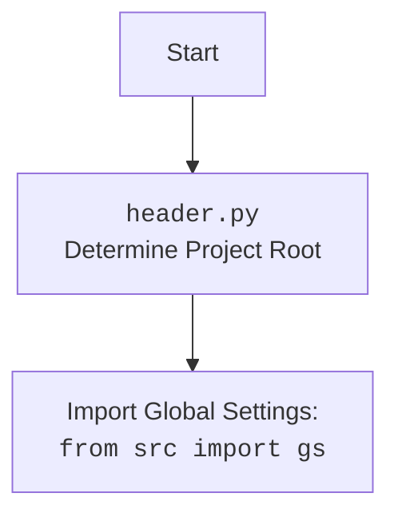

## Анализ кода: `hypotez/src/scenario/executor.py`

### 1. <алгоритм>

Этот модуль отвечает за выполнение сценариев, загрузку их из файлов и обработку процесса извлечения информации о продукте и вставки ее в PrestaShop.

1.  **`dump_journal(s, journal)`**:
    *   Сохраняет данные журнала в JSON-файл.
        *   Пример: `dump_journal(supplier_instance, {'name': 'timestamp', 'scenario_files': {}})`

2.  **`run_scenario_files(s, scenario_files_list)`**:
    *   Принимает список файлов сценариев или один файл сценария.
    *   Перебирает каждый файл сценария и выполняет его с помощью `run_scenario_file`.
    *   Записывает результаты выполнения каждого файла сценария в журнал (`_journal`).
    *   Пример: `run_scenario_files(supplier_instance, [Path('/path/to/scenario1.json'), Path('/path/to/scenario2.json')])`

3.  **`run_scenario_file(s, scenario_file)`**:
    *   Загружает сценарии из указанного файла.
    *   Перебирает сценарии, определенные в файле.
    *   Выполняет каждый сценарий с помощью `run_scenario`.
    *   Пример: `run_scenario_file(supplier_instance, Path('/path/to/scenario.json'))`

4.  **`run_scenarios(s, scenarios)`**:
    *   Выполняет список сценариев (не файлов).
    *   Перебирает каждый сценарий и выполняет его с помощью `run_scenario`.
    *   Записывает результаты выполнения каждого сценария в журнал (`_journal`).
    *   Пример: `run_scenarios(supplier_instance, [{'url': 'http://example.com/category', 'actions': []}])`

5.  **`run_scenario(supplier, scenario, scenario_name)`**:
    *   Выполняет полученный сценарий.
    *   Получает список продуктов в категории с помощью `s.related_modules.get_list_products_in_category(s)`.
    *   Перебирает URL-адреса продуктов и переходит на страницу каждого продукта.
    *   Собирает поля продукта с помощью `s.related_modules.grab_product_page(s)` и `s.related_modules.grab_page(s)`.
    *   Вставляет собранные данные с помощью `insert_grabbed_data(f)`.
    *   Пример: `run_scenario(supplier_instance, {'url': 'http://example.com/product1', 'name': 'Product1'}, 'Product1 Scenario')`

6.  **`insert_grabbed_data_to_prestashop(f, coupon_code, start_date, end_date)`**:
    *   Вставляет продукт в PrestaShop.
    *   Пример: `insert_grabbed_data_to_prestashop(product_fields_instance, 'SUMMER20', '2024-07-01', '2024-07-31')`

```mermaid
graph TD
    A[Start] --> B{run_scenario_files(s, scenario_files_list)};
    B -- scenario_files_list is Path --> C[scenario_files_list = [scenario_files_list]];
    B -- scenario_files_list is list --> D{not isinstance(scenario_files_list, list)};
    D -- True --> E[Raise TypeError];
    D -- False --> F{scenario_files_list is empty};
    F -- True --> G[scenario_files_list = s.scenario_files];
    F -- False --> G
    G --> H{for scenario_file in scenario_files_list};
    H -- scenario_file --> I{run_scenario_file(s, scenario_file)};
    I -- True --> J[Log success];
    I -- False --> K[Log failure];
    J --> H;
    K --> H;
    H -- No more scenario_file --> L[Return True];

    subgraph run_scenario_file
        O[Start run_scenario_file] --> P{j_loads(scenario_file)};
        P -- Success --> Q{for scenario_name, scenario in scenarios_dict.items()};
        P -- FileNotFoundError or JSONDecodeError --> R[Log critical error];
        Q --> S{run_scenario(s, scenario, scenario_name)};
        S -- True --> T[Log scenario success];
        S -- False --> U[Log scenario failure];
        T --> Q;
        U --> Q;
        Q -- No more scenarios --> V[Return True];
        R --> W[Return False];
    end

    subgraph run_scenario
        AA[Start run_scenario] --> BB[d.get_url(scenario['url'])];
        BB --> CC{s.related_modules.get_list_products_in_category(s)};
        CC -- No products --> DD[Log warning];
        CC -- Products --> EE{for url in list_products_in_category};
        EE --> FF{d.get_url(url)};
        FF -- False --> GG[Log error];
        FF -- True --> HH[f = asyncio.run(s.related_modules.grab_page(s))];
        HH -- not f --> II[Log error];
        HH -- f --> JJ[product = Product(...)];
        JJ --> KK{insert_grabbed_data(f)};
        KK -- Exception --> LL[Log error];
        KK -- Success --> EE;
        GG --> EE;
        II --> EE;
        EE -- No more urls --> MM[Return list_products_in_category];
    end
```



### 2. <mermaid>

```mermaid
graph TD
    A[Start] --> B{dump_journal(s, journal: dict)};
    B --> C[Create file path: _journal_file_path];
    C --> D[Dump journal data to JSON: j_dumps(journal, _journal_file_path)];
    D --> E[End];
```

**Объяснение диаграммы `mermaid`**:

*   **A \[Start]**: Начало функции `dump_journal`.
*   **B {dump\_journal(s, journal: dict)}**: Основная функция, принимающая экземпляр поставщика `s` и словарь `journal`.
*   **C \[Create file path: \_journal\_file\_path]**: Создание пути к файлу журнала, используя `s.supplier_abs_path` и имя журнала.
*   **D \[Dump journal data to JSON: j\_dumps(journal, \_journal\_file\_path)]**: Запись данных журнала в JSON-файл с использованием функции `j_dumps`.
*   **E \[End]**: Завершение функции.

#### `header.py` flowchart:


### 3. <объяснение>

#### Импорты:

*   `os`, `sys`: Обеспечивают взаимодействие с операционной системой.
*   `requests`: Используется для выполнения HTTP-запросов (не используется напрямую в предоставленном коде, но может использоваться в других частях модуля).
*   `asyncio`: Используется для асинхронного программирования.
*   `time`: Предоставляет функции, связанные со временем.
*   `tempfile`: Используется для создания временных файлов и каталогов.
*   `datetime`: Используется для работы с датами и временем.
*   `math`: Предоставляет математические функции.
*   `pathlib.Path`: Предоставляет способ представления путей файловой системы.
*   `typing`: Используется для аннотации типов.
*   `json`: Используется для работы с данными в формате JSON.
*   `header`: Определяет корень проекта.
*   `src.gs`: Содержит глобальные настройки.
*   `src.utils.printer.pprint`: Используется для красивой печати данных.
*   `src.utils.jjson.j_loads`, `src.utils.jjson.j_dumps`: Используются для загрузки и сохранения JSON-файлов.
*   `src.endpoints.prestashop.product_async.PrestaProductAsync`, `src.endpoints.prestashop.product_async.ProductFields`: Используются для взаимодействия с PrestaShop для управления продуктами.
*   `src.db.ProductCampaignsManager`: Используется для управления кампаниями продуктов в базе данных.
*   `src.logger.logger.logger`: Используется для логирования событий.
*   `src.logger.exceptions.ProductFieldException`: Пользовательское исключение для ошибок полей продукта.

#### Переменные:

*   `_journal: dict`: Глобальный журнал для отслеживания выполнения сценариев.

#### Функции:

*   `dump_journal(s, journal: dict) -> None`:
    *   Сохраняет данные журнала в JSON-файл.
    *   Аргументы:
        *   `s (object)`: Экземпляр поставщика.
        *   `journal (dict)`: Словарь, содержащий данные журнала.
    *   Возвращает: `None`.

*   `run_scenario_files(s, scenario_files_list: List[Path] | Path) -> bool`:
    *   Выполняет список файлов сценариев.
    *   Аргументы:
        *   `s (object)`: Экземпляр поставщика.
        *   `scenario_files_list (List[Path] | Path)`: Список путей к файлам сценариев или один путь к файлу.
    *   Возвращает: `True`, если все сценарии выполнены успешно, `False` в противном случае.
    *   Вызывает исключение `TypeError`, если `scenario_files_list` не является списком или объектом `Path`.

*   `run_scenario_file(s, scenario_file: Path) -> bool`:
    *   Загружает и выполняет сценарии из файла.
    *   Аргументы:
        *   `s (object)`: Экземпляр поставщика.
        *   `scenario_file (Path)`: Путь к файлу сценария.
    *   Возвращает: `True`, если сценарий выполнен успешно, `False` в противном случае.

*   `run_scenarios(s, scenarios: Optional[List[dict] | dict] = None, _journal=None) -> List | dict | bool`:
    *   Выполняет список сценариев (не файлов).
    *   Аргументы:
        *   `s (object)`: Экземпляр поставщика.
        *   `scenarios (Optional[List[dict] | dict], optional)`: Список сценариев или один сценарий в виде словаря. По умолчанию `None`.
    *   Возвращает: Результат выполнения сценариев или `False` в случае ошибки.

*   `run_scenario(supplier, scenario: dict, scenario_name: str, _journal=None) -> List | dict | bool`:
    *   Выполняет полученный сценарий.
    *   Аргументы:
        *   `supplier (object)`: Экземпляр поставщика.
        *   `scenario (dict)`: Словарь, содержащий детали сценария.
        *   `scenario_name (str)`: Имя сценария.
    *   Возвращает: Результат выполнения сценария.

*   `insert_grabbed_data_to_prestashop(f: ProductFields, coupon_code: Optional[str] = None, start_date: Optional[str] = None, end_date: Optional[str] = None) -> bool`:
    *   Вставляет продукт в PrestaShop.
    *   Аргументы:
        *   `f (ProductFields)`: Экземпляр `ProductFields`, содержащий информацию о продукте.
        *   `coupon_code (Optional[str], optional)`: Код купона. По умолчанию `None`.
        *   `start_date (Optional[str], optional)`: Дата начала акции. По умолчанию `None`.
        *   `end_date (Optional[str], optional)`: Дата окончания акции. По умолчанию `None`.
    *   Возвращает: `True`, если вставка прошла успешно, `False` в противном случае.

#### Классы:

*   В коде используются классы `PrestaProductAsync`, `ProductFields`, `ProductCampaignsManager`, `Product` и `PrestaShop`, но их определения не включены в предоставленный фрагмент кода.

#### Потенциальные ошибки и области для улучшения:

*   Обработка исключений может быть улучшена за счет более конкретных блоков `except`.
*   Необходимо проверить, что все пути к файлам существуют и доступны.
*   Документация для параметров `_journal` в функциях `run_scenarios` и `run_scenario` отсутствует.

#### Взаимосвязи с другими частями проекта:

*   Этот модуль тесно связан с модулями `src.gs`, `src.utils.jjson`, `src.endpoints.prestashop.product_async`, `src.db` и `src.logger`. Он использует их для доступа к глобальным настройкам, загрузки/сохранения JSON-файлов, взаимодействия с PrestaShop, управления данными в базе данных и логирования.