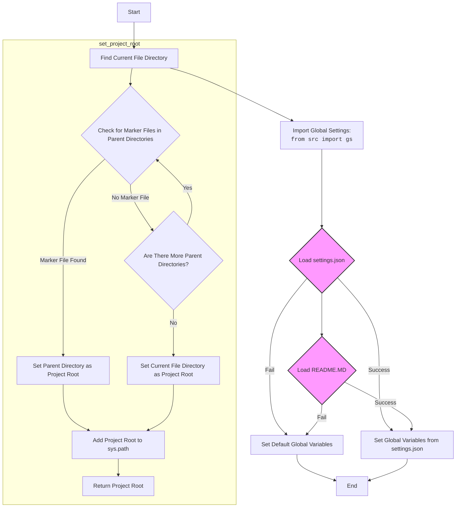
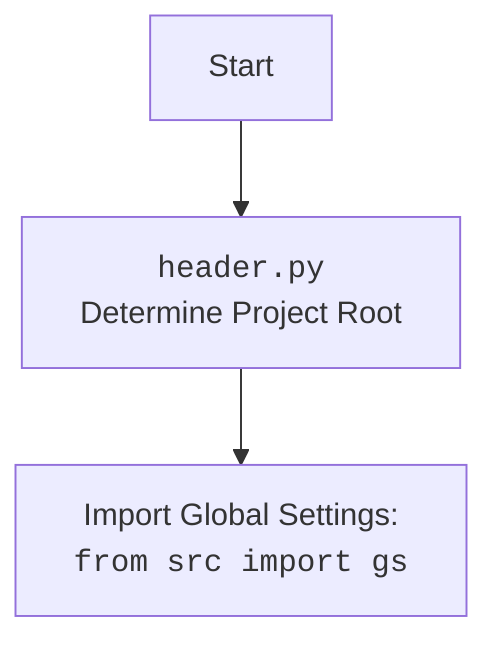

## Анализ кода `hypotez/src/scenario/header.py`

### 1. <алгоритм>

1.  **`set_project_root(marker_files=('__root__', '.git'))`**:
    *   Начинает поиск корневой директории проекта с директории, в которой расположен текущий файл (`__file__`).
    *   Переходит вверх по дереву директорий, проверяя каждую директорию на наличие файлов или директорий, указанных в `marker_files` (`'__root__'` или `'.git'`).
        *   *Пример:* Если `__file__` находится в `/path/to/project/src/scenario/header.py`, функция сначала проверит `/path/to/project/src/scenario/`, затем `/path/to/project/src/`, затем `/path/to/project/`.
    *   Если один из `marker_files` найден, директория, содержащая его, устанавливается как корневая директория проекта.
        *   *Пример:* Если файл `.git` найден в `/path/to/project/`, то `/path/to/project/` будет установлена как корневая директория.
    *   Если корневая директория не найдена, директория, в которой находится скрипт, считается корневой.
    *   Добавляет корневую директорию в `sys.path`, чтобы обеспечить возможность импорта модулей из проекта.
    *   Возвращает объект `Path`, представляющий корневую директорию проекта.

2.  **`__root__: Path = set_project_root()`**:
    *   Вызывает функцию `set_project_root()` для определения корневой директории проекта.
    *   Сохраняет возвращенный объект `Path` в глобальной переменной `__root__`.

3.  **`from src import gs`**:
    *   Импортирует модуль `gs` из пакета `src`. Предположительно, `gs` содержит глобальные настройки и пути проекта.

4.  **Чтение `settings.json`**:
    *   Пытается открыть и прочитать файл `settings.json`, расположенный в `gs.path.root / 'src' / 'settings.json'`.
    *   Использует `json.load()` для десериализации JSON-содержимого файла в словарь `settings`.
    *   Обрабатывает исключения `FileNotFoundError` и `json.JSONDecodeError`, если файл не найден или содержит невалидный JSON. В случае ошибки, переменная `settings` остается `None`.

5.  **Чтение `README.MD`**:
    *   Пытается открыть и прочитать файл `README.MD`, расположенный в `gs.path.root / 'src' / 'README.MD'`.
    *   Читает содержимое файла в строку `doc_str`.
    *   Обрабатывает исключения `FileNotFoundError` и `json.JSONDecodeError`, если файл не найден или содержит невалидный JSON. В случае ошибки, переменная `doc_str` остается `None`.

6.  **Определение глобальных переменных проекта**:
    *   Инициализирует глобальные переменные, такие как `__project_name__`, `__version__`, `__doc__`, `__details__`, `__author__`, `__copyright__`, и `__cofee__`, с использованием данных из словаря `settings`, если он был успешно загружен. Если `settings` равен `None`, используются значения по умолчанию.

### 2. <mermaid>



**Объяснение зависимостей:**

*   Функция `set_project_root` определяет корневую директорию проекта, начиная с текущей директории файла и двигаясь вверх по дереву директорий, пока не найдет один из "маркерных" файлов (например, `__root__` или `.git`).
*   Импорт `from src import gs` предполагает наличие модуля `gs` в пакете `src`, который, вероятно, содержит глобальные настройки проекта, включая пути к файлам конфигурации и другим ресурсам.
*   Блок `settings_json` пытается загрузить настройки из файла `settings.json`. В случае успеха, эти настройки используются для инициализации глобальных переменных проекта. В случае неудачи, используются значения по умолчанию.
*    Блок `README_MD` пытается загрузить `README.MD`. В случае успеха, `__doc__` глобальная переменная будет содержать описание.
*   Блоки `set_global_vars` и `set_default_global_vars` устанавливают значения глобальных переменных проекта, используя либо значения из файла `settings.json`, либо значения по умолчанию.



### 3. <объяснение>

**Импорты:**

*   `sys`: Используется для работы с системными переменными и функциями, такими как `sys.path` для добавления пути к проекту.
*   `json`: Используется для чтения данных из JSON-файла (`settings.json`).
*   `packaging.version.Version`: Используется для работы с версиями пакетов. В данном коде явно не используется, но, вероятно, предназначен для использования в дальнейшем для сравнения версий.
*   `pathlib.Path`: Используется для представления путей к файлам и директориям, облегчает работу с файловой системой.

**Функции:**

*   `set_project_root(marker_files=('__root__', '.git')) -> Path`:
    *   **Аргументы:**
        *   `marker_files (tuple, optional)`: Кортеж имен файлов или директорий, которые используются для определения корневой директории проекта. По умолчанию `('__root__', '.git')`.
    *   **Возвращаемое значение:**
        *   `Path`: Объект `Path`, представляющий корневую директорию проекта.
    *   **Назначение:**
        *   Функция определяет корневую директорию проекта путем поиска файлов или директорий-маркеров в родительских директориях текущего файла. Это позволяет запускать скрипт из любой поддиректории проекта без необходимости указывать абсолютные пути.
        *   После определения корневой директории, функция добавляет ее в `sys.path`, чтобы обеспечить возможность импорта модулей из проекта.
    *   **Пример:**

        ```python
        from pathlib import Path
        
        # Предположим, что скрипт находится в /path/to/project/src/scenario/header.py
        # и в /path/to/project/ находится файл .git
        
        root_path = set_project_root()
        print(root_path)  # Выведет: /path/to/project
        ```

**Переменные:**

*   `__root__: Path`: Глобальная переменная, хранящая объект `Path`, представляющий корневую директорию проекта. Инициализируется результатом вызова функции `set_project_root()`.
*   `settings: dict`: Глобальная переменная, хранящая словарь с настройками проекта, прочитанными из файла `settings.json`. Если файл не найден или содержит ошибку, переменная остается `None`.
*   `doc_str: str`: Глобальная переменная, хранящая строку с содержимым файла `README.MD`. Если файл не найден или содержит ошибку, переменная остается `None`.
*   `__project_name__: str`: Глобальная переменная, хранящая имя проекта. Если настройка `project_name` найдена в файле `settings.json`, используется ее значение, в противном случае используется значение по умолчанию `'hypotez'`.
*   `__version__: str`: Глобальная переменная, хранящая версию проекта. Если настройка `version` найдена в файле `settings.json`, используется ее значение, в противном случае используется значение по умолчанию `''`.
*   `__doc__: str`: Глобальная переменная, хранящая документацию проекта. Если `doc_str` успешно прочитана из файла `README.MD`, используется ее значение, в противном случае используется значение по умолчанию `''`.
*   `__details__: str`: Глобальная переменная, хранящая детали проекта. В данном коде всегда инициализируется пустой строкой `''`.
*   `__author__: str`: Глобальная переменная, хранящая имя автора проекта. Если настройка `author` найдена в файле `settings.json`, используется ее значение, в противном случае используется значение по умолчанию `''`.
*   `__copyright__: str`: Глобальная переменная, хранящая информацию об авторских правах проекта. Если настройка `copyrihgnt` найдена в файле `settings.json`, используется ее значение, в противном случае используется значение по умолчанию `''`.
*   `__cofee__: str`: Глобальная переменная, хранящая сообщение с предложением поддержать разработчика. Если настройка `cofee` найдена в файле `settings.json`, используется ее значение, в противном случае используется значение по умолчанию `"Treat the developer to a cup of coffee for boosting enthusiasm in development: https://boosty.to/hypo69"`.

**Потенциальные ошибки и области для улучшения:**

*   **Опечатка:** В коде есть опечатка в имени переменной `__copyright__`: `copyrihgnt` вместо `copyright`.
*   **Обработка ошибок:** В блоках `try...except` для чтения `settings.json` и `README.MD` используется `...` в блоке `except`. Желательно логировать ошибки с помощью `logger.error` для облегчения отладки.
*   **Использование `gs`:** Код предполагает, что модуль `gs` содержит атрибут `path.root`. Необходимо убедиться, что это действительно так, и что этот атрибут содержит корректный путь к корневой директории проекта.
*   **Аннотации типов:** Не все переменные аннотированы типами. Желательно добавить аннотации типов для всех переменных, чтобы улучшить читаемость и поддерживаемость кода.

**Взаимосвязи с другими частями проекта:**

*   Данный модуль (`header.py`) является важной частью проекта, так как он определяет корневую директорию проекта и загружает глобальные настройки. Эти настройки используются другими модулями проекта для определения путей к файлам, получения информации о проекте и т.д.
*   Модуль `gs` (global settings) является центральным местом для хранения глобальных настроек проекта. Другие модули могут импортировать `gs` для доступа к этим настройкам.

```python
# Improved code
import sys
import json
from packaging.version import Version
from pathlib import Path
import logging

logger = logging.getLogger(__name__)

def set_project_root(marker_files=('__root__', '.git')) -> Path:
    """
    Finds the root directory of the project starting from the current file's directory,
    searching upwards and stopping at the first directory containing any of the marker files.

    Args:
        marker_files (tuple): Filenames or directory names to identify the project root.
    
    Returns:
        Path: Path to the root directory if found, otherwise the directory where the script is located.
    """
    __root__: Path
    current_path: Path = Path(__file__).resolve().parent
    __root__ = current_path
    for parent in [current_path] + list(current_path.parents):
        if any((parent / marker).exists() for marker in marker_files):
            __root__ = parent
            break
    if __root__ not in sys.path:
        sys.path.insert(0, str(__root__))
    return __root__


# Get the root directory of the project
__root__: Path = set_project_root()
"""__root__ (Path): Path to the root directory of the project"""

from src import gs

settings: dict | None = None
try:
    with open(gs.path.root / 'src' /  'settings.json', 'r') as settings_file:
        settings = json.load(settings_file)
except (FileNotFoundError, json.JSONDecodeError) as e:
    logger.error(f"Error loading settings.json: {e}")
    settings = None


doc_str: str | None = None
try:
    with open(gs.path.root / 'src' /  'README.MD', 'r') as settings_file:
        doc_str = settings_file.read()
except (FileNotFoundError, json.JSONDecodeError) as e:
    logger.error(f"Error loading README.MD: {e}")
    doc_str = None

 

__project_name__: str = settings.get("project_name", 'hypotez') if settings  else 'hypotez'
__version__: str = settings.get("version", '')  if settings  else ''
__doc__: str = doc_str if doc_str else ''
__details__: str = ''
__author__: str = settings.get("author", '')  if settings  else ''
__copyright__: str = settings.get("copyright", '')  if settings  else '' # Fixed typo
__cofee__: str = settings.get("cofee", "Treat the developer to a cup of coffee for boosting enthusiasm in development: https://boosty.to/hypo69")  if settings  else "Treat the developer to a cup of coffee for boosting enthusiasm in development: https://boosty.to/hypo69"
```

**Изменения:**

*   Добавлена обработка исключений с использованием `logger.error` для более информативной отладки в блоках `try...except` при чтении файлов `settings.json` и `README.MD`.
*   Исправлена опечатка в имени переменной `__copyright__` (`copyrihgnt` заменено на `copyright`).
*   Добавлены `| None` к аннотациям типов переменных `settings` и `doc_str` для указания, что они могут быть `None`.