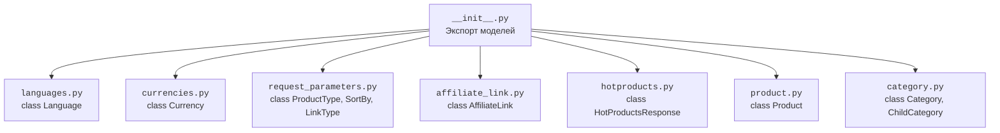

### **Анализ кода `hypotez/src/suppliers/aliexpress/api/models/__init__.py`**

#### **1. <алгоритм>**:
1. **Импорт модулей**: Импортируются классы из различных файлов в директории `models`.
2. **Экспорт классов**: Классы `Language`, `Currency`, `ProductType`, `SortBy`, `LinkType`, `AffiliateLink`, `HotProductsResponse`, `Product`, `Category`, `ChildCategory` становятся доступными для использования в других частях проекта через `src.suppliers.aliexpress.api.models`.
3. **Поток данных**:
   - `Language` и `Currency` используются для представления языков и валют, соответственно.
   - `ProductType`, `SortBy`, и `LinkType` используются для задания параметров запроса к API AliExpress.
   - `AffiliateLink` используется для представления партнерской ссылки.
   - `HotProductsResponse` используется для представления ответа на запрос популярных товаров.
   - `Product` используется для представления товара.
   - `Category` и `ChildCategory` используются для представления категорий товаров.

#### **2. <mermaid>**:

**Объяснение `mermaid`**:

- Файл `__init__.py` импортирует классы из различных файлов (`languages.py`, `currencies.py`, `request_parameters.py`, `affiliate_link.py`, `hotproducts.py`, `product.py`, `category.py`) и делает их доступными для использования через модуль `src.suppliers.aliexpress.api.models`.

#### **3. <объяснение>**:

- **Импорты**:
  - `Language` (из `languages.py`): Класс для представления языков.
  - `Currency` (из `currencies.py`): Класс для представления валют.
  - `ProductType`, `SortBy`, `LinkType` (из `request_parameters.py`): Enum-классы для определения параметров запроса к API AliExpress.
  - `AffiliateLink` (из `affiliate_link.py`): Класс для представления партнерской ссылки.
  - `HotProductsResponse` (из `hotproducts.py`): Класс для представления ответа на запрос популярных товаров.
  - `Product` (из `product.py`): Класс для представления товара.
  - `Category`, `ChildCategory` (из `category.py`): Классы для представления категорий товаров.

- **Классы**:
  - `Language`: Представляет язык. Может содержать атрибуты, такие как код языка и название.
  - `Currency`: Представляет валюту. Может содержать атрибуты, такие как код валюты и символ.
  - `ProductType`, `SortBy`, `LinkType`: Перечисления, определяющие возможные значения для параметров запроса.
  - `AffiliateLink`: Представляет партнерскую ссылку. Может содержать атрибуты, такие как URL и параметры.
  - `HotProductsResponse`: Представляет ответ на запрос популярных товаров. Может содержать атрибуты, такие как список товаров и метаданные.
  - `Product`: Представляет товар. Может содержать атрибуты, такие как название, цена, описание и изображения.
  - `Category`: Представляет категорию товаров. Может содержать атрибуты, такие как название и идентификатор.
  - `ChildCategory`: Представляет подкатегорию товаров.

- **Функции**:
  - В данном файле функции отсутствуют.

- **Переменные**:
  - В данном файле переменные отсутствуют.

**Потенциальные области для улучшения**:
- Добавить документацию к классам, чтобы было понятно, какие атрибуты они содержат и как их использовать.
- Рассмотрение возможности использования `Enum` для `Language` и `Currency`, если количество языков и валют ограничено.

**Взаимосвязи с другими частями проекта**:
- Этот файл предоставляет модели данных, используемые для взаимодействия с API AliExpress. Они используются в других частях проекта для запроса данных и обработки ответов.