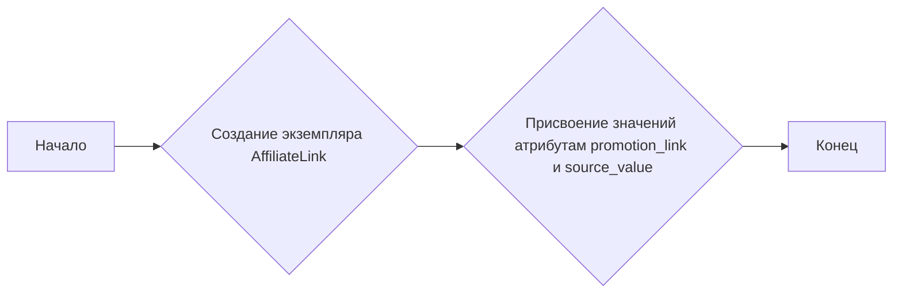

## Анализ кода `affiliate_link.py`

### 1. <алгоритм>

Этот код определяет структуру данных для представления партнерской ссылки AliExpress.  Алгоритм работы с этим классом заключается в создании экземпляра класса `AffiliateLink` с передачей ему значений для `promotion_link` и `source_value`.

### 2. <mermaid>

В данном коде нет импортов, поэтому диаграмма `mermaid` будет простой.

### 3. <объяснение>

**Расположение файла:** `hypotez/src/suppliers/aliexpress/api/models/affiliate_link.py` указывает на то, что этот файл определяет модель данных, используемую для работы с API AliExpress в контексте партнерских ссылок.

**Импорты:**
- Отсутствуют.

**Классы:**
- `AffiliateLink`:
  - Роль: Представляет структуру данных для партнерской ссылки.
  - Атрибуты:
    - `promotion_link` (str):  Строка, содержащая URL партнерской ссылки.
    - `source_value` (str): Строка, содержащая информацию об источнике ссылки.
  - Методы: Отсутствуют.

**Функции:**
- Отсутствуют.

**Переменные:**
- `promotion_link`:  Атрибут класса `AffiliateLink`, представляющий собой строку с URL партнерской ссылки.
- `source_value`: Атрибут класса `AffiliateLink`, представляющий собой строку с информацией об источнике ссылки.

**Потенциальные улучшения:**
- Можно добавить валидацию типов для атрибутов `promotion_link` и `source_value`.
- Можно добавить методы для работы с партнерскими ссылками, например, метод для проверки валидности ссылки.

**Взаимосвязи с другими частями проекта:**
- Этот класс, вероятно, используется в других модулях проекта `hypotez`, связанных с AliExpress API, для представления и обработки данных партнерских ссылок. Например, он может быть использован в модулях, отвечающих за получение данных о товарах или генерацию партнерских ссылок.