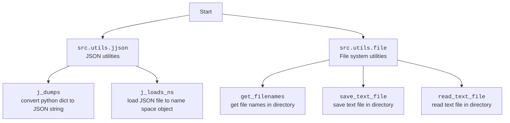

### **Алгоритм**

1.  **`test_initialize_campaign`**:
    *   Определяются моковые данные кампании (`mock_json_data`), включающие название, заголовок, язык, валюту и категорию.
        ```python
        mock_json_data = {
            "name": campaign_name,
            "title": "Test Campaign",
            "language": language,
            "currency": currency,
            "category": {
                category_name: {
                    "name": category_name,
                    "tags": "tag1, tag2",
                    "products": [],
                    "products_count": 0
                }
            }
        }
        ```
    *   Выполняется патч функции `src.utils.jjson.j_loads_ns` для возврата моковых данных.
        ```python
        mocker.patch("src.utils.jjson.j_loads_ns", return_value=SimpleNamespace(**mock_json_data))
        ```
    *   Инициализируется кампания (`campaign.initialize_campaign()`).
    *   Проверяется, что атрибуты кампании были корректно инициализированы на основе моковых данных.
        ```python
        assert campaign.campaign.name == campaign_name
        assert campaign.campaign.category.test_category.name == category_name
        ```

2.  **`test_get_category_products_no_json_files`**:
    *   Выполняется патч функций `src.utils.file.get_filenames` и `src.suppliers.aliexpress.campaign.ali_promo_campaign.AliPromoCampaign.fetch_product_data` для возврата пустых списков.
        ```python
        mocker.patch("src.utils.file.get_filenames", return_value=[])
        mocker.patch("src.suppliers.aliexpress.campaign.ali_promo_campaign.AliPromoCampaign.fetch_product_data", return_value=[])
        ```
    *   Получаются продукты категории (`campaign.get_category_products(force=True)`).
    *   Проверяется, что возвращенный список продуктов пуст.
        ```python
        assert products == []
        ```

3.  **`test_get_category_products_with_json_files`**:
    *   Определяются моковые данные продукта (`mock_product_data`).
        ```python
        mock_product_data = SimpleNamespace(product_id="123", product_title="Test Product")
        ```
    *   Выполняется патч функций `src.utils.file.get_filenames` и `src.utils.jjson.j_loads_ns` для возврата моковых данных.
        ```python
        mocker.patch("src.utils.file.get_filenames", return_value=["product_123.json"])
        mocker.patch("src.utils.jjson.j_loads_ns", return_value=mock_product_data)
        ```
    *   Получаются продукты категории (`campaign.get_category_products()`).
    *   Проверяется, что возвращенный список содержит один продукт с корректными данными.
        ```python
        assert len(products) == 1
        assert products[0].product_id == "123"
        assert products[0].product_title == "Test Product"
        ```

4.  **`test_create_product_namespace`**:
    *   Определяются данные продукта (`product_data`).
        ```python
        product_data = {
            "product_id": "123",
            "product_title": "Test Product"
        }
        ```
    *   Создается пространство имен продукта (`campaign.create_product_namespace(**product_data)`).
    *   Проверяется, что атрибуты продукта были корректно установлены.
        ```python
        assert product.product_id == "123"
        assert product.product_title == "Test Product"
        ```

5.  **`test_create_category_namespace`**:
    *   Определяются данные категории (`category_data`).
        ```python
        category_data = {
            "name": category_name,
            "tags": "tag1, tag2",
            "products": [],
            "products_count": 0
        }
        ```
    *   Создается пространство имен категории (`campaign.create_category_namespace(**category_data)`).
    *   Проверяется, что атрибуты категории были корректно установлены.
        ```python
        assert category.name == category_name
        assert category.tags == "tag1, tag2"
        ```

6.  **`test_create_campaign_namespace`**:
    *   Определяются данные кампании (`campaign_data`).
        ```python
        campaign_data = {
            "name": campaign_name,
            "title": "Test Campaign",
            "language": language,
            "currency": currency,
            "category": SimpleNamespace()
        }
        ```
    *   Создается пространство имен кампании (`campaign.create_campaign_namespace(**campaign_data)`).
    *   Проверяется, что атрибуты кампании были корректно установлены.
        ```python
        assert camp.name == campaign_name
        assert camp.title == "Test Campaign"
        ```

7.  **`test_prepare_products`**:
    *   Выполняется патч функций `src.suppliers.aliexpress.campaign.ali_promo_campaign.AliPromoCampaign.get_prepared_products`, `src.utils.file.read_text_file` и `src.utils.file.get_filenames`.
        ```python
        mocker.patch("src.suppliers.aliexpress.campaign.ali_promo_campaign.AliPromoCampaign.get_prepared_products", return_value=[])
        mocker.patch("src.utils.file.read_text_file", return_value="source_data")
        mocker.patch("src.utils.file.get_filenames", return_value=["source.html"])
        mocker.patch("src.suppliers.aliexpress.campaign.ali_promo_campaign.AliPromoCampaign.process_affiliate_products")
        ```
    *   Вызывается метод подготовки продуктов (`campaign.prepare_products()`).
    *   Проверяется, что метод `process_affiliate_products` был вызван один раз.
        ```python
        campaign.process_affiliate_products.assert_called_once()
        ```

8.  **`test_fetch_product_data`**:
    *   Определяются идентификаторы продуктов (`product_ids`).
        ```python
        product_ids = ["123", "456"]
        ```
    *   Определяются моковые продукты (`mock_products`).
        ```python
        mock_products = [SimpleNamespace(product_id="123"), SimpleNamespace(product_id="456")]
        ```
    *   Выполняется патч функции `src.suppliers.aliexpress.campaign.ali_promo_campaign.AliPromoCampaign.process_affiliate_products`.
        ```python
        mocker.patch("src.suppliers.aliexpress.campaign.ali_promo_campaign.AliPromoCampaign.process_affiliate_products", return_value=mock_products)
        ```
    *   Получаются данные продуктов (`campaign.fetch_product_data(product_ids)`).
    *   Проверяется, что возвращенный список содержит два продукта с корректными идентификаторами.
        ```python
        assert len(products) == 2
        assert products[0].product_id == "123"
        assert products[1].product_id == "456"
        ```

9.  **`test_save_product`**:
    *   Определяется моковый продукт (`product`).
        ```python
        product = SimpleNamespace(product_id="123", product_title="Test Product")
        ```
    *   Выполняется патч функций `src.utils.jjson.j_dumps` и `pathlib.Path.write_text`.
        ```python
        mocker.patch("src.utils.jjson.j_dumps", return_value="{}")
        mocker.patch("pathlib.Path.write_text")
        ```
    *   Сохраняется продукт (`campaign.save_product(product)`).
    *   Проверяется, что метод `Path.write_text` был вызван один раз с корректными аргументами.
        ```python
        Path.write_text.assert_called_once_with("{}", encoding='utf-8')
        ```

10. **`test_list_campaign_products`**:
    *   Определяются моковые продукты (`product1`, `product2`).
        ```python
        product1 = SimpleNamespace(product_title="Product 1")
        product2 = SimpleNamespace(product_title="Product 2")
        ```
    *   Продукты добавляются в категорию кампании (`campaign.category.products = [product1, product2]`).
    *   Получается список заголовков продуктов (`campaign.list_campaign_products()`).
    *   Проверяется, что возвращенный список содержит корректные заголовки.
        ```python
        assert product_titles == ["Product 1", "Product 2"]
        ```

### **Mermaid**

```mermaid
flowchart TD
    subgraph AliPromoCampaignTest
        A[test_initialize_campaign] --> B{initialize_campaign()};
        B --> C{assert campaign.campaign.name == campaign_name};
        B --> D{assert campaign.campaign.category.test_category.name == category_name};

        E[test_get_category_products_no_json_files] --> F{get_category_products(force=True)};
        F --> G{assert products == []};

        H[test_get_category_products_with_json_files] --> I{get_category_products()};
        I --> J{assert len(products) == 1};
        I --> K{assert products[0].product_id == "123"};
        I --> L{assert products[0].product_title == "Test Product"};

        M[test_create_product_namespace] --> N{create_product_namespace(**product_data)};
        N --> O{assert product.product_id == "123"};
        N --> P{assert product.product_title == "Test Product"};

        Q[test_create_category_namespace] --> R{create_category_namespace(**category_data)};
        R --> S{assert category.name == category_name};
        R --> T{assert category.tags == "tag1, tag2"};

        U[test_create_campaign_namespace] --> V{create_campaign_namespace(**campaign_data)};
        V --> W{assert camp.name == campaign_name};
        V --> X{assert camp.title == "Test Campaign"};

        Y[test_prepare_products] --> Z{prepare_products()};
        Z --> AA{assert process_affiliate_products.assert_called_once()};

        BB[test_fetch_product_data] --> CC{fetch_product_data(product_ids)};
        CC --> DD{assert len(products) == 2};
        CC --> EE{assert products[0].product_id == "123"};
        CC --> FF{assert products[1].product_id == "456"};

        GG[test_save_product] --> HH{save_product(product)};
        HH --> II{assert Path.write_text.assert_called_once_with("{}", encoding='utf-8')};

        JJ[test_list_campaign_products] --> KK{list_campaign_products()};
        KK --> LL{assert product_titles == ["Product 1", "Product 2"]};
    end
```

**Объяснение `mermaid`:**

*   Диаграмма представляет собой блок-схему, отображающую тестовые функции и их основные шаги.
*   Каждая тестовая функция представлена прямоугольником.
*   Функции, вызываемые внутри тестовых функций, и утверждения (`assert`) представлены в фигурах с закругленными углами.
*   Стрелки показывают поток выполнения от одной функции к другой или к утверждению.

**Импорты и зависимости `mermaid`:**

Диаграмма не использует импорты напрямую, но отражает логику работы с классами и функциями, которые импортируются в файле `test_alipromo_campaign.py`.



### **Объяснение**

**Импорты:**

*   `pytest`: Фреймворк для написания и запуска тестов.
*   `pathlib.Path`: Класс для представления путей к файлам и каталогам.
*   `types.SimpleNamespace`: Класс для создания простых объектов, атрибуты которых можно добавлять и изменять.
*   `src.suppliers.aliexpress.campaign.ali_promo_campaign.AliPromoCampaign`: Класс, представляющий кампанию AliPromo.
*   `src.utils.jjson.j_dumps`, `src.utils.jjson.j_loads_ns`: Функции для работы с JSON. `j_dumps` используется для преобразования Python объектов в JSON-строки, а `j_loads_ns` - для загрузки JSON-файлов в объекты namespace.
*   `src.utils.file.save_text_file`: Функция для сохранения текста в файл.
*   `src.utils.file.read_text_file`: Функция для чтения текста из файла.
*   `src import gs`: Импорт глобальных настроек проекта.

**Переменные:**

*   `campaign_name`: Название тестовой кампании.
*   `category_name`: Название тестовой категории.
*   `language`: Язык кампании.
*   `currency`: Валюта кампании.

**Фикстуры:**

*   `campaign()`: Фикстура `pytest`, которая создает экземпляр класса `AliPromoCampaign` с тестовыми параметрами. Эта фикстура используется во многих тестах для предоставления готового объекта кампании.

**Тесты:**

*   `test_initialize_campaign(mocker, campaign)`: Тестирует метод `initialize_campaign` класса `AliPromoCampaign`. Мокирует функцию `j_loads_ns`, чтобы вернуть тестовые данные, и проверяет, что атрибуты кампании инициализированы правильно.
*   `test_get_category_products_no_json_files(mocker, campaign)`: Тестирует метод `get_category_products`, когда нет JSON-файлов. Мокирует функции `get_filenames` и `fetch_product_data`, чтобы вернуть пустые списки, и проверяет, что результат также пуст.
*   `test_get_category_products_with_json_files(mocker, campaign)`: Тестирует метод `get_category_products`, когда есть JSON-файлы. Мокирует функции `get_filenames` и `j_loads_ns`, чтобы вернуть тестовые данные, и проверяет, что результат содержит ожидаемые данные.
*   `test_create_product_namespace(campaign)`: Тестирует метод `create_product_namespace`. Создает пространство имен продукта с тестовыми данными и проверяет, что атрибуты установлены правильно.
*   `test_create_category_namespace(campaign)`: Тестирует метод `create_category_namespace`. Создает пространство имен категории с тестовыми данными и проверяет, что атрибуты установлены правильно.
*   `test_create_campaign_namespace(campaign)`: Тестирует метод `create_campaign_namespace`. Создает пространство имен кампании с тестовыми данными и проверяет, что атрибуты установлены правильно.
*   `test_prepare_products(mocker, campaign)`: Тестирует метод `prepare_products`. Мокирует несколько функций и проверяет, что метод `process_affiliate_products` вызывается один раз.
*   `test_fetch_product_data(mocker, campaign)`: Тестирует метод `fetch_product_data`. Мокирует функцию `process_affiliate_products`, чтобы вернуть тестовые данные, и проверяет, что результат содержит ожидаемые данные.
*   `test_save_product(mocker, campaign)`: Тестирует метод `save_product`. Мокирует функции `j_dumps` и `Path.write_text` и проверяет, что `Path.write_text` вызывается с ожидаемыми аргументами.
*   `test_list_campaign_products(campaign)`: Тестирует метод `list_campaign_products`. Добавляет тестовые продукты в категорию кампании и проверяет, что результат содержит ожидаемые заголовки продуктов.

**Возможные улучшения:**

*   Добавить больше проверок в тесты, чтобы убедиться, что все возможные сценарии обрабатываются правильно.
*   Использовать более конкретные моки, чтобы тесты были более надежными и менее подвержены изменениям в коде.

**Взаимосвязи с другими частями проекта:**

*   Тесты используют класс `AliPromoCampaign` из модуля `src.suppliers.aliexpress.campaign.ali_promo_campaign`, который, вероятно, содержит основную логику для работы с кампаниями AliPromo.
*   Тесты используют функции `j_dumps`, `j_loads_ns`, `save_text_file` и `read_text_file` из модулей `src.utils.jjson` и `src.utils.file`, которые предоставляют утилиты для работы с JSON и файловой системой.
*   Тесты используют `pytest` для организации и запуска тестов, `pathlib.Path` для работы с путями к файлам, и `types.SimpleNamespace` для создания простых объектов с атрибутами.