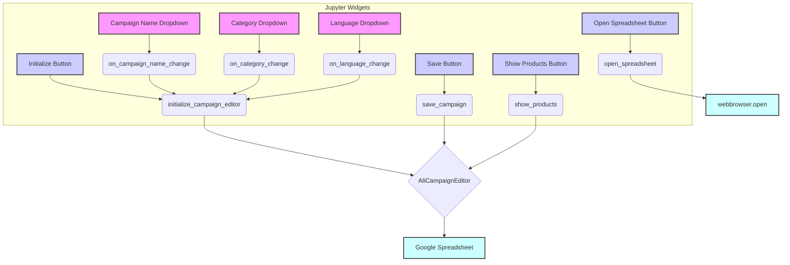
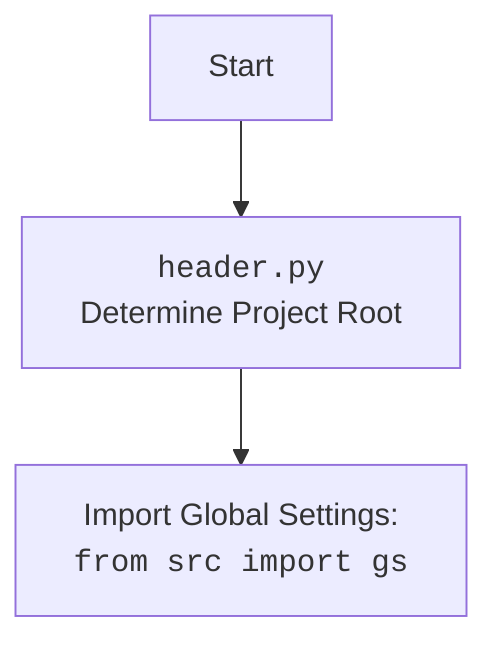

### **Алгоритм**

1.  **Инициализация виджетов**:
    *   При создании экземпляра класса `JupyterCampaignEditorWidgets` происходит инициализация виджетов Jupyter, таких как выпадающие списки для выбора имени кампании, категории и языка, а также кнопки для инициализации редактора кампании, сохранения кампании, отображения продуктов и открытия таблицы Google.
    *   Настраиваются колбэки для обработки изменений в выпадающих списках и нажатиях кнопок.
    *   Происходит инициализация редактора кампании с использованием значений по умолчанию.

    ```python
    self.campaign_name_dropdown = widgets.Dropdown(
        options = get_directory_names(self.campaigns_directory),
        description = "Campaign Name:",
    )
    ```

2.  **Обработка изменений**:
    *   При изменении выбранного имени кампании в выпадающем списке `campaign_name_dropdown`, вызывается метод `on_campaign_name_change`, который обновляет выпадающий список категорий и инициализирует редактор кампании с новым именем кампании.

    ```python
    self.campaign_name_dropdown.observe(self.on_campaign_name_change, names="value")
    ```

3.  **Инициализация редактора кампании**:
    *   При вызове метода `initialize_campaign_editor` происходит получение выбранных значений из выпадающих списков имени кампании, категории и языка.
    *   Создается экземпляр класса `AliCampaignEditor` с выбранными параметрами.
    *   Если выбрана категория, то получаются продукты для данной категории.

    ```python
    self.language, self.currency = self.language_dropdown.value.split()
    if self.campaign_name:
        self.update_category_dropdown(self.campaign_name)
        self.campaign_editor = AliCampaignEditor(campaign_name = self.campaign_name, language = self.language, currency = self.currency)
    ```

4.  **Сохранение кампании**:
    *   При нажатии на кнопку "Save Campaign" вызывается метод `save_campaign`, который сохраняет кампанию и ее категории с использованием `AliCampaignEditor`.

    ```python
    self.save_button.on_click(self.save_campaign)
    ```

5.  **Отображение продуктов**:
    *   При нажатии на кнопку "Show Products" вызывается метод `show_products`, который отображает продукты в выбранной категории с использованием `AliCampaignEditor`.

    ```python
    self.show_products_button.on_click(self.show_products)
    ```

6.  **Открытие таблицы Google**:
    *   При нажатии на кнопку "Open Google Spreadsheet" вызывается метод `open_spreadsheet`, который открывает Google Spreadsheet в браузере, используя URL, полученный из `AliCampaignEditor`.

    ```python
    self.open_spreadsheet_button.on_click(self.open_spreadsheet)
    ```

7.  **Отображение виджетов**:
    *   Метод `display_widgets` отображает все виджеты в Jupyter notebook для взаимодействия с пользователем.

    ```python
    display(
        self.campaign_name_dropdown,
        self.category_name_dropdown,
        self.language_dropdown,
        self.initialize_button,
        self.save_button,
        self.show_products_button,
        self.open_spreadsheet_button,
    )
    ```

### **Mermaid**



**Описание зависимостей:**

*   **ipywidgets**: Используется для создания интерактивных виджетов, таких как выпадающие списки и кнопки.
*   **IPython.display**: Используется для отображения виджетов в Jupyter notebook.
*   **webbrowser**: Используется для открытия URL в браузере.
*   **src**: Содержит модули `gs`, `AliCampaignEditor`, `locales`, `pprint`, `get_directory_names`, `logger`.



### **Объяснение**

**Импорты:**

*   `types.SimpleNamespace`: Используется для создания простых объектов, к которым можно обращаться по атрибутам.
*   `header`: Предположительно, содержит информацию о заголовках проекта или общие настройки.
*   `pathlib.Path`: Используется для работы с путями к файлам и директориям.
*   `ipywidgets.widgets`: Используется для создания интерактивных виджетов, таких как выпадающие списки и кнопки.
*   `IPython.display.display`: Используется для отображения виджетов в Jupyter notebook.
*   `webbrowser`: Используется для открытия URL в браузере.
*   `src.gs`: Содержит глобальные настройки проекта, такие как пути к директориям.
*   `src.suppliers.aliexpress.campaign.AliCampaignEditor`: Класс для редактирования кампаний AliExpress.
*   `src.suppliers.aliexpress.utils.locales`: Содержит информацию о локалях (языках и валютах).
*   `src.utils.printer.pprint`, `src.utils.printer.get_directory_names`: Функции для красивого вывода и получения имен директорий.
*   `src.logger.logger.logger`: Модуль для логирования событий.

**Классы:**

*   `JupyterCampaignEditorWidgets`: Класс, предоставляющий виджеты для взаимодействия с редактором кампаний AliExpress в Jupyter notebook.
    *   Атрибуты:
        *   `language` (str): Выбранный язык.
        *   `currency` (str): Выбранная валюта.
        *   `campaign_name` (str): Выбранное имя кампании.
        *   `category_name` (str): Выбранное имя категории.
        *   `category` (SimpleNamespace): Объект, представляющий категорию.
        *   `campaign_editor` (AliCampaignEditor): Экземпляр редактора кампании.
        *   `products` (list[SimpleNamespace]): Список продуктов.
        *   `campaigns_directory` (str): Путь к директории с кампаниями.
        *   `campaign_name_dropdown` (widgets.Dropdown): Выпадающий список для выбора имени кампании.
        *   `category_name_dropdown` (widgets.Dropdown): Выпадающий список для выбора категории.
        *   `language_dropdown` (widgets.Dropdown): Выпадающий список для выбора языка и валюты.
        *   `initialize_button` (widgets.Button): Кнопка для инициализации редактора кампании.
        *   `save_button` (widgets.Button): Кнопка для сохранения кампании.
        *   `show_products_button` (widgets.Button): Кнопка для отображения продуктов.
    *   Методы:
        *   `__init__`: Инициализирует виджеты и настраивает редактор кампании.
        *   `initialize_campaign_editor`: Инициализирует редактор кампании на основе выбранных значений.
        *   `update_category_dropdown`: Обновляет выпадающий список категорий на основе выбранной кампании.
        *   `on_campaign_name_change`: Обрабатывает изменения в выпадающем списке имени кампании.
        *   `on_category_change`: Обрабатывает изменения в выпадающем списке категории.
        *   `on_language_change`: Обрабатывает изменения в выпадающем списке языка и валюты.
        *   `save_campaign`: Сохраняет кампанию и ее категории.
        *   `show_products`: Отображает продукты в выбранной категории.
        *   `open_spreadsheet`: Открывает Google Spreadsheet в браузере.
        *   `setup_callbacks`: Настраивает колбэки для виджетов.
        *   `display_widgets`: Отображает виджеты в Jupyter notebook.

**Функции:**

*   `get_directory_names(path: Path) -> list[str]`: Возвращает список имен директорий по указанному пути.

**Переменные:**

*   `language` (str): Выбранный язык.
*   `currency` (str): Выбранная валюта.
*   `campaign_name` (str): Выбранное имя кампании.
*   `category_name` (str): Выбранное имя категории.
*   `category` (SimpleNamespace): Объект, представляющий категорию.
*   `campaign_editor` (AliCampaignEditor): Экземпляр редактора кампании.
*   `products` (list[SimpleNamespace]): Список продуктов.
*   `campaigns_directory` (str): Путь к директории с кампаниями.
*   `campaign_name_dropdown` (widgets.Dropdown): Выпадающий список для выбора имени кампании.
*   `category_name_dropdown` (widgets.Dropdown): Выпадающий список для выбора категории.
*   `language_dropdown` (widgets.Dropdown): Выпадающий список для выбора языка и валюты.
*   `initialize_button` (widgets.Button): Кнопка для инициализации редактора кампании.
*   `save_button` (widgets.Button): Кнопка для сохранения кампании.
*   `show_products_button` (widgets.Button): Кнопка для отображения продуктов.

**Потенциальные ошибки и области для улучшения:**

*   Обработка ошибок при инициализации `AliCampaignEditor` и выполнении других операций, связанных с API AliExpress.
*   Добавление валидации введенных данных и обработки пустых значений.
*   Улучшение логирования для более детального отслеживания работы виджетов и редактора кампании.
*   Добавление возможности выбора нескольких категорий для отображения продуктов.

**Взаимосвязи с другими частями проекта:**

*   Этот модуль использует `AliCampaignEditor` из `src.suppliers.aliexpress.campaign` для взаимодействия с API AliExpress и управления кампаниями.
*   Он также использует `locales` из `src.suppliers.aliexpress.utils` для получения информации о локалях (языках и валютах).
*   Для логирования используется модуль `logger` из `src.logger.logger`.
*   Глобальные настройки проекта, такие как пути к директориям, хранятся в `src.gs`.