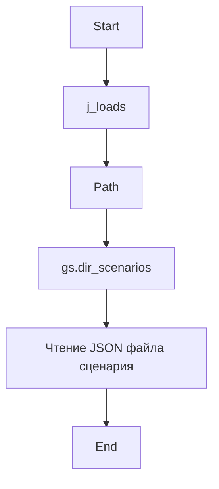
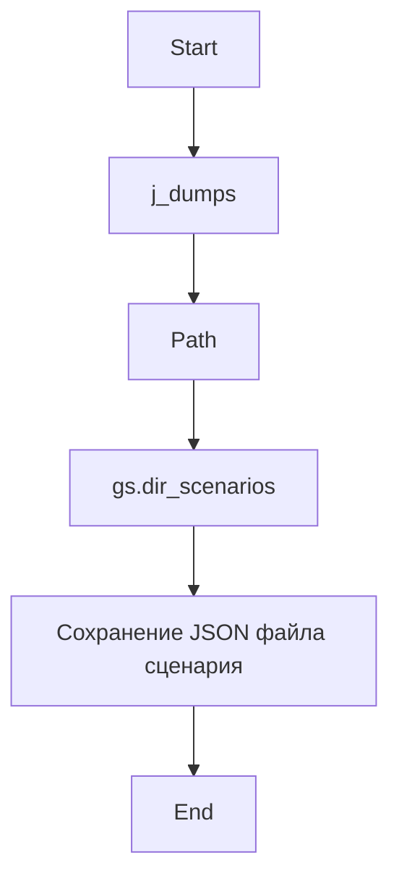
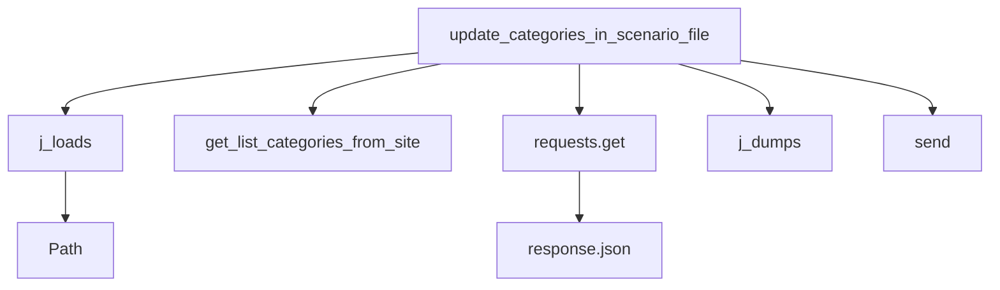

## Проект `hypotez`
# Роль `code explainer`

### **1. <алгоритм>**:

**get_list_products_in_category**
   1. Функция `get_list_products_in_category` принимает экземпляр поставщика `s`.
   2. Вызывает функцию `get_prod_urls_from_pagination` с этим экземпляром поставщика `s`.
   3. Возвращает результат, полученный от `get_prod_urls_from_pagination`.

**get_prod_urls_from_pagination**
   1. Функция `get_prod_urls_from_pagination` принимает экземпляр поставщика `s`.
   2. Извлекает веб-драйвер `_d` из поставщика `s`.
   3. Извлекает локаторы для ссылок на товары `_l` из конфигурации поставщика.
   4. Использует веб-драйвер `_d` для выполнения локатора `_l` и получает список ссылок на товары `list_products_in_category`.
   5. Если список `list_products_in_category` пуст, возвращает пустой список.
   6. В цикле пытается найти и нажать кнопку пагинации "вперед".
   7. Если кнопка пагинации не найдена, выходит из цикла.
   8. Расширяет список `list_products_in_category` новыми ссылками, полученными с текущей страницы.
   9. Возвращает список `list_products_in_category`.

**update_categories_in_scenario_file**
   1. Функция `update_categories_in_scenario_file` принимает экземпляр поставщика `s` и имя файла сценария `scenario_filename`.
   2. Загружает JSON из файла сценария.
   3. Получает список категорий с сайта, вызывая функцию `get_list_categories_from_site`.
   4. Обновляет список идентификаторов категорий `all_ids_in_file` из файла сценария.
   5. Получает JSON категорий из магазина с сайта Aliexpress.
   6. Извлекает список групп категорий `groups` из полученного JSON.
   7. Формирует списки `all_ids_on_site` и `all_categories_on_site` из идентификаторов и данных категорий, полученных с сайта.
   8. Определяет `removed_categories` как категории, присутствующие в файле сценария, но отсутствующие на сайте.
   9. Определяет `added_categories` как категории, присутствующие на сайте, но отсутствующие в файле сценария.
  10. Если есть добавленные категории, добавляет их в файл сценария.
  11. Если есть удаленные категории, отключает их в файле сценария.
  12. Отправляет уведомления о добавленных и удаленных категориях.
  13. Возвращает `True`.

```mermaid
flowchart TD
    A[Начало: get_list_products_in_category(s)] --> B{Вызов: get_prod_urls_from_pagination(s)}
    B --> C[Извлечение ссылок на товары]
    C --> D{Ссылки найдены?}
    D -- Нет --> E[Возврат: пустой список]
    D -- Да --> F{Цикл: перелистывание страниц}
    F -- Нет страниц --> G[Возврат: список ссылок]
    F -- Есть страницы --> H[Добавление новых ссылок в список]
    H --> F

```

```mermaid
flowchart TD
    A[Начало: update_categories_in_scenario_file(s, scenario_filename)] --> B{Загрузка JSON из файла сценария}
    B --> C{Получение списка категорий с сайта: get_list_categories_from_site()}
    C --> D{Обновление списка идентификаторов категорий из файла сценария}
    D --> E{Получение JSON категорий из магазина Aliexpress}
    E --> F{Извлечение списка групп категорий}
    F --> G{Формирование списков идентификаторов и данных категорий с сайта}
    G --> H{Определение удаленных категорий}
    H --> I{Определение добавленных категорий}
    I --> J{Есть добавленные категории?}
    J -- Да --> K{Добавление новых категорий в файл сценария}
    K --> L{Отправка уведомления о добавлении категорий}
    J -- Нет --> M{Есть удаленные категории?}
    M -- Да --> N{Отключение удаленных категорий в файле сценария}
    N --> O{Отправка уведомления об отключении категорий}
    M -- Нет --> P[Конец: Возврат True]
    L --> P
    O --> P

```





### **2. <mermaid>**:

```mermaid
flowchart TD
    A[get_list_products_in_category] --> B[get_prod_urls_from_pagination]
    B --> C{s.driver}
    C --> D{s.locators['category']['product_links']}
    D --> E[execute_locator(_l)]
    E --> F{s.locators['category']['pagination']['->']}
    F --> G[execute_locator (s.locators)]
```

**Объяснение зависимостей:**

- `get_list_products_in_category` вызывает `get_prod_urls_from_pagination` для получения URL товаров.
- `get_prod_urls_from_pagination` использует `s.driver` для взаимодействия с веб-страницей.
- `s.locators['category']['product_links']` предоставляет локаторы для извлечения ссылок на товары.
- `execute_locator(_l)` выполняет локатор для поиска элементов на странице.
- `s.locators['category']['pagination']['->']` предоставляет локаторы для навигации по страницам.



**Объяснение зависимостей:**

- `update_categories_in_scenario_file` использует `j_loads` для загрузки JSON из файла сценария.
- `update_categories_in_scenario_file` вызывает `get_list_categories_from_site` для получения списка категорий с сайта.
- `update_categories_in_scenario_file` использует `requests.get` для получения JSON категорий из магазина Aliexpress.
- `update_categories_in_scenario_file` использует `j_dumps` для сохранения JSON в файл сценария.
- `update_categories_in_scenario_file` использует `send` для отправки уведомлений.
- `j_loads` использует `Path` для работы с путями к файлам.
- `requests.get` использует `response.json` для обработки JSON-ответа.

### **3. <объяснение>**:

**Импорты:**

- `typing.Union`: Используется для указания, что переменная или функция может принимать значения разных типов.
- `pathlib.Path`: Используется для работы с путями к файлам и директориям.
- `src.gs`: Импортирует глобальные настройки проекта.
- `src.utils.jjson.j_dumps`: Используется для сериализации данных в JSON-формат.
- `src.utils.jjson.j_loads`: Используется для десериализации данных из JSON-формата.
- `src.logger.logger.logger`: Используется для логирования событий и ошибок.
- `src.db.manager_categories.suppliers_categories.CategoryManager`: Класс для управления категориями.
- `src.db.manager_categories.suppliers_categories.AliexpressCategory`: Модель категории Aliexpress.

**Переменные:**

- `credentials`: Содержит учетные данные для доступа к базе данных переводов.
- `manager`: Экземпляр класса `CategoryManager`, используемый для управления категориями.

**Функции:**

- `get_list_products_in_category(s)`:
  - Аргументы:
    - `s`: Экземпляр поставщика (`Supplier`).
  - Возвращает: `list[str, str]` - список URL товаров со страницы категории.
  - Назначение: Считывает URL товаров со страницы категории, перелистывая страницы, если их несколько.

- `get_prod_urls_from_pagination(s)`:
  - Аргументы:
    - `s`: Экземпляр поставщика (`Supplier`).
  - Возвращает: `list[str]` - Список ссылок, собранных со страницы категории.
  - Назначение: Собирает ссылки на товары со страницы категории с перелистыванием страниц.

- `update_categories_in_scenario_file(s, scenario_filename: str) -> bool`:
  - Аргументы:
    - `s`: Экземпляр поставщика.
    - `scenario_filename`: Имя файла сценария.
  - Возвращает: `bool` - `True`, если обновление выполнено успешно.
  - Назначение: Проверяет изменения категорий на сайте и обновляет файл сценария. Сравнивает JSON, полученный с сайта, с файлом сценария и добавляет/удаляет категории.

- `get_list_categories_from_site(s,scenario_file,brand='')`:
    - TODO: Нет документации и реализация обрезана (`...`)
    - Аргументы:
        - `s`: экземпляр поставщика
        - `scenario_file`: имя файла сценария
        - `brand`: бренд
    - Назначение: получение списка категорий с сайта

**Классы:**

- `DBAdaptor`:
  - Назначение: Адаптер для работы с базой данных категорий Aliexpress.
  - Методы:
    - `select(cat_id:int = None, parent_id:int = None, project_cat_id:int = None)`: Выбирает записи из таблицы `AliexpressCategory`.
    - `insert()`: Вставляет новую запись в таблицу `AliexpressCategory`.
    - `update()`: Обновляет запись в таблице `AliexpressCategory`.
    - `delete()`: Удаляет запись из таблицы `AliexpressCategory`.

**Потенциальные ошибки и области для улучшения:**

- В функции `get_prod_urls_from_pagination` есть комментарий `@todo Опасная ситуация здесь/ Могу уйти в бесконечный цикл`. Необходимо добавить механизм предотвращения бесконечного цикла.
- В функции `update_categories_in_scenario_file` есть много вложенных циклов и условий, что может ухудшить читаемость и производительность. Следует рассмотреть возможность рефакторинга.
- Функция `get_list_categories_from_site` имеет урезанную реализацию (`...`) и требует завершения.
- В коде используются устаревшие стили форматирования строк (например, `f\'\'\'{scenario_filename}\'\'\'`). Рекомендуется использовать более современный синтаксис f-строк.
- Отсутствует обработка исключений при работе с сетью (например, в функции `update_categories_in_scenario_file` при выполнении `requests.get`).

**Взаимосвязи с другими частями проекта:**

- Модуль использует глобальные настройки из `src.gs` для получения путей к файлам и учетных данных.
- Модуль использует `src.utils.jjson` для работы с JSON-файлами.
- Модуль использует `src.logger.logger` для логирования событий и ошибок.
- Модуль использует `src.db.manager_categories.suppliers_categories` для взаимодействия с базой данных категорий.