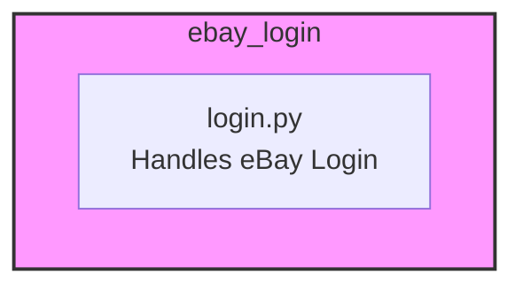

### **Анализ кода `hypotez/src/suppliers/ebay/login.py`**

#### **1. <алгоритм>**:

Файл `login.py` расположен в каталоге `src/suppliers/ebay/`. Предполагается, что этот модуль отвечает за процесс авторизации на платформе eBay. Однако предоставленный код содержит только метаданные и docstring, но не имеет исполняемого кода. Следовательно, трудно описать конкретный алгоритм.

Предполагая, что этот файл должен содержать логику для входа на eBay, можно представить следующий алгоритм:

1.  **Инициализация веб-драйвера**: Создание экземпляра веб-драйвера (например, Chrome, Firefox) для автоматизации действий браузера.
2.  **Переход на страницу входа eBay**: Использование веб-драйвера для перехода на страницу входа eBay.
3.  **Ввод учетных данных**: Заполнение полей имени пользователя/электронной почты и пароля с помощью веб-драйвера.
4.  **Отправка формы входа**: Нажатие кнопки входа с использованием веб-драйвера.
5.  **Проверка успешной авторизации**: Проверка, успешно ли выполнен вход, путем поиска определенных элементов на странице после входа (например, имени пользователя, панели управления учетной записью).
6.  **Обработка ошибок**: Если вход не удался, регистрируется сообщение об ошибке.

Пример (гипотетический):

```python
def login_to_ebay(driver, username, password):
    """
    Авторизуется на eBay, используя предоставленные учетные данные.

    Args:
        driver: Экземпляр веб-драйвера.
        username (str): Имя пользователя или адрес электронной почты.
        password (str): Пароль.

    Returns:
        bool: True, если вход выполнен успешно, False в противном случае.
    """
    try:
        driver.get('https://www.ebay.com/signin/')  # Переход на страницу входа
        username_field = driver.find_element_by_id('userid')  # Находим поле для ввода имени пользователя
        password_field = driver.find_element_by_id('pass')  # Находим поле для ввода пароля
        username_field.send_keys(username)  # Вводим имя пользователя
        password_field.send_keys(password)  # Вводим пароль
        login_button = driver.find_element_by_id('sgnBt')  # Находим кнопку входа
        login_button.click()  # Кликаем на кнопку входа
        # Проверка успешного входа (гипотетическая)
        account_link = driver.find_element_by_id('gh-la')
        return True
    except Exception as e:
        logger.error(f'Ошибка при входе в eBay: {e}', exc_info=True)
        return False
```

#### **2. <mermaid>**:

Учитывая, что предоставленный код не содержит импортов или исполняемого кода, диаграмма mermaid будет отражать структуру файла и его предполагаемую роль.



**Объяснение `mermaid`**:

-   Диаграмма представляет модуль `login.py`, который, как предполагается, отвечает за обработку входа в систему eBay.

#### **3. <объяснение>**:

**Общее**:

Файл `login.py` предназначен для обработки авторизации на платформе eBay. Однако предоставленный код содержит только метаданные и docstring. Отсутствует фактическая реализация.

**Импорты**:

В предоставленном коде нет импортов. Предполагается, что в реальной реализации потребуются такие библиотеки, как `selenium` для автоматизации веб-браузера и `src.logger.logger` для логирования.

**Классы**:

В предоставленном коде нет классов.

**Функции**:

В предоставленном коде нет функций.

**Переменные**:

В предоставленном коде нет переменных.

**Потенциальные ошибки и области для улучшения**:

-   Отсутствует фактическая реализация. Необходимо добавить код для автоматизации входа в eBay.
-   Необходимо добавить обработку ошибок, чтобы корректно обрабатывать сбои при входе в систему.
-   Необходимо добавить логирование для отслеживания процесса входа в систему и выявления возможных проблем.

**Взаимосвязи с другими частями проекта**:

-   Этот модуль будет взаимодействовать с другими частями проекта, такими как:
    *   Конфигурационные файлы для получения учетных данных.
    *   Модули для обработки данных, полученных после авторизации.
    *   Модуль логирования для регистрации действий и ошибок.

**Рекомендации**:

Необходимо реализовать логику входа в eBay, используя, например, библиотеку `selenium`. Добавить обработку ошибок и логирование.