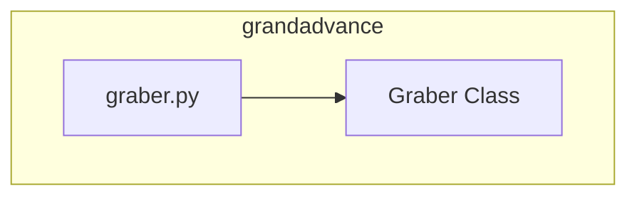

### Анализ кода `hypotez/src/suppliers/grandadvance/__init__.py`

#### 1. <алгоритм>

1.  **Импорт модуля `Graber`**: Импортирует класс `Graber` из модуля `.graber`. Этот класс предположительно отвечает за сбор данных с использованием определенного механизма (например, парсинга веб-страниц).
2.  **Инициализация модуля**: Файл `__init__.py` делает директорию `grandadvance` пакетом, позволяя другим частям проекта импортировать модуль `Graber` через `from src.suppliers.grandadvance import Graber`.

#### 2. <mermaid>

**Объяснение зависимостей:**

*   `graber.py`: Содержит класс `Graber`, который, вероятно, используется для сбора и обработки данных от поставщика `grandadvance`.

#### 3. <объяснение>

*   **Импорты**:
    *   `from .graber import Graber`: Импортирует класс `Graber` из модуля `graber.py`, находящегося в той же директории (`src/suppliers/grandadvance`). Этот класс, вероятно, содержит логику для получения данных с сайта `grandadvance`.
*   **Классы**:
    *   `Graber`: Предположительно, класс `Graber` отвечает за парсинг и извлечение данных с сайта `grandadvance`. Подробная функциональность класса находится в модуле `graber.py`.
*   **Функции**:
    *   В данном файле функции отсутствуют, так как он служит для инициализации пакета и импорта класса `Graber`.
*   **Переменные**:
    *   Переменные в явном виде не определены, но класс `Graber` может содержать атрибуты, определяющие его состояние и поведение.
*   **Взаимосвязи с другими частями проекта**:
    *   Этот модуль предоставляет класс `Graber`, который может использоваться другими частями проекта `hypotez` для получения данных от поставщика `grandadvance`. Например, он может быть использован в модулях, отвечающих за агрегацию данных от различных поставщиков.