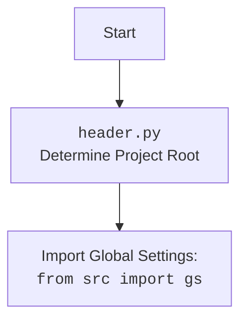

## Анализ кода `hypotez/src/suppliers/grandadvance/graber.py`

### 1. <алгоритм>

1.  **Инициализация**:
    *   Загрузка конфигурации из `grandadvance.json` и `product.json` в объекты `SimpleNamespace`.
    *   Вызов конструктора родительского класса `Graber` с указанием префикса поставщика, драйвера и индекса языка.
    *   Установка локатора для декоратора из `product.json`.
2.  **Получение данных**:
    *   Используются методы родительского класса `Graber` для обработки полей товара. При необходимости нестандартной обработки методы перегружаются в текущем классе.
3.  **Предварительные действия**:
    *   Перед отправкой запроса к веб-драйверу выполняются предварительные действия с использованием декоратора. Декоратор по умолчанию находится в родительском классе.
4.  **Завершение**:
    *   Данные возвращаются в формате, определенном в родительском классе `Graber`.

### 2. <mermaid>

```mermaid
flowchart TD
    subgraph grandadvance [grandadvance/graber.py]
        A[__init__] --> B{Загрузка конфигурации из JSON}
        B -- grandadvance.json, product.json --> C[Вызов super().__init__]
        C --> D{Установка локатора для декоратора}
    end

    subgraph src.suppliers.graber [src/suppliers/graber.py]
        E[Graber (родительский класс)] --> F{Обработка полей товара}
        F --> G{Декоратор для предварительных действий}
    end

    grandadvance --> src.suppliers.graber
    style grandadvance fill:#f9f,stroke:#333,stroke-width:2px
    style src.suppliers.graber fill:#ccf,stroke:#333,stroke-width:2px
```

**Объяснение зависимостей `mermaid`:**

*   `grandadvance/graber.py` зависит от `src/suppliers/graber.py`, так как наследует класс `Graber` из этого модуля.
*   `__init__`: Метод инициализации класса `Graber` в модуле `grandadvance/graber.py`.
*   `Загрузка конфигурации из JSON`: Загружает конфигурационные файлы `grandadvance.json` и `product.json` для настройки и локаторов.
*   `Вызов super().__init__`: Инициализирует родительский класс `Graber` из `src/suppliers/graber.py`.
*   `Установка локатора для декоратора`: Устанавливает локатор, который используется для выполнения предварительных действий с декоратором.
*   `Graber (родительский класс)`: Класс `Graber` из `src/suppliers/graber.py`, который содержит основную логику обработки полей товара.
*   `Обработка полей товара`: Методы для извлечения и обработки данных о товаре.
*   `Декоратор для предварительных действий`: Декоратор, который выполняет предварительные действия перед отправкой запроса к веб-драйверу.



### 3. <объяснение>

*   **Импорты**:
    *   `typing.Any`: Используется для обозначения типа переменной, которая может быть любого типа.
    *   `header`: Импортирует модуль `header.py`, который, вероятно, содержит общие настройки и функции.
    *   `header.__root__`: Переменная, определяющая корень проекта.
    *   `src.gs`: Импортирует глобальные настройки проекта.
    *   `src.suppliers.graber.Graber as Grbr, Context, close_pop_up`: Импортирует базовый класс `Graber` (переименованный в `Grbr`), класс `Context` и функцию `close_pop_up` из модуля `src.suppliers.graber`.
    *   `src.utils.jjson.j_loads_ns`: Импортирует функцию `j_loads_ns` для загрузки JSON файлов в виде объектов `SimpleNamespace`.
    *   `src.webdriver.driver.Driver`: Импортирует класс `Driver` для управления веб-драйвером.
    *   `types.SimpleNamespace`: Используется для создания объектов, к которым можно обращаться по атрибутам.
    *    `src.logger.logger.logger`: используется для логирования.

*   **Классы**:
    *   `Graber`:
        *   Роль: Класс для сбора данных о товарах с сайта `grandadvance.co.il`.
        *   Атрибуты:
            *   `driver`: Экземпляр класса `Driver` для управления веб-драйвером.
            *   `lang_index`: Индекс языка.
        *   Методы:
            *   `__init__(self, driver: Driver, lang_index: int)`: Конструктор класса. Загружает конфигурацию и локаторы, инициализирует родительский класс `Graber`.
        *   Взаимодействие:
            *   Наследует класс `Graber` из модуля `src.suppliers.graber`.
            *   Использует `j_loads_ns` для загрузки конфигурации из JSON файлов.
            *   Использует `Context.locator_for_decorator` для установки локатора для декоратора.

*   **Функции**:
    *   `__init__(self, driver: Driver, lang_index: int)`:
        *   Аргументы:
            *   `driver (Driver)`: Экземпляр класса `Driver`.
            *   `lang_index (int)`: Индекс языка.
        *   Возвращаемое значение: `None`.
        *   Назначение: Инициализация класса `Graber`. Загружает конфигурацию и локаторы, инициализирует родительский класс `Graber`.
        *   Пример:

```python
graber = Graber(driver=driver_instance, lang_index=0)
```

*   **Переменные**:
    *   `ENDPOINT (str)`: Константа, содержащая имя поставщика (`grandadvance`).
    *   `config (SimpleNamespace)`: Объект, содержащий конфигурацию, загруженную из `grandadvance.json`.
    *   `locator (SimpleNamespace)`: Объект, содержащий локаторы элементов, загруженные из `product.json`.

**Потенциальные ошибки и области для улучшения**:

*   Обработка исключений при загрузке JSON файлов.
*   Добавить логирование для отслеживания процесса сбора данных.
*   Улучшить документацию класса и методов.