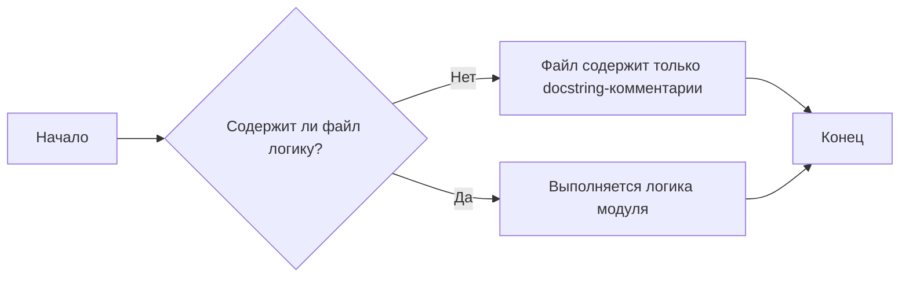

### **Анализ кода `hypotez/src/suppliers/ivory/login.py`**

#### **1. <алгоритм>**:

Код, представленный в файле `hypotez/src/suppliers/ivory/login.py`, состоит в основном из docstring-комментариев, описывающих модуль `src.suppliers.ivory`. Он также содержит информацию о платформе (Windows, Unix) и краткое описание модуля. Однако, отсутствует фактический код, реализующий какую-либо логику.

**Блок-схема**:

**Пример**:
Так как в файле отсутствует исполняемый код, примеры для каждого логического блока отсутствуют.

#### **2. <mermaid>**:

В данном коде нет импортов, которые можно было бы отобразить в диаграмме зависимостей `mermaid`. Код состоит только из комментариев и не содержит исполняемого кода.

#### **3. <объяснение>**:

- **Импорты**:
  - Отсутствуют.

- **Классы**:
  - Отсутствуют.

- **Функции**:
  - Отсутствуют.

- **Переменные**:
  - Отсутствуют.

**Потенциальные ошибки и области для улучшения**:

1.  **Отсутствие кода**: Файл `login.py` в директории `src/suppliers/ivory` должен содержать код для аутентификации или авторизации поставщика `IVORY`. На данный момент файл содержит только docstring-комментарии.
2.  **Неполная документация**: Docstring-комментарии присутствуют, но они не описывают никакой конкретной функциональности, так как её нет в файле.

**Взаимосвязи с другими частями проекта**:
Так как файл должен содержать логику аутентификации для поставщика `IVORY`, он будет связан с модулями, которые используют этого поставщика для получения данных или выполнения других операций.