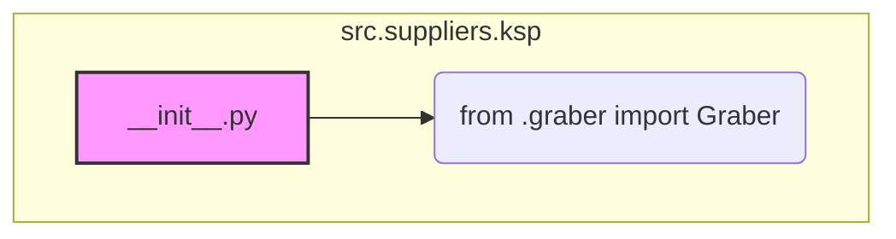

### **Анализ кода `hypotez/src/suppliers/ksp/__init__.py`**

#### **1. <алгоритм>**:

Этот файл является частью пакета `src.suppliers.ksp` и служит для определения интерфейса и импорта основных компонентов этого пакета.

1.  **Импорт класса `Graber`**: Класс `Graber` импортируется из модуля `.graber`.

    *   Пример:
        ```python
        from .graber import Graber
        ```
        Этот шаг делает класс `Graber` доступным для использования в других модулях, которые импортируют пакет `src.suppliers.ksp`.
2.  **Экспорт класса `Graber`**: После импорта класс `Graber` становится частью публичного интерфейса пакета `src.suppliers.ksp`.

#### **2. <mermaid>**:



**Объяснение зависимостей в `mermaid`**:

*   `A[__init__.py]` представляет файл `__init__.py` в пакете `src.suppliers.ksp`.
*   `B(from .graber import Graber)` указывает на импорт класса `Graber` из модуля `.graber` (который предполагает, что есть файл `graber.py` в той же директории).

#### **3. <объяснение>**:

*   **Импорты**:
    *   `from .graber import Graber`: Импортирует класс `Graber` из модуля `graber.py`, находящегося в той же директории, что и `__init__.py`. Это позволяет использовать `Graber` как часть пакета `ksp`.
*   **Классы**:
    *   `Graber`: Класс, вероятно, предназначен для сбора или обработки данных. Подробности о его функциональности можно найти в файле `graber.py`.
*   **Функции**:
    *   В данном файле функции отсутствуют. Основная цель — импорт и экспорт класса `Graber`.
*   **Переменные**:
    *   В явном виде переменные не определены. Однако класс `Graber` может содержать свои атрибуты и методы, которые будут использоваться при его создании и использовании.

**Дополнительные замечания**:

*   Файл `__init__.py` делает класс `Graber` доступным при импорте пакета `src.suppliers.ksp`. Например, можно будет написать `from src.suppliers.ksp import Graber` и использовать этот класс.
*   Для полного понимания функциональности необходимо изучить код в файле `graber.py`.