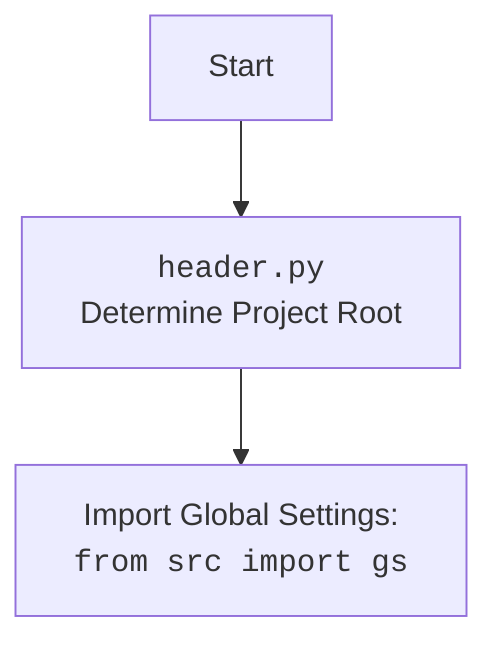

# Анализ кода `hypotez/src/suppliers/kualastyle/header.py`

## Алгоритм

1.  **`set_project_root(marker_files)`**:
    *   Начинает поиск корневого каталога проекта с каталога текущего файла.
    *   Проверяет наличие файлов-маркеров (по умолчанию `__root__` или `.git`) в текущем и родительских каталогах.
    *   Если маркер найден, устанавливает родительский каталог в качестве корневого.
    *   Добавляет корневой каталог в `sys.path`, если его там еще нет.

    ```python
    # Пример:
    # Предположим, что маркер '.git' найден в каталоге '/path/to/project/.git'
    # Тогда __root__ будет установлен в '/path/to/project'
    ```

2.  **Определение `__root__`**:
    *   Вызывает `set_project_root()` для определения корневого каталога проекта.
    *   Сохраняет путь к корневому каталогу в переменной `__root__`.

    ```python
    # Пример:
    # __root__ = Path('/path/to/project')
    ```

3.  **Чтение `settings.json`**:
    *   Пытается прочитать файл `settings.json` из каталога `src` в корневом каталоге проекта.
    *   Если файл найден и успешно прочитан, его содержимое сохраняется в переменной `settings`.
    *   Обрабатывает исключения `FileNotFoundError` и `json.JSONDecodeError`, если файл не найден или содержит неверный JSON.

    ```python
    # Пример:
    # Если settings.json содержит '{"project_name": "hypotez", "version": "1.0"}',
    # то settings = {"project_name": "hypotez", "version": "1.0"}
    ```

4.  **Чтение `README.MD`**:
    *   Пытается прочитать файл `README.MD` из каталога `src` в корневом каталоге проекта.
    *   Если файл найден и успешно прочитан, его содержимое сохраняется в переменной `doc_str`.
    *   Обрабатывает исключения `FileNotFoundError` и `json.JSONDecodeError`, если файл не найден или содержит неверный JSON.

    ```python
    # Пример:
    # Если README.MD содержит "This is a sample project",
    # то doc_str = "This is a sample project"
    ```

5.  **Определение метаданных проекта**:
    *   Извлекает метаданные проекта (имя, версию, описание, автора, авторские права, сообщение о кофе) из `settings`, если `settings` существует.
    *   Если `settings` не существует, использует значения по умолчанию.
    *   Сохраняет метаданные в глобальных переменных `__project_name__`, `__version__`, `__doc__`, `__details__`, `__author__`, `__copyright__`, `__cofee__`.

    ```python
    # Пример:
    # Если settings = {"project_name": "hypotez", "version": "1.0", "author": "John Doe"},
    # то __project_name__ = "hypotez", __version__ = "1.0", __author__ = "John Doe"
    ```

## Mermaid

```mermaid
flowchart TD
    Start --> FindRoot[Найти корневой каталог проекта с помощью marker_files]
    FindRoot --> SetRoot[Установить __root__ (Path)]
    SetRoot --> ReadSettings[Попытка чтения settings.json]
    ReadSettings -- Успешно прочитано --> ReadMe[Попытка чтения README.MD]
    ReadSettings -- Ошибка --> DefaultSettings[Использовать настройки по умолчанию]
    ReadMe -- Успешно прочитано --> DefineMetadata[Определить метаданные проекта из настроек]
    ReadMe -- Ошибка --> DefineMetadata
    DefaultSettings --> DefineMetadata
    DefineMetadata --> End[Конец]
```

**Объяснение зависимостей:**

*   `sys`: Используется для добавления корневого каталога проекта в `sys.path`.
*   `json`: Используется для чтения `settings.json`.
*   `packaging.version.Version`: Используется для работы с версиями.
*   `pathlib.Path`: Используется для работы с путями к файлам и каталогам.
*   `src`: Импортирует модуль `gs` из `src`, который, вероятно, содержит глобальные настройки путей.



## Объяснение

### Импорты:

*   `sys`: Этот модуль предоставляет доступ к некоторым переменным и функциям, взаимодействующим с интерпретатором Python.  В данном случае используется для добавления корневой директории проекта в `sys.path`, чтобы обеспечить возможность импорта модулей из этой директории.
*   `json`:  Используется для работы с данными в формате JSON. В этом файле он применяется для чтения содержимого файла `settings.json`, который, вероятно, содержит конфигурационные параметры проекта.
*   `packaging.version.Version`: Этот модуль из библиотеки `packaging` предназначен для работы с версиями программного обеспечения, позволяя сравнивать и сортировать версии.
*   `pathlib.Path`:  Этот модуль предоставляет способ представления путей к файлам и директориям в объектно-ориентированном стиле, упрощая операции с файловой системой.
*   `src`: Импортирует модуль `gs` из `src`, который, вероятно, содержит глобальные настройки путей.

### Функции:

*   `set_project_root(marker_files: tuple[str, ...]=('__root__', '.git')) -> Path`:
    *   **Аргументы**:
        *   `marker_files` (tuple): Кортеж имен файлов или директорий, которые используются для определения корневого каталога проекта. По умолчанию `('__root__', '.git')`.
    *   **Возвращаемое значение**:
        *   `Path`: Путь к корневому каталогу проекта.
    *   **Назначение**:
        *   Функция ищет корневой каталог проекта, начиная с директории, в которой находится текущий файл, и двигаясь вверх по дереву каталогов. Она останавливается, когда находит каталог, содержащий один из файлов-маркеров. Если корневой каталог не найден, возвращается директория, где находится скрипт. После этого, если корневой каталог еще не добавлен в `sys.path`, он добавляется.
    *   **Пример**:

    ```python
    # Пример использования функции set_project_root
    from pathlib import Path
    root_path:Path = set_project_root(marker_files=('.git',))
    print(root_path)
    # Output: /путь/к/корневому/каталогу
    ```

### Переменные:

*   `__root__` (Path):  Путь к корневому каталогу проекта.  Определяется путем вызова функции `set_project_root()`.
*   `settings` (dict): Словарь, содержащий настройки проекта, прочитанные из файла `settings.json`. Если файл не найден или не может быть прочитан, переменная остается `None`.
*   `doc_str` (str):  Строка, содержащая содержимое файла `README.MD`.  Если файл не найден или не может быть прочитан, переменная остается `None`.
*   `__project_name__` (str): Имя проекта.  Берется из `settings`, если доступно, иначе используется значение по умолчанию `'hypotez'`.
*   `__version__` (str): Версия проекта. Берется из `settings`, если доступно, иначе используется значение по умолчанию `''`.
*   `__doc__` (str): Описание проекта. Берется из `doc_str`, если доступно, иначе используется значение по умолчанию `''`.
*   `__details__` (str): Дополнительные сведения о проекте.  Всегда устанавливается в `''`.
*   `__author__` (str):  Автор проекта. Берется из `settings`, если доступно, иначе используется значение по умолчанию `''`.
*   `__copyright__` (str): Информация об авторских правах проекта. Берется из `settings`, если доступно, иначе используется значение по умолчанию `''`.
*   `__cofee__` (str): Сообщение о кофе. Берется из `settings`, если доступно, иначе используется значение по умолчанию `"Treat the developer to a cup of coffee for boosting enthusiasm in development: https://boosty.to/hypo69"`.

### Потенциальные ошибки и области для улучшения:

*   **Обработка исключений**: В блоках `try...except` для чтения `settings.json` и `README.MD` используется `...` в блоке `except`.  Было бы лучше логировать ошибки с использованием модуля `logger` из `src.logger.logger` для более информативной отладки.  Пример:

    ```python
    import json
    from src.logger import logger

    settings: dict = None
    try:
        with open(gs.path.root / 'src' / 'settings.json', 'r') as settings_file:
            settings = json.load(settings_file)
    except (FileNotFoundError, json.JSONDecodeError) as e:
        logger.error(f'Error while processing settings.json: {e}', exc_info=True)

    doc_str: str = None
    try:
        with open(gs.path.root / 'src' / 'README.MD', 'r') as settings_file:
            doc_str = settings_file.read()
    except (FileNotFoundError, json.JSONDecodeError) as e:
        logger.error(f'Error while processing README.MD: {e}', exc_info=True)
    ```

*   **Использование `j_loads` или `j_loads_ns`**: Для чтения JSON или конфигурационных файлов замените стандартное использование `open` и `json.load` на `j_loads` или `j_loads_ns`.
*   **Аннотации типов**:  Хотя большинство переменных аннотированы типами, стоит убедиться, что все переменные и возвращаемые значения функций имеют аннотации типов для повышения читаемости и надежности кода.

### Взаимосвязи с другими частями проекта:

*   Этот модуль зависит от модуля `gs` из пакета `src`, который, вероятно, содержит глобальные настройки и пути проекта.
*   Он также использует файлы `settings.json` и `README.MD`, расположенные в каталоге `src` корневого каталога проекта, для получения метаданных проекта.
*   Определяет глобальные переменные (`__project_name__`, `__version__` и т.д.), которые могут использоваться другими модулями проекта для получения информации о проекте.